# 多模态大模型调研

综述：https://arxiv.org/pdf/2306.13549.pdf

Clip、blip、blip2、instruct-blip、llava、llava 1.5、[llava-Next](https://llava-vl.github.io/blog/2024-01-30-llava-next/)、minigpt4、minigpt4\_v2、qwen-vl、DeepSeek-VL、fuyu、Video-LLaVA、[MiniGemini](https://github.com/dvlab-research/MiniGemini)、internVL、[internVL1.5](https://github.com/OpenGVLab/InternVL)、[MiniCpm-V](https://github.com/OpenBMB/MiniCPM-V)、[interLM-Xcomposer（1、2、4kHD）](https://github.com/InternLM/InternLM-XComposer)

### 综述

[A Survey on Multimodal Large Language Models](https://arxiv.org/abs/2306.13549)

* 典型的MLLM结构：（contact:基于投影的、基于查询的连接器和基于融合）

* 多模态编码器：

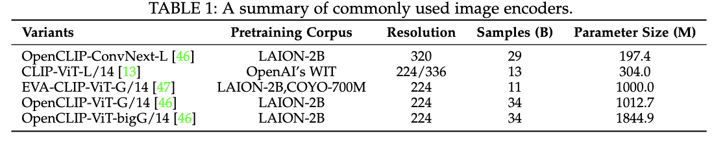

* pertained LLM

* Modality interface

  * contact：基于投影的、基于查询(token，编码器的输出被转换为token并与文本token连接，然后再发送到 LLM)和基于融合(特征)

  * 借助专家模型将图像转换为语言，然后将语言发送到 LLM(将视频转换为文本描述会扭曲时空关系)

* 训练（三个阶段：pre-training(大规模的文本配对数据), instruction-tuning, alignment tuning）

  * pre-training(大规模的文本配对数据)

  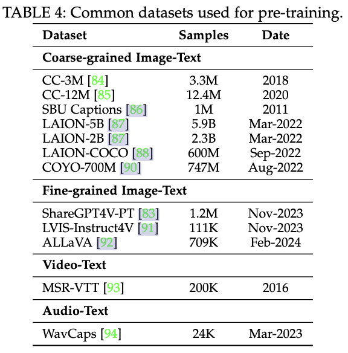

  * Instruction tuning

  * &#x20;alignment tuning（人工反馈 (RLHF) 和直接偏好优化 (DPO) 的强化学习）

* 评估（closed-set、open-set）

  * Caption（生成任务）

  * retrieval（理解任务）

  * ......

### CLIP

[Learning Transferable Visual Models From Natural Language Supervision](https://arxiv.org/abs/2103.00020)（2021.02 OpenAI）

code：https://github.com/OpenAI/CLIP

#### 模型结构

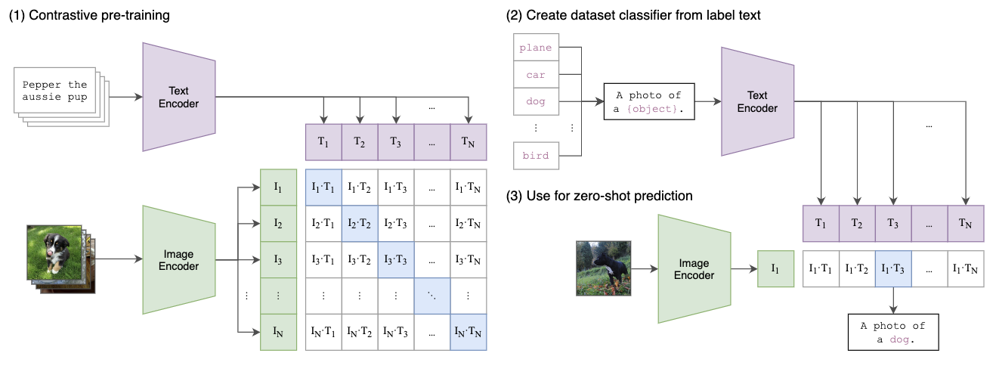

1.**图像编码器：**&#x52;esNet-50,ResNet-101,ViT-B/32, ViT-B/16, ViT-L/14.

&#x20;  **文本编码器：**&#x74;ransformer

2.**预训练方法：**&#x4EC5;预测整个文本与哪个图像配对，而不是该文本的确切单词

* **对比学习：**&#x8054;合训练图像编码器和文本编码器，最大化批次中 N 个真实对的图像和文本嵌入的余弦相似度，最小化 N²- N 个错误对的嵌入的余弦相似度。

* **损失计算：**&#x5728;相似性分数上优化了对称交叉熵损失，损失来自两部分：文本和图像

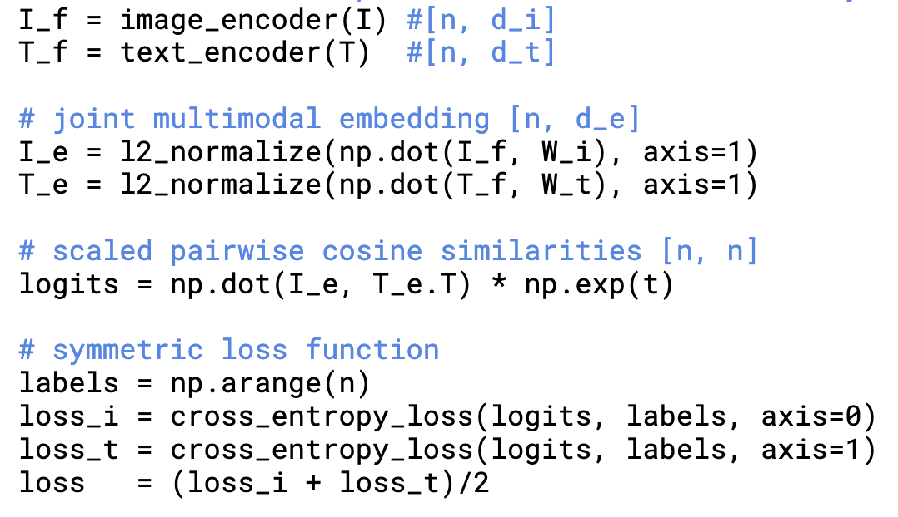

#### 数据

训练数据来自互联网收集的4亿个图像文本对。

#### 评测

* zero-shot效果，与全监督对比

* few-shot能力

### BLIP

[BLIP: Bootstrapping Language-Image Pre-training for Unified Vision-Language Understanding and Genera](https://arxiv.org/abs/2201.12086)（2022.01 Salesforce Research）

code：https://github.com/salesforce/BLIP

#### Summary

1. 解决了多数现有的预训练模型不够灵活，无法适应广泛的视觉语言任务的问题，

2. 网络数据集噪声太大，清洗数据

3. BLIP预训练一个具有理解和生成能力的统一模型，模型包括三部分：单模态编码器、基于图像的文本编码器和基于图像的文本解码器，单模态编码器中VIT做image encoder，BERT做text encoder。

#### 模型结构

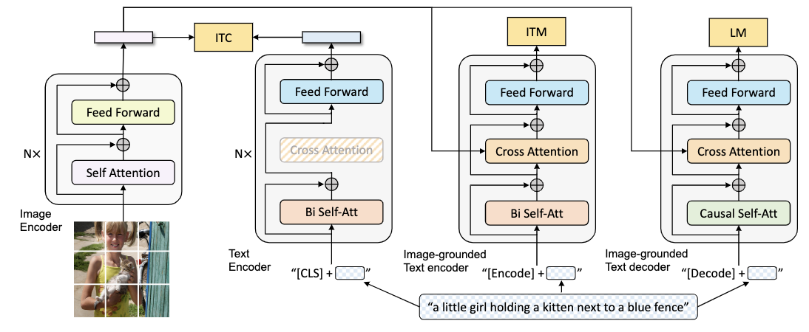

1.\[CLS] 标记附加到文本输入的开头以总结句子，\[Encode] 的输出嵌入用作图像-文本对的多模态表示，\[Decode] 令牌用于对序列的开头进行信号，并使用序列结束标记对其结尾进行信号

2.Pre-training

* ITC：[Align before Fuse: Vision and Language Representation Learning with Momentum Distillation](https://arxiv.org/abs/2107.07651)，**训练image encoder和text encoder**

* ITM：区分正负样本对， 是一个二元分类任务，其中模型使用 ITM 头（线性层）来预测图像-文本对在给定多模态特征的情况下是否为正（匹配）或负（不匹配），从ITC里面选最难（最像）的负样本，进入ITM，也就是说正负样本比是1:1；ITM里面输入文本token，以及在cross attention里面注入视觉embedding作为key和value。当送入image sequence embedding与text是pair时， 类别标签为1，否则为0。**训练image encoder和image-grounded text encdoer**

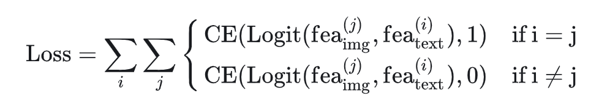

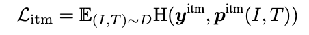

* LM：自回归，预测下一个词。输入文本token，以及在cross attention里面注入视觉embedding作为key和value，**训练image encoder和image-grounded text decdoer**

3.**CapFilt：**&#x4ECE;噪声图文对中学习，然后生成和过滤产生新的数据集，再去迭代优化原模型。

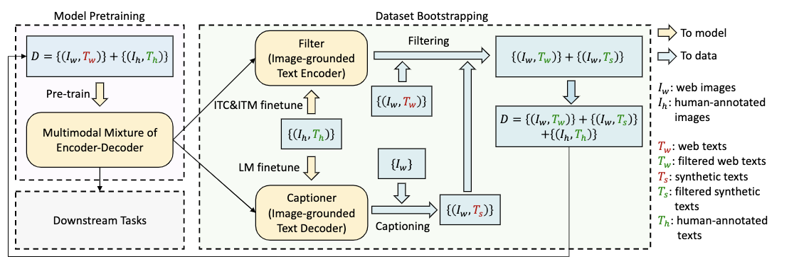

两个模块：给web图片生成caption的captioner、去除noisy image-text pairs的filter

* 用互联网数据+人工标注数据训练了一版pretrain model

* 再用人工标注数据（COCO）finetune一版model

* 用fintune好的image-ground text decoder，过一下互联网数据**生成caption**，**用LM进行finetune**

* 用fintune好的image-ground text encoder，过一下互联网数据，**过滤caption**，这里caption包括生成的也包括原来数据集的，剩下的caption作为新数据标注，**用ITC和ITM进行finetune**，该过滤器删除了原始 Web 文本 Tw 和合成文本 Ts 中的嘈杂文本，以学习文本是否与图像匹配。该过滤器删除了原始 Web 文本 Tw 和合成文本 Ts 中的嘈杂文本，如果 ITM 头部将其预测为与图像不匹配，则认为文本有噪声。

* 进入下一轮pretrain

#### 数据

* 人工标注数据：COCO、Visual Genome

* 网络数据集：Conceptual Captions , Conceptual 12M , SBU captions 、LAION&#x20;

#### 评测

##### 消融实验

* Captioner和Filter的有效性

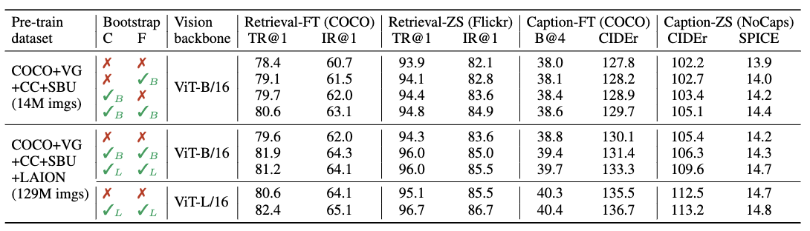

* beam search和nucleus sampling对生成synthetic caption的影响

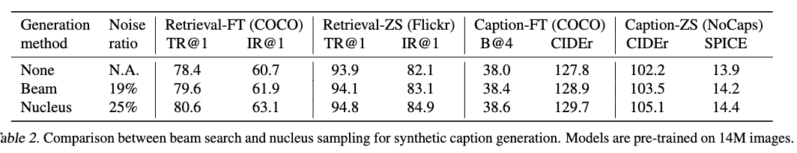

* 预训练期间，文本编码器和文本解码器参数共享策略的影响

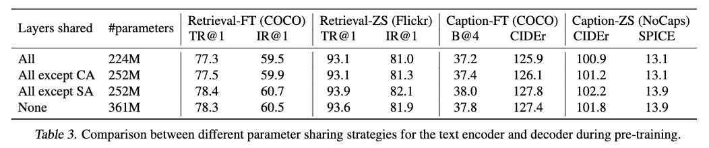

* CapFilter期间，研究了字幕器和过滤器是否与预训练相同的方式共享参数的效果。下游任务的性能下降，由于参数共享，字幕器产生的嘈杂字幕不太可能被过滤器过滤掉，如较低的噪声比（8% 与 25% 相比）。

### BLIPv2

[BLIP-2: Bootstrapping Language-Image Pre-training with Frozen Image Encoders and Large Language Mode](https://arxiv.org/abs/2301.12597)（2023.01 Salesforce Research）

code：https://github.com/salesforce/LAVIS/tree/main/projects/blip2

#### Summary

image-to-text 生成损失，不足以弥合模态差距。BLIPv2 使用两阶段预训练的轻量级Q-Former 弥合模态差距，**Image Encoder使用CLIP/EVA-CLIP的Image encoder，ViT-L/14**，移除了ViT的最后一层，使用倒数第二层的输出特征，**LLM使用基于解码器的llm的无监督训练OPT模型族**，以及**基于编码器-解码器的llm的指令训练的FlanT5模型族**。**Q-Former是一个轻量级转换器，它使用一组可学习的查询向量从冻结的图像编码器中提取视觉特征**，它为LLM提供最有用的视觉特征来输出所需的文本。

#### 模型结构

* Q- former：其一为image transofmrer，其二是text-transformer。使用 BERTbase 的预训练权重初始化 QFormer，而交叉注意力层是随机初始化的。**定义了一个可训练的query作为输入。image embedding用作cross attention层的key， value。**

* 预训练：[BLIP系列文章小结（BLIP, BLIP-2, InstructBLIP）](https://zhuanlan.zhihu.com/p/664011842)

  * **第一阶段：联合冻结的视觉编码器视觉语言表征学习**，强制 Q-Former 学习与文本最相关的视觉表示。**训练 Q-Former**，以便Query可以学习提取文本信息量最大的视觉表示。

    * ITC:单个图片产生的image embedding有32个（等于learned query的数量），而text embedding只有1个。同时计算32个image embedding与text embedding的距离，仅取最近的计算loss。

    * ITM:将query embedding与text embedding拼接起来作为输入，送入到QFormer中的Image Transformer中，通过一个二分类线性分类器，将每个输出查询嵌入馈送到两类线性分类器以获得 logit，最后对Qformer在query embedding位置的输出向量取平均后进行预测。

    * ITG:给定输入图像作为条件。因此，query被迫提取捕获有关文本的所有信息的视觉特征。我们采用多模态因果自注意力掩码来控制查询-文本交互，query可以互相关注，但不能关注文本token。每个文本token都可以关注所有query及其先前的文本token。

  * **第二阶段：联合冻结的LLM视觉语言生成学习，使其输出视觉表示可以由 LLM 解释，训练Q-Former和全连接层**

    * 输入图片到Image Encoder后得到图像的表征；

    * 图像表征与Queries一起送入到Q-Former中得到Queries的输出；

    * 再经过全连接层与Text tokens的维度对齐之后，输入给LLM Decoder中进行解码预测

  

#### 数据

和BLIP使用数据集一样，包括COCO，Visual Genome，CC3M，CC12M，SBU、LAION40

#### 评测

* **视觉语言表示学习对视觉语言生成学习的影响。**

在没有表示学习的情况下，Q-Former 未能弥合模态差距，导致零样本 VQA 的性能显着降低。

* **基于图像的文本生成 (ITG) 损失**通过强制查询来提取与语言相关的视觉特征来提高图像文本检索性能。

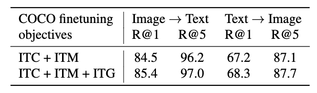

### InstructBLIP

[InstructBLIP: Towards General-purpose Vision-Language Models with Instruction Tuning](https://arxiv.org/abs/2305.06500v1)（2023.05 Salesforce Research 、香港科技大学、南洋理工大学）

code：https://github.com/salesforce/LAVIS/tree/main/projects/instructblip&#x20;

#### Summary

使用预训练好的BLIPv2进行初始化，**textual instruction不仅提供给冻结的LLM，还提供给Q-Former，**&#x4EE5;便它可以从冻结的图像编码器中提取与指令相关的视觉特征。我们收集了 26 个公开可用的数据集，并将它们转换为指令调整格式。此外，引入了一个指令感知查询转换器， Image Encoder和BLIP v2一样，LLM使用FlanT5-XL (3B)、FlanT5-XXL (11B)、Vicuna-7B 和 Vicuna-13B（由于原始的 BLIPv2 模型不包括 Vicuna 的检查点，我们使用与 BLIPv2 相同的程序使用 Vicuna 进行预训练）

* 数据：精心制作了 10 到 15 个不同的自然语言指令模板，并使用平衡数据策略

* 模型：指令感知视觉模型可以适应任务指令并产生最有利于手头任务的视觉表示

#### 模型结构

* instruction tuning

  * InstructionBLIP是用指令集对训练好的BLIP-2进一步微调。**InstructionBLIP仅微调Q-Former和FullyConnected两个模块**，和BLIP-2中第二阶段的微调参数一致。有所区别的是它的Q-Former的输入不仅有learned queries还有instruction的文本，其目的是为了让Q-Former产出的soft visual prompt更有倾向性（即能根据不同的指令提取不同的图像特征，也即是instruction-aware visual feature extraction）。从源码来看instruction-aware visual feature extraction的实现比较简单，直接将learned queries的embedding （image\_learned\_embed）和instruction的文本embedding(instruct\_embed)在特征维度拼接起来，再送入到SelfAttention层中。其它都和BLIP-2中第二阶段微调一致。

#### 数据

* 黄色表示训练数据，白色表示测试数据，

由于每个datasets的数量不同，还需要对datasets进行平衡，否则模型可能会在数据量大的datasets过拟合，在数据量少的datasets欠拟合。平衡规则如下：

假定各dataset的数据量为： {S1,S2,…,SD} ,在训练阶段采样的数据来自dataset d的概率为&#x20;

* Instruction Template

#### 评测

* 去除指令感知视觉特征和平衡数据采样策略的消融研究结果

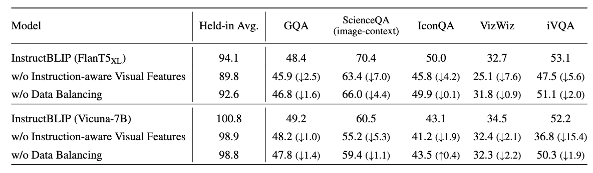

* 基于 BLIP-2 FlanT5-XLbackbone 的指令调整和多任务训练的比较,研究指令调优中观察到的零样本泛化的改进是否主要来自指令的格式或仅来自多任务处理

### LLaVA

[Visual Instruction Tuning](https://arxiv.org/abs/2304.08485v1) (2023.04 威斯康星大学-马迪逊分校、微软研究院、哥伦比亚大学)

code：https://llava-vl.github.io

#### 一、Summary

**新颖的端到端训练的大型多模态模型,首次尝试将指令微调扩展到语言图像多模态空间**，首次尝试使用仅语言 GPT-4 来生成多模态语言图像指令跟踪数据，将指令微调扩展到语言图像多模态空间，并构建了两个具有不同且具有挑战性的面向应用的任务的评估基准。Vision Encoder使用CLIP预训练的ViT-L/14，语言解码器使用Vicuna还是llama，Projection (Linear → GELU → Linear)&#x20;

#### 二、模型结构

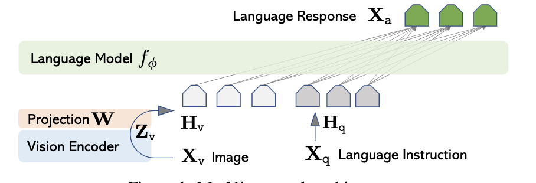

* Training

  * 输入序列

  

  对于每个图像 Xv，我们生成多轮对话数据 (X1q , X1a , · · · , XTq , XTa )，其中 T 是轮次的总数。我们通过将所有答案视为助手的响应，将第 t 轮的指令 Xtinstruct 组织为序列：

  

  对于长度为 L 的序列，计算目标答案 Xa 的概率：

  

  * **第一阶段Pre-training：特征对齐**

  将 CC3M 中 595K 个图文对转换为单轮对话，训练过程中冻结视觉编码器和语言解码器的参数，**只训练中间线性层（为了获得图像特征和语言特征对齐）**&#x7684;参数。

  * **第二阶段Fintune：端到端**

  保持视觉编码器的权重冻结，并继续**更新LLAVA中投影层和LLM的预训练权重**

#### 三、数据

1. **预训练数据：CC-595K，单轮对话**

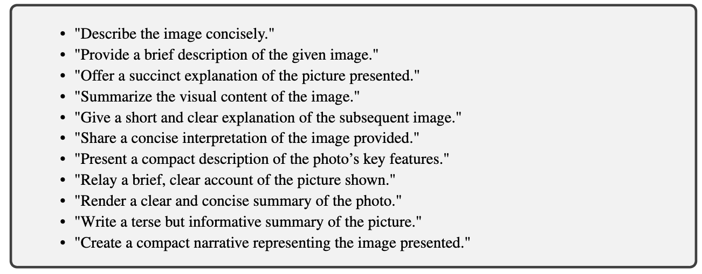

对于每张图片，从上面的简短描述来构建指令，指令数据为单轮对话，记图片Xv, Caption Xc, 问题Xq，那么指令为：**Human: Xq Xv\<STOP>\nAssistant: Xc\<STOP>\n**

* **微调数据集**

  * 多模态对话机器人：利用158K语言-图像指令跟随数据对Chatbot进行了微调

  * ScienceQA数据集

  * **构建LLaVA-Instruct-158K**，构造Q\&A数据，用GPT-4生成response，用Question构造LLM能识别的图像特征，让LLM生成对应Answer

    1. &#x20;Context ：Captions（从多个维度描述图像），Bounding boxes（描述图像中的物体位置）

    2. Response：构造conversation、detailed description、complex reasoning三类数据；前两个关注图像本身，最后一个关注深度推理

    

* **评估Benchmark&#x20;**

- **LLaVA Benchmark (COCO)**。从COCO-Val-2014中随机选择了30张图片，每张图片生成三种类型的问题（对话、详细描述、复杂推理），一共得到90个图片-指令对。

- **LLaVA Benchmark (In-the-Wild)**。收集了一组不同的 24 张图像，共有 60 个问题，包括室内和室外场景、表情包、绘画、草图等，并将每个图像与高度详细和手动策划的描述相关联（人工标注），并对问题进行适当的选择。

#### 四、评测

* **不同训练数据的LLAVA-Bench (COCO)消融实验。**&#x4C;LaVA依据图像和问题预测答复，使用GPT-4预测生成结果作为理论上限，将两个响应一起送入GPT-4进行打分评估。通过指令调整，模型遵循用户指令的能力显着提高。其次，添加少量详细的描述和复杂的推理问题有助于将模型的整体能力显著提高 7 分。此外，它还提高了模型在会话问题上的性能，这表明推理能力的提高补充了对话能力。

* LLaVA-Bench (In-the-Wild).更具挑战性的任务中的能力和对新领域的泛化能力

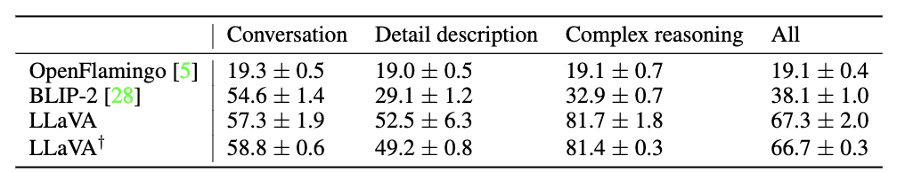

* ScienceQA上进行的一些消融实验

  * 视觉特征，尝试使用 CLIP 视觉编码器的最后一层特征。

  * 思维链。为了确定模型预测中答案和推理过程之间的顺序，类似 CoT 的推理优先策略可以大大提高收敛性，但对最终性能的贡献相对较小。

  * 预训练。我们跳过预训练并直接从头开始训练科学 QA

  * 模型大小。我们保持所有配置与我们最好的 13B 模型相同，并训练 7B 模型。

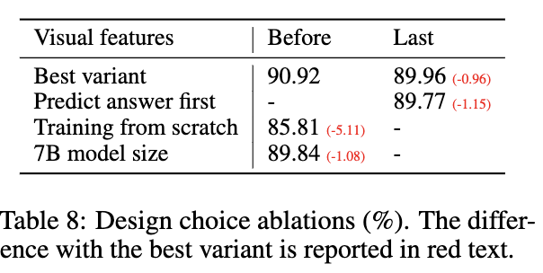

### LLaVA1.5

[Improved Baselines with Visual Instruction Tuning](https://arxiv.org/abs/2310.03744) （2023.10 威斯康星大学-马迪逊，微软雷德蒙研究院）

code：https://llava-vl.github.io&#x20;

#### 一、Summary

**LLaVA 1.5 相较于LLaVA&#x20;**

在模型结构上，LLaVA 1.5 相对于 LLaVA 改动很小，只是将 adapter 从单层的 linear 换成了两层的 MLP，称为 connector。

在分辨率上，LLaVA 1.5 提升到 336。

在数据上，LLaVA 1.5 增加了许多 QA 和 OCR 的数据。

**使用带有MLP(双层)投影的CLIP-ViT-L-336px**，**基于LLaVA使用两层 MLP 改进视觉语言连接器的表示能力可以提高 LLaVA 的多模态能力，**&#x5E76;扩大了输入图像的分辨率。

#### 二、模型结构

* 训练

LLaVA-1.5遵循了LLaVA的双阶段训练方式。第一阶段，进行视觉语言表示的预训练,**训练MLP**，使用约60万张图像文本对。第二阶段，在65万多模态指令数据上进行调优，**更新LLAVA中MLP和LLM**

#### 三、数据

1. **特征对齐数据集：**&#x35;58K subset of the LAION-CC-SBU dataset with BLIP captions。

2. **微调数据集**。视觉指令调优方面,LLaVA-1.5使用了不同类型的数据集,包括VQA、OCR、区域级VQA、视觉对话、语言对话等,一共约65万条数据。

#### 四、评测

1. 研究了llava在数据、模型和输入图像分辨率对三个数据集的选择的缩放效果，选择在 GQA 、MME 和 MM-Vet 上进行实验，分别检查具有简短答案、带有输出格式的 VQA 和自然视觉对话的 VQA 的代表性能力

   * 对于 InstructBLIP 等方法，无**法在短格式和长格式 VQA 之间取得平衡**，**使用单个响应格式提示，该提示清楚地表明输出格式，在促进简短答案时附加到 VQA 问题的末尾：使用单个单词或短语回答问题。**

   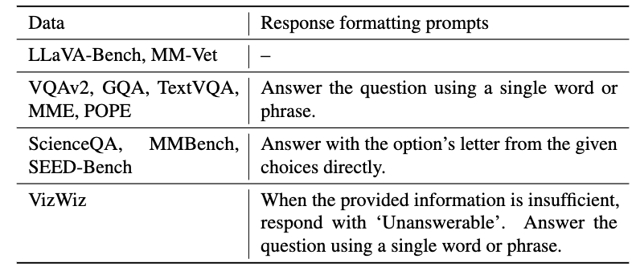

   * 进一步扩大了输入图像分辨率，以允许LLM清楚地“看到”图像的细节，并将GQA数据集作为附加的视觉知识源添加。

   * 结合了ShareGPT数据，并将LLM扩展到13B。

* **LLaVA1.5的LLM的选择**

* **LLaVA1.5数据效率消融**。对训练数据混合进行随机(0.1-0.5)子采样，全数据混合提供了最好的知识覆盖率，只有 50% 的样本，该模型仍然保持了超过 98% 的完整数据集性能。这表明数据效率还有进一步改进的空间。

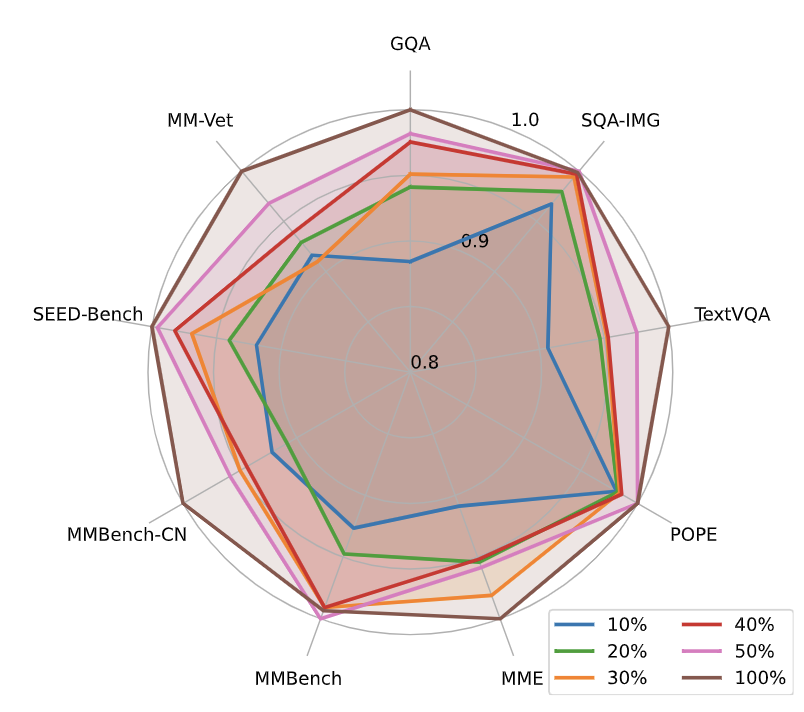

### LLaVA-NEXT (2024.01)

[LLaVA-NeXT: Improved reasoning, OCR, and world knowledge](https://llava-vl.github.io/blog/2024-01-30-llava-next/) （2024.01）

pdf:https://static.hliu.cc/files/llava/improved\_llava.pdf

#### 一、Summary

**LLaVA-NEXT 相较于LLaVA1.5**

LLaVA-NEXT 的技术改进包含动态高分辨率，高质量数据，更强的 LLM 基座三个方面

#### 二、技术改进

* **动态高分辨率**

  * 预定义了一组分辨率来支持多达六个网格(1x1，1x2，1x3，1x4，1x5，1x6，2x2，2x3及其转置)

  * 后处理，(1) 填充删除，224\*224，(2) 行令牌，我们将特殊标记附加到每行特征的末尾，(3) 展平图像特征图并将其输入语言模型和语言标记特征。

  * 全局上下文，将图像resize为 242\*224的单个图像，并将其与高分辨率特征连接起来以提供全局上下文。

* **高质量数据**

数据方面，LLaVA-NeXT的提升包括两部分：高质量用户指令数据和多模态图表数据。

* **更强的 LLM 基座**

除了 LLaVA 系列一直沿用的 Vicuna 7B/13B，LLaVA-NeXT有还尝试了 Mistral-7B 和 Nous-Hermes-2-Yi-34

* **训练：没有对视觉projection进行额外的高分辨率预训练，并直接对高分辨率图像执行视觉指令调整**。

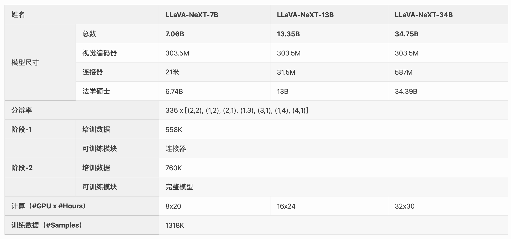

#### 三、数据

1. **预训练数据**

和LLaVA 1.5一样，558K subset of the LAION-CC-SBU dataset with BLIP captions

* **微调数据（未开源）**

  * **高质量用户指令数据**

    * **开源现有的 LAION-GPT-V 和 ShareGPT-4V**

    * **过往用户试用 LLaVA demo 中积攒下来的图片和指令，用 GPT4V 来回答这些问题**。

  * **多模态图表数据**

    * **TextCaps** 被**移出了 LLaVA 1.6 的训练数据（为了后续用TextVQA做OCR的ZSL），同时补上了 DocVQA 和 SynDog-EN 作为代替**。

    * 和 Qwen-VL 一样，**&#x20;ChartQA，DVQA 和 AI2D 来提升模型对表格图像的理解**

#### 四、评测

1. **全局上下文的重要性**

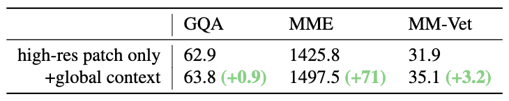

### LLaVA-NEXT (2024.05)

blog:https://llava-vl.github.io/blog/2024-05-10-llava-next-stronger-llms/

#### 一、Summary

**更强大和更大的语言模型增加多模式能力，高达3倍的模型尺寸**

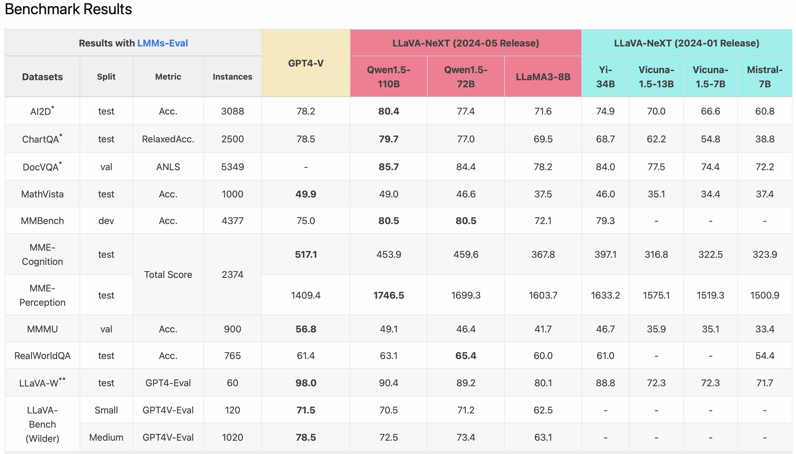

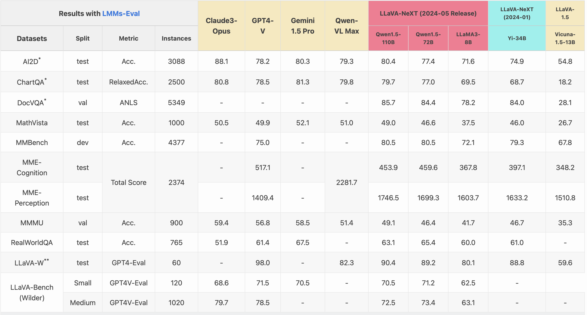

#### 二、模型和数据

* 第一阶段的训练数据为 558K 样本，和之前一样

* 第二阶段的训练数据约为 790K 样本。

#### 三、评测

1. MMMU用于多学科理解，Mathvista用于视觉数学推理，AI2D用于科学图表理解，LLaVA-W用于日常视觉聊天场景

   1. **提高语言能力：**&#x5728;可比规模的LLM中（例如，7B Mistral/Vicuna，7B Qwen，8B LLaMa3）中，存在一个一致的模式，即以MMMU分数衡量的更高语言能力对应于多模式能力的提高。

   2. **模型尺寸的影响：**&#x5728;同一LLM系列中（例如，Qwen LLM：7B、72B、110B），较大的模型在多式联运基准上始终表现出卓越的性能。这凸显了这样一种概念，即较大的模型往往具有增强的语言能力，从而提高了跨多模式任务的性能。

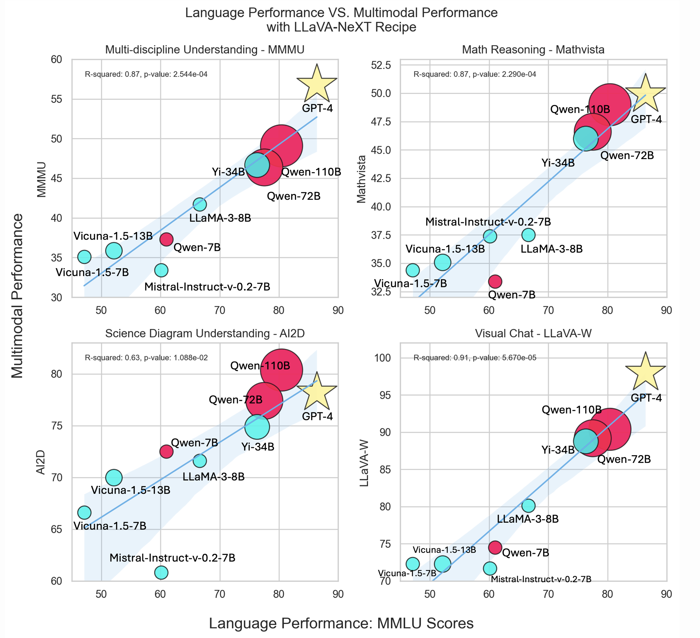

### MiniGPT-4

[MiniGPT-4: Enhancing Vision-Language Understanding with Advanced Large Language Models](https://arxiv.org/abs/2304.10592) （2023.04 阿卜杜拉国王科技大学）

code：  https://gitcode.com/Vision-CAIR/MiniGPT-4

#### 一、Summary

在第二阶段**设计了一个详细的图像描述数据集**来微调模型，解决了在短图像标题对上训练的模型可能会产生不自然的语言输出（重复和碎片化）的问题。**视觉编码器使用EVA-CLIP 的 ViT-G/14和 BLIPv2的Q-Former  ，大语言模型使用Vicuna**。

#### 二、模型结构

* **训练**

  * **Stage one**，**只有线性投影层被预训练**。

  * **Stage two，使用更小但高质量的图像-文本数据集预训练模型进行微调**，并使用设计的会话模板来提高生成可靠性和可用性。

    

#### 三、数据

1. **Stage one**：Conceptual Caption、SBU和LAION

2. **Stage two**：**随机从caption数据集中随机选择 5,000 张图像**，**使用第一个预训练阶段导出的模型来生成输入图像的综合描述**。**使用 ChatGPT 进行处理，类似llava构造微调数据的方式，手动验证**每个图像描述的正确性，5000 个图像-文本对中只有大约 **3500 个**我们的要求。

#### 四、评测

* 第二阶段微调前后详细字幕和诗歌生成任务的失败率。微调阶段显著减少了生成失败。

* **证明使用单个线性层将视觉特征与 LLM 对齐的有效性**，此外，(b) 和(c) 的性能都略低于原始的MiniGPT-4。这表明单个投影层（线性层）足以在我们的有限训练数据设置中对齐视觉编码器和大型语言模型

### MiniGPT-v2

[MiniGPT-v2: large language model as a unified interface for vision-language multi-task learning](https://arxiv.org/abs/2310.09478) （2023.10 阿卜杜拉国王科技大学(KAUST)、Meta AI Research）

code：https://minigpt-v2.github.io/

#### 一、Summary

使用单个模型**通过简单的多模态指令有效地执行不同的视觉语言任务**。为每个任务提供了一个唯一的任务标识符标记，**选择更大分辨率图像，线性层将每四个相邻的视觉标记连接成一个标记，**&#x5E76;将它们投影到大型语言模型的同一特征空间中的单个嵌入中，将总数减少了 75%。**视觉编码器使用EVA，大语言模型使用LLaMA2-7B，任务标识符tokens如下：**

#### 二、模型结构

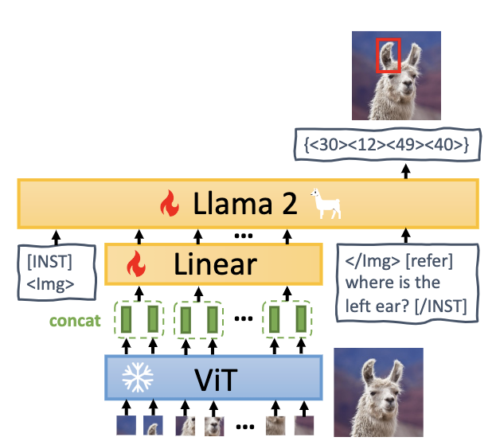

* **模型输入**

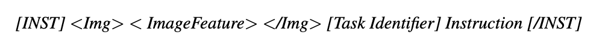

* **训练**

  * **Stage 1: Pretraining.**&#x4F7F;用弱标记的图像-文本数据集和高质量的细粒度视觉语言注释数据集，**训线性层**

  * **Stage 2: Multi-task training(SFT).**&#x7528;多个任务的细粒度数据改进模型。**训线性层和LLM**

  * **Stage 3: Multi-modal instruction tuning(SFT).**&#x4F7F;用更多多模态指令和语言数据集来微调我们的模型，**训线性层和LLM**

#### 三、数据

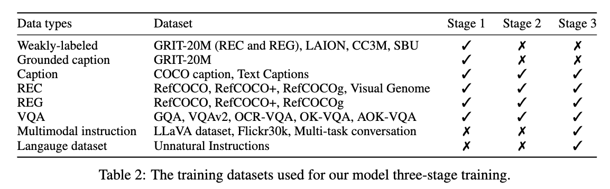

#### 四、评测

* VQA基准的**任务标识符**消融研究。在模型训练期间使用任务标识符可以整体提高来自多个 VQA 基准的 VQA 性能

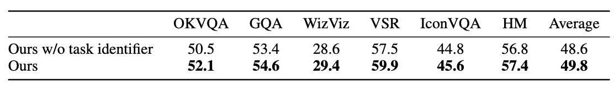

### Qwen-VL

[Qwen-VL: A Versatile Vision-Language Model for Understanding, Localization, Text Reading, and Beyond](https://arxiv.org/abs/2308.12966) （2023.08 阿里巴巴集团）

code：https://github.com/QwenLM/Qwen-VL

#### 一、Summary

引入一种新的视觉受体(包括**语言对齐的视觉编码器和位置感知适配器**)来增强LLM基底具有视觉能力。大型语言模型使用 Qwen-7B ，视觉编码器使用 Openclip预训练的 ViT-bigG（448\*448） ，并增加了Position-aware Vision-Language adapter，缓解长图像特征序列带来的效率问题，随机初始化单层cross-attention模块，使用一组可训练的向量作为query，视觉编码器生成的图像特征作为key，进行cross-attention，压缩图像特征至256固定长度

#### 二、模型结构

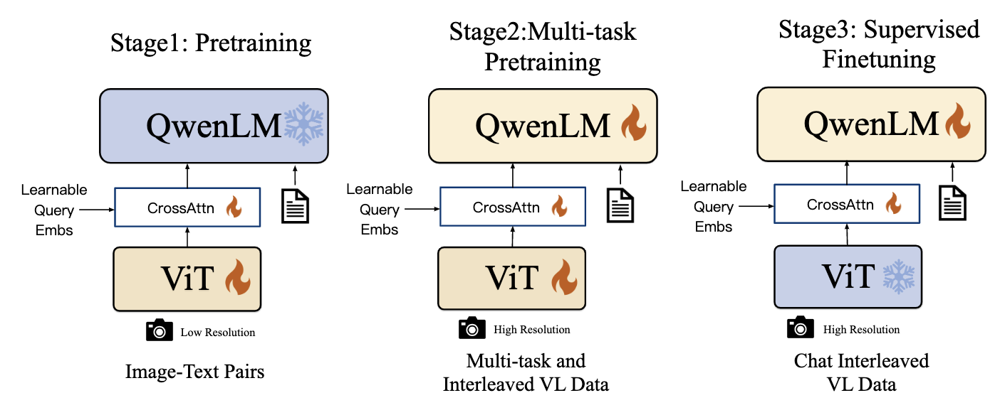

* **Training**

  * **Pre-training：**&#x5229;用大规模、弱标记、网络爬取的图像-文本对，冻结大型语言模型，**只优化视觉编码器和VL适配器**，输入图像的大小调整为224 × 224，训练目标是最小化文本token的交叉熵。

  * **Multi-task Pre-training：**&#x5F15;入具有更大输入分辨率448\*448图像和交错图像文本数据的高质量细粒度 VL 注释数据，**训练整个模型**，训练目标是最小化文本标记的交叉熵。

  * **Supervised Fine-tuning：冻结视觉编码器并优化语言模型和适配器模块。**

#### 三、数据

1. Pre-training，清洗数据

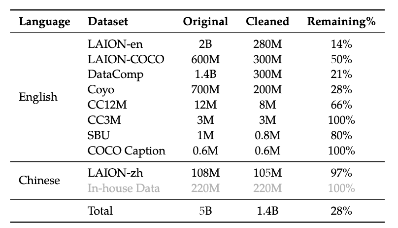

* Multi-task Pre-training

&#x20;     Data Format

\<box> and \</box> ：边界框的字符串

\<ref> and \</ref>：对应的描述性单词或句子相关联的字符串

* Supervised Fine-tuning：**手动注释、模型生成和策略连接构建了一组额外的对话数据，以将定位和多图像理解能力纳入 Qwen-VL 模型中。**&#x6B64;外，我们在**训练期间混合多模态和纯文本对话数据**，以确保模型在对话能力方面的普遍性。

#### 四、评测

1. **研究多模态训练对纯文本能力的影响**， Qwen-VL 在 Qwen-7B 的 LLM 上有很好的初始化，因此在纯文本任务上与许多纯文本 LLM 相当。

* **使用视觉语言适配器的不同压缩特征长度时训练损失的可视化**。

  1. 左侧，在训练开始时使用的查询越少，初始损失越低。然而，随着收敛，过多的或太少的查询会导致收敛变慢。

  2. 右侧，考虑到第二个训练阶段(多任务预训练)应用448\*448分辨率，其中ViT/14输出的序列长度为(448/14)² = 1024。太少的查询会导致丢失更多的信息。

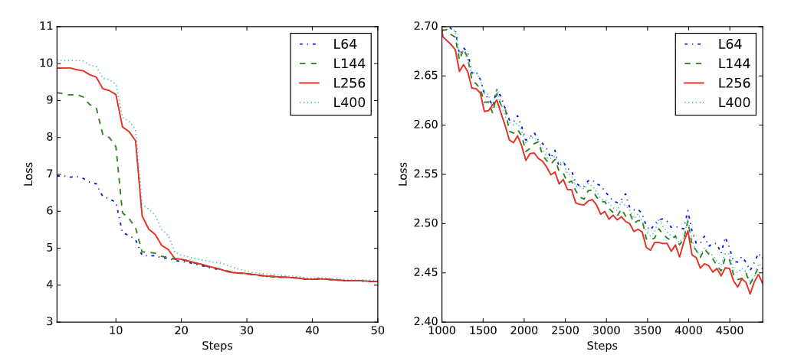

* 使用窗口注意和全局注意时损失的可视化，使用 Window Attention 时，模型的损失明显更高,但训练速度相似。因此，我们决定**在训练 Qwen-VL 时，对 Vision Transformer 使用 Global Attention**。

  1. 训练速度

  

  * Window Attention :即仅在模型的 ViT 部分的大部分层中以 224 × 224 的窗口执行 Attention，并在模型的 ViT 部分的一小部分层（例如每 4 层中的 1 个）中执行完整的 448 × 448 或 896 × 896 图像的注意力

### Qwen2-VL

[Qwen2-VL: Enhancing Vision-Language Model's Perception of the World at Any Resolution](https://arxiv.org/pdf/2409.12191)（2024.09 阿里巴巴）

code：https://github.com/huggingface/transformers/blob/main/src/transformers/models/qwen2\_vl

#### 一、Summary

* 任意动态分辨率，不用切图（最小最大像素\[56\*56,784\* 1280]）

* 多模态旋转位置嵌入，使用单独的组件来表示时间和空间信息

#### 二、模型结构

* Vit：DFN 的 ViT,删除原始绝对位置嵌入并引入 2D-RoPE来捕获图像的二维位置信息

* ViT之后使用MLP将**相邻的2 × 2token压缩为单个token**

* 多模态旋转位置嵌入(M-RoPE)

* 任意分辨率输入，也是按索引生成attention\_mask

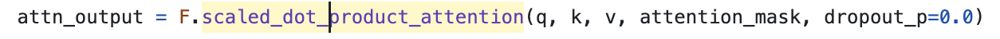

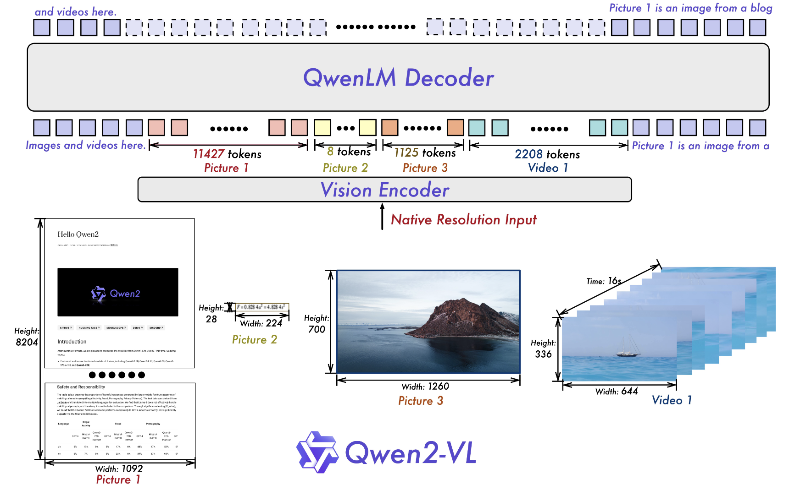

* LLM中的多模态旋转位置嵌入（[M-RoPE](https://zhuanlan.zhihu.com/p/719388479)）：

#### 三、训练

1. stage1：只关注训练 ViT，大量图像-文本对(图像文本对）

2. stage2：**解冻所有参数**。

3. stage3：冻住ViT，微调 LLM。包含图像-文本对、光学字符识别 (OCR) 数据、交错图像-文本文章、视觉问答数据集、视频对话和图像知识数据集。

#### 四、消融实验

* 固定分辨率（调整图像的大小），调整图像大小只会导致性能上的小扰动，证明了对不同图像大小的鲁棒性。

* 仅仅增加图像大小(min\_pixel)并不总是可以提高性能。为不同的图像选择合适的分辨率更为重要。

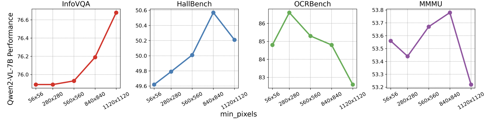

* M-RoPE

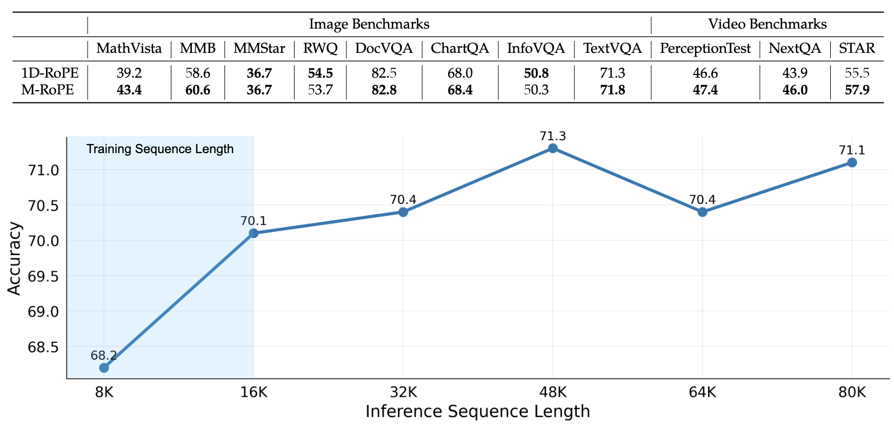

* M-RoPE 在 Video-MME 中等长度视频上的长度外推能力。图 5 说明了 Qwen2-VL-72B 在不同推理长度下的性能。

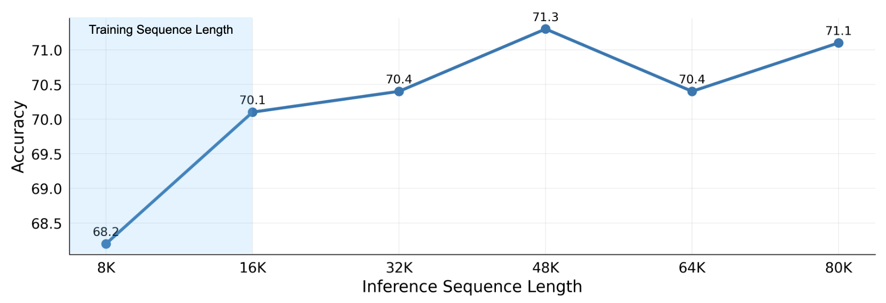

* 随着模型大小和训练数据量的增加，性能在一系列基准测试中不断提高。

### Qwen2.5-VL

2025.2.6 【暂无paper】

blog：https://qwenlm.github.io/zh/blog/qwen2.5-vl/

huggingface：https://huggingface.co/collections/Qwen/qwen25-vl-6795ffac22b334a837c0f9a5

#### 一、Summary

主要特点：

* **感知更丰富的世界**：Qwen2.5-VL 不仅擅长识别常见物体，如花、鸟、鱼和昆虫，以及著名山川的地标，还包括影视作品中的 IP，以及各种各样的商品。还能够分析图像中的文本、图表、图标、图形和布局。（类似万物识别）

* **Agent**：Qwen2.5-VL 直接作为一个视觉 Agent，可以推理并动态地使用工具，初步具备了使用电脑、网页、手机的能力。

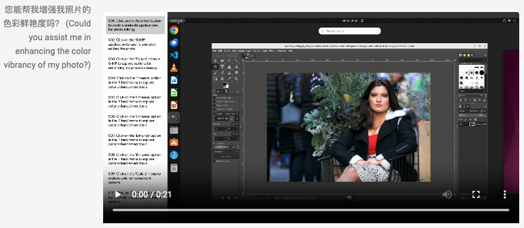

* **理解长视频和捕捉事件**：Qwen2.5-VL 能够理解超过 1 小时的视频，并且这次它具备了通过精准定位相关视频片段来捕捉事件的新能力。

* **视觉定位**：Qwen2.5-VL 可以通过生成 bounding boxes 或者 points 来准确定位图像中的物体，并能够为坐标和属性提供稳定的 JSON 输出。

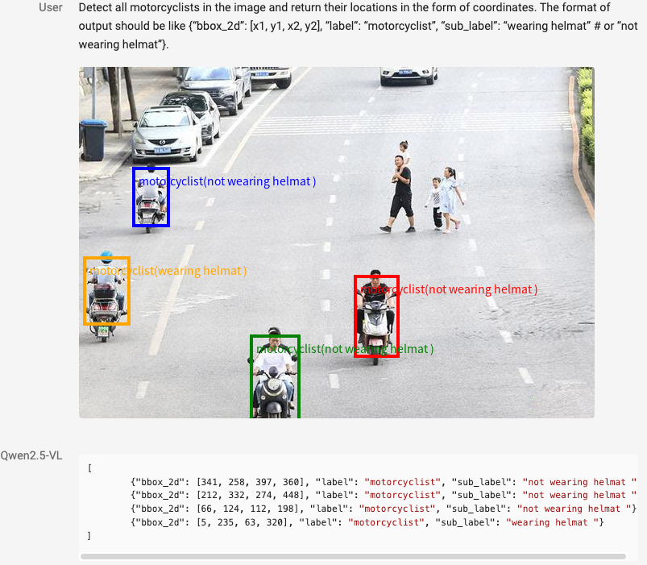

* **结构化输出**：设计了一种更全面的文档解析格式，称为 QwenVL HTML 格式，它既可以将文档中的文本精准地识别出来，也能够提取文档元素（如图片、表格等）的位置信息，从而准确地将文档中的版面布局进行精准还原。基于精心构建的海量数据，QwenVL HTML 可以对广泛的场景进行鲁棒的文档解析，比如杂志、论文、网页、甚至手机截屏等等。对于发票、表单、表格等数据，Qwen2.5-VL 支持其内容的结构化输出，惠及金融、商业等领域的应用。

* OCR能力：识别能力提升至一个新的水平，增强了多场景、多语言和多方向的文本识别和文本定位能力；

#### 二、模型结构

与 Qwen2-VL 相比，Qwen2.5-VL 增强了模型对时间和空间尺度的感知能力，并进一步简化了网络结构以提高模型效率。

* **时间和图像尺寸的感知**

在空间维度上，Qwen2.5-VL 不仅能够动态地将不同尺寸的图像转换为不同长度的 token，还直接使用图像的实际尺寸来表示检测框和点等坐标，而不进行传统的坐标归一化。这使得模型能够直接学习图像的尺度。

在时间维度上，引入了动态 FPS 训练和绝对时间编码，将 mRoPE id 直接与时间流速对齐。这使得模型能够通过时间维度 id 的间隔来学习时间的节奏。这样一来，模型不仅能够支持小时级别的超长视频理解，还具备秒级的事件定位能力。它不仅能够准确地理解小时级别的长视频内容，还可以在视频中搜索具体事件，并对视频的不同时间段进行要点总结，从而快速、高效地帮助用户提取视频中蕴藏的关键信息。

* **更简洁高效的视觉编码器**

视觉编码器在多模态大模型中扮演着至关重要的角色。我们从头开始训练了一个原生动态分辨率的 ViT，包括 CLIP、视觉-语言模型对齐和端到端训练等阶段。为了解决多模态大模型在训练和测试阶段 ViT 负载不均衡的问题，我们引入了窗口注意力机制，有效减少了 ViT 端的计算负担。在我们的 ViT 设置中，只有四层是全注意力层，其余层使用窗口注意力。最大窗口大小为 8x8，小于 8x8 的区域不需要填充，而是保持原始尺度，确保模型保持原生分辨率。此外，为了简化整体网络结构，我们使 ViT 架构与 LLMs 更加一致，采用了 RMSNorm 和 SwiGLU 结构。

### DeepSeek-VL

[DeepSeek-VL: Towards Real-World Vision-Language Understanding](https://arxiv.org/abs/2403.05525) （2024.03 DeepSeek-AI）

code：https://github.com/deepseek-ai/DeepSeek-VL

#### 一、Summary

**弥补与专有模型的差距：**

* 数据构建上，构建了一个指令调优数据集，涵盖PDF、图表等；

* 模型架构上，DeepSeek-VL 结合了混合视觉编码器，

* 训练策略上，调整多模态数据和文本数据比率（7:3）以促进两种模式的平衡集成。

**大语言模型为DeepSeek-LLM，视觉编码器为SigLIP-L(主要用于语义视觉表示)提取高级语义特征（576\*1024），SAM-B 提取低级语义特征。Vision-Language Adaptor为两层混合MLP来桥接视觉编码器和LLM。不同的单层 MLP 用于分别处理高分辨率特征和低分辨率特征（576\*1024），随后，这些特征沿它们的维度连接（576\*2024），然后通过另一层 MLP(GeLU的激活以及一层embedding映射) 转换为 LLM 的输入空间**

#### 二、模型结构

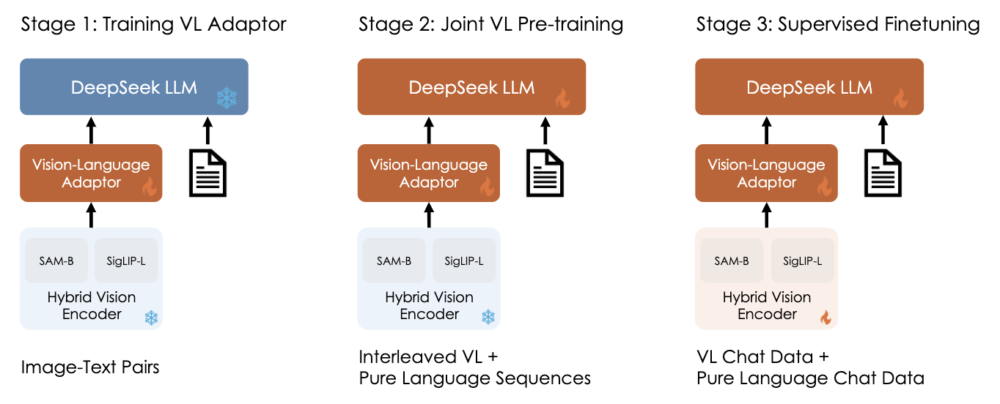

* **训练**：只计算语言部分的下一个token预测损失。

  * **Stage 1涉及训练视觉语言 (VL) 适配器**，在嵌入空间中建立视觉和语言元素之间的概念联系，从而促进大型语言模型 (LLM) 对图像中描绘的实体的全面理解。

  * **Stage2是联合视觉和语言预训练，包括联合语言多模态训练（**&#x9009;择语言与多模态数据的训练比率约为 7:3）和**缩放视觉语言预训练**（在较小的模型（特别是 1.3B 模型）上进行实验，然后将其放大到 7B 模型），其&#x4E2D;**&#x20;VL 适配器和语言模型都是可训练的。**

  * **Stage 3是监督微调阶段**，在此期间将**训练低分辨率视觉编码器 SigLIP-L、VL 适配器和语言模型**，SAM-B冻结（GPU有限）。

#### 三、数据

1. **Stage 1：训练视觉语言 (VL) 适配器**

   由 ShareGPT4V 获得的 1.25 亿个图像-文本配对字幕以及 250 万个Document OCR渲染对组成的数据集

2. **Stage 2：联合视觉和语言预训练阶段，多模态与文本数据混合（7:3）**

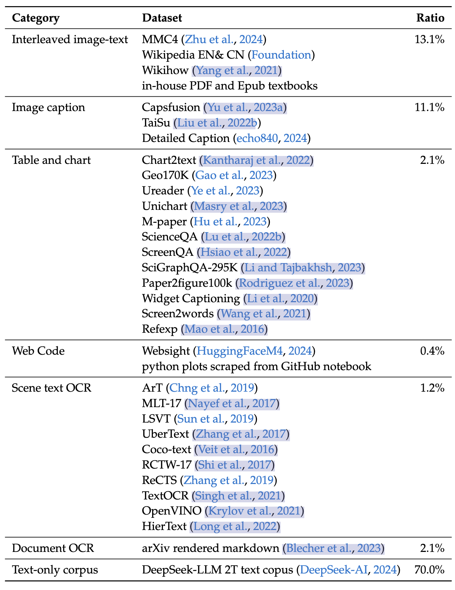

* **Supervised Fine-tuning阶段：**

#### 四、评测

1. 第二个训练阶段不同模态融合率的比较结果。过多的多模态数据（多模态：language=100%:0%）会导致 LLM 中语言能力的显著遗忘。合适的比率（多模态：language=70%:30%）可以有效缓解语言遗忘的问题，同时增强模型的多模态能力。前三个是多模态能力，后三个是大语言模型能力（PPL指标是[困惑度](https://zhuanlan.zhihu.com/p/651410752)）

* **第一个训练阶段扩展数据集**，然后应用监督微调。结果表明增加训练数据体积并不能在这个阶段提高性能，projection的容量本质上是受限的，这使得它无法捕获多模态任务所需的广泛知识。。

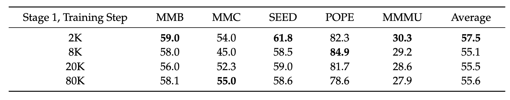

* **三个阶段训练的必要性**，与单独组合阶段 1 和阶段 3 相比，组合证明了**多模态预训练（stage2）的有效性**。第 2 阶段和第 3 阶段的组合略微落后于第 1 阶段和第 3 阶段的组合性能，表明**视觉语言适配器预热（stage1）阶段仍然有意义**

* **一个batch内是否混合语言和多模态数据，模态分组始终优于非分组**。

* **模态预热（stage1）**&#x7684;的性能比较结果。模态预热始终匹配或超过在训练阶段 2 的所有评估任务中没有模态预热的方法的性能（多模态：Language=60%:40%）

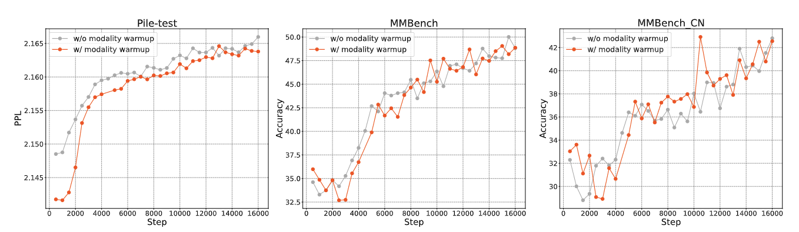

* **视觉语言适配器设计。两种方式：用于结合视觉特征的方法和 MLP 适配器的设计**

  1. 在序列连接之前沿图像的宽度和高度维度的视觉特征，为了保持序列长度不变，与在大多数指标中简单地沿嵌入维度合并相比，并没有取得更好的结果。

  2. 在适配器架构方面，采用混合策略更稳定并提高性能

### Fuyu-8B

[Fuyu-8B: A Multimodal Architecture for AI Agents](https://www.adept.ai/blog/fuyu-8b) （2023.10 AI公司Adept）

code：https://colab.research.google.com/github/nengelmann/Fuyu-8B

#### 一、Summary

**没有专门的图像编码器。**&#x56FE;像块直接线性投影到Transformer的第一层，绕过了嵌入查找，支持任意图像分辨率。只是像处理文本令牌序列一样处理图像token序列。我们去除了图像特定的位置嵌入，并按栅格扫描顺序输入尽可能多的图像令牌。为了告诉模型何时换行，只是使用一个特殊的图像换行字符\n。

#### 二、模型结构

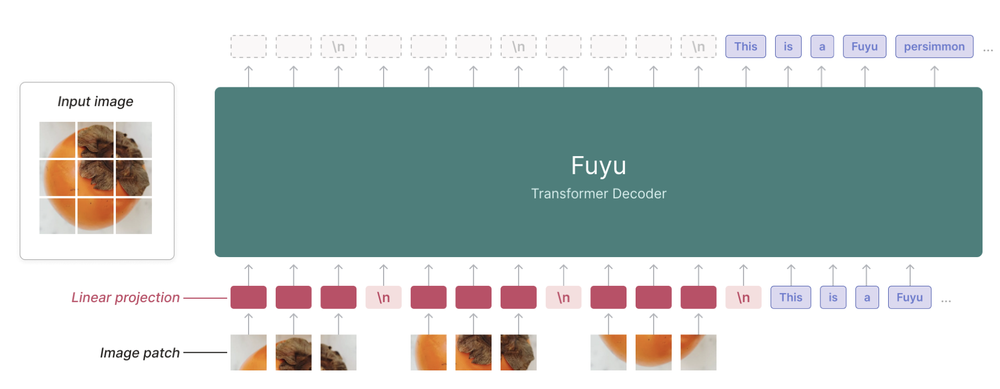

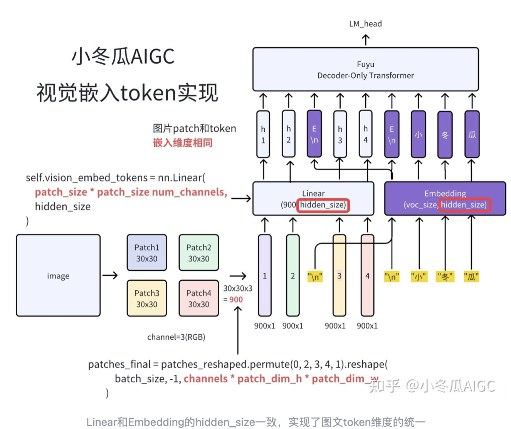

* Decoder-only transformer，没有图像编码器。图像块直接线性投影到transformer的第一层。

#### 三、数据

#### 四、评测

* 选择了四个最常用的图像理解数据集：VQAv2、OKVQA、COCO Captions和AI2D。VQAv2和OKVQA是自然图像问答数据集，COCO是一个字幕数据集，AI2D是一个涉及科学图表的多选数据集。我们将我们的模型与PALM-e、PALI-X、QWEN-VL和LLaVA 1.5进行比较。

### Video-LLaVA

[Video-LLaVA: Learning United Visual Representation by Alignment Before Projection](https://arxiv.org/abs/2311.10122) （2023.11 北京大学电子与计算机工程学院，鹏程实验室，中山大学计算机科学与工程学院，腾讯数据平台）

code：https://gitcode.com/PKU-YuanGroup/Video-LLaVA

#### 一、Summary

Video-LLAVA首先将图像和视频的表示对齐到统一的视觉特征空间中，并将图像和视频联合训练。由于视觉表示已经在投影之前对齐，我们使用共享投影层来映射LLM的统一视觉表示。**视频编码器和图像编码器是LanguageBind，由OpenClip的ViT-L/14 初始化，预对齐LLM的输入，减少不同视觉信号的表示之间的差距。共享投影层由 2 个全连接层组成，在通过共享投影层后，将统一的视觉表示输入LLM。**

#### 二、模型结构

**LanguageBind：**

除文本外的其他模态，采用24层vision transformer结构，1024-dimensional的token，patch size为14；使用OpenCLIP-large参数初始化

将LanguageBind方法扩展到多个（N个）模态的第一步是将数据处理成令牌序列。随后，参数将从OpenCLIP进行初始化。然后通过令牌屏蔽和LoRA微调来训练不同模态的编码器，同时保持语言编码器冻结。最后，将该模态与语言特征空间对齐。

对于语言编码器，研究人员使用了一个12层的transformer模型，维度为768，初始化来源于OpenCLIP。

* **训练**

&#x20;     给定一个文本输入XT和可视信号XV，输入信号编码成token序列，每批中的数据是图像和视频的随机组合。

&#x20;    通过最大化似然概率，该模型最终实现了多模态理解能力

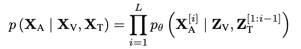

* **Understanding Training**

获取在广泛的图像/视频-文本对数据集中解释视觉信号的能力。**每个视觉信号对应于单轮对话数据 (Xq, Xa)**，其中 XT = Xq 和 Xa 是ground truth。这一阶段的训练目标是原始的自回归损失，模型学习观看视觉的基本能力。在这个过程中，我们冻结了模型的其他参数，**只训练投影层**

* **Instruction Tuning**

模型需要提供对应于不同指令的响应。这些指令通常涉及更复杂的视觉理解任务，而不仅仅是描述视觉信号。对话数据（X1q, X1a, · · · , XNq , XNa）由多轮组成，**训练投影层和LLM**

#### 三、数据

* 视觉理解:LAION-CC-SBU(图像-文本对)，Valley 子集(视频-文本对)---单轮对话

* 指令微调：LLaVA的图像-文本数据集Video-ChatGPT（视频-文本数据集）---多轮对话

#### 四、评测

1. **&#x20;投影前视频与图像对齐，**&#x7528;相同尺度的 MAE 图像编码器替换图像编码器并保留 LanguageBind 视频编码器

   1. 投影前对齐对图像的影响

   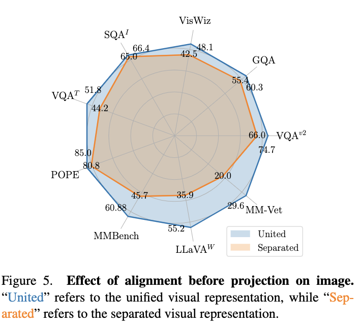

   * 投影前对齐对视频的影响，由于用MAE编码器替换图像编码器，在LLM对视觉表示的初始学习过程中，视频特征和图像特征不再统一。

   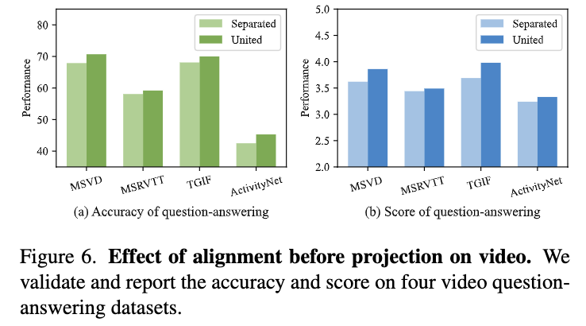

2. **联合图像和视频训练的影响**

   1. 对视频的影响，\* 表示没有在图像上训练，图像和视频的联合训练有助于LLM对视觉表示的理解。

   

   * 对图像的影响,Video-LLAVA 在无法回答的问题和数量任务中优于 LLAVA，这表明使用视频的联合训练减轻了图像中的物体幻觉，增强了对图像中数值信号的理解。

   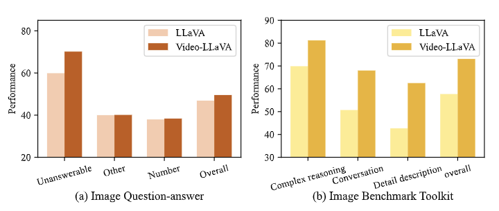

### MiniGemini

[Mini-Gemini: Mining the Potential of Multi-modality Vision Language Models](https://arxiv.org/abs/2403.18814)(2024.03 香港中文大学、SmartMore)

code：https://github.com/dvlab-research/MiniGemini

#### 一、Summary

**从三个方面缩小性能差距，即高分辨率视觉token、高质量数据和VLM引导的生成。**

利用双视觉[编码器](https://so.csdn.net/so/search?q=%E7%BC%96%E7%A0%81%E5%99%A8\&spm=1001.2101.3001.7020)来提供低分辨率的和高分辨率的视觉嵌入；patch信息挖掘以在高分辨率区域和低分辨率视觉query之间进行patch-level挖掘；LLM用于理解和生成。构建了一个高质量的数据集，使用高分辨率图像，**LR使用CLIP预训练的VIT，HR使用LAION 预训练 ConvNext，LLM 用于文本与图像的理解和生成，Vicuna、Hermes-2等**

#### 二、模型结构

1. **双视觉编码器：用双视觉编码器来提供低分辨率的视觉嵌入和高分辨率候选，在推理过程中，低分辨率编码器生成视觉query(N\*C)，而高分辨率编码器提供候选key(N\*M²\*C)和value。**

2. **patch信息挖掘和视觉token扩展**

   

   **patch信息挖掘**，**通过交叉注意力（保持 token 数不变）将高分辨率信息注入到视觉token中**，低分辨率图像作为quer&#x79;**(N\*C)，**&#x9AD8;分辨率图像作为ke&#x79;**(N\*M²\*C)**&#x548C;value。

   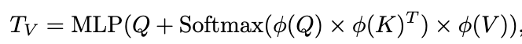

   **视觉token扩展，**&#x5C06;低分图的2倍分辨率图片，等分四分，也经过低分视觉编码器编码，平铺后和原本的Visual Embedding作Concat得到Tv（5N）

3. **扩展应用：集成VLM与生成模型，图像和文本生成**，使用挖掘的视觉token和输入文本token，我们将它们连接为 LLM 的输入，用于自回归生成

* **训练**

  * 预训练阶段：训练MLP

  * 指令微调：训练MLP+LLM

#### 三、数据

1. 预训练阶段（1.2M）

   1. 来自 LLAVA 过滤 CC3M 数据集 的 558K 图像标题对

   2. 来自 LLAVA 数据集的 695K 采样 GPT-4V 响应字幕

2. 指令微调阶段（1.5M）

   1. &#x20;LlaVA数据集中抽取 643K 单轮和多轮对话（不包括 21K TextCaps数据）， ShareGPT4V ， 10K LION-GPT-4V caption， ALLAVA 数据集的 700K GPT-4V 响应指令对， LIMA和 OpenAssistant2的 6K 纯文本多轮对话。

   2. 增强 OCR 相关能力，进一步收集了 28K QA 对，其中包括 10K DocVQA 、4K ChartQA 10K DVQA 和 4K AI2D数据

3. 生成相关数据， 用于文生图场景（扩展应用）（13k）

   1. Simple instruction re-caption的数据集主要占8K，使用GPT-4 Turbo对来自LAION-GPT-4V的8k张图像文本对，让GPT4将用户输入的短输入转换成适合Stable Diffusion的target caption；

   2. In-context prompt generation的数据集主要占5K，使用来自于LIMA和OpenAssistant2的高质量真实世界上下文对话的数据，让GPT4生成适合上下文对话图像生成的提示词；

   

#### 四、评测

* **patch信息挖掘的影响。**&#x48;R 图像的更大视觉编码器对候选质量的贡献更大，并且模型具有提高输入图像分辨率的功能，考虑到有效性和效率之间的平衡，选择ConvNeXt-L作为默认的HR视觉编码器

* **高质量数据的影响和token扩展的有效性。**&#x5F53;增加 LR 和 HR 输入分辨率时，该模型在所有基准测试中都取得了显著的增益。

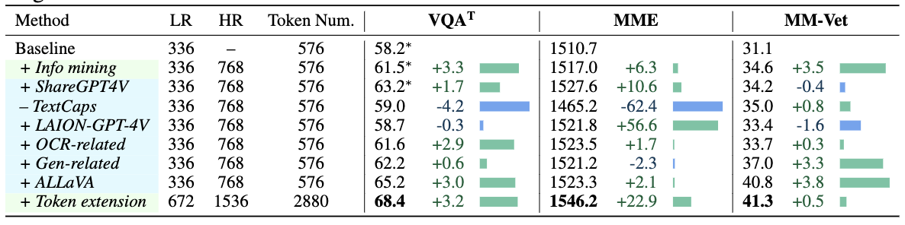

### InternVL

[InternVL: Scaling up Vision Foundation Models and Aligning for Generic Visual-Linguistic Tasks](https://arxiv.org/abs/2312.14238) (2023.12 上海人工智能实验室OpenGVLab、南京大学、香港大学、香港中文大学、清华大学、中国科学技术大学)

code：https://github.com/OpenGVLab/InternVL

#### 一、Summary

轻量级的contact层，参数规模的不一致、表示的不一致且连接效率低下。使用大规模的视觉基础模型 InternViT-6B（224\*224）， LLM 初始化的语言中间件 **QLLaMA 对齐**，通过**渐进式对齐策略**确保训练稳定性，该策略在大规模噪声图像-文本数据上发起对比学习，随后过渡到细粒度数据上的生成学习。

#### 二、模型结构

1. **训练**

   1. **视觉语言对比训练**

采用LLAMA-7B编码文本，并使用InternViT-6B提取视觉特征，在批次中图像-文本对的相似度得分上最小化对称交叉熵损失。

2. **视觉语言生成训练**（进一步将特征空间与LLM对齐）

将 InternViT-6B 与 QLLaMA 连接起来，并采用生成训练策略。保持 InternViT-6B 和 QLLaMA 冻结，并且只用过滤的高质量数据**训练新添加的可学习查询和交叉注意力层**。遵循BLIP-2的损失函数，该阶段的损失被计算为三个分量的总和：图像-文本对比(ITC)损失、图像-文本匹配(ITM)损失和基于图像的文本生成(ITG)损失。

* **监督微调**

在创建多模态对话系统的InternVL中，通过MLP层将其与现成的LLM解码器(如Vicuna或InternLM)连接起来，并进行监督微调(SFT)。由于 QLLaMA 和 LLM 的特征空间相似，即使冻结 LLM 解码器，我们也可以实现稳健的性能，**选择仅训练 MLP 层或 MLP 层和 QLLaMA**。这种方法不仅加快了SFT过程，而且保持了llm的原始语言能力

* 四种不同的任务

  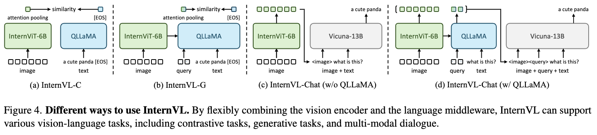

  1. **视觉感知任务**，InternVL的视觉编码器，例如InternViT-6B，可以作为视觉任务的主干。给定一个输入图像，我们的模型可以为密集预测任务生成特征图，或使用全局平均池化和线性投影进行图像分类。

  2. **对比任务**，引了两种推理模式：InternVL-C 和InternVLG，使用视觉编码器或InternViT 和 QLLaMA 的组合来编码视觉特征。具体来说，将注意力池应用于实习生的视觉特征或 QLLaMA 的查询特征，以计算全局视觉特征If 。此外，通过从 QLLaMA 的 \[EOS] 标记中提取特征，将文本编码为 Tf。通过计算 If 和 Tf 之间的相似度分数，我们支持各种对比任务，例如图像文本检索。&#x20;

  3. **生成任务，**&#x4E0E; QFormer 不同，QLLAMA 由于其放大的参数，本质上具有良好的图像字幕能力。QLLaMA 的查询重新组织了 InternViT-6B 中的视觉表示，并作为 QLLaMA 的前缀文本播放。随后的文本标记按顺序逐个生成。

  4. **多模态对话，**&#x5F15;入了 InternVLChat，利用 InternVL 作为视觉组件与 LLM 连接。为此，我们有两种不同的配置。一种选择是独立使用 InternViT-6B，另一种方法是同时采用完整的 InternVL 模型。

#### 三、数据

1. 第一二阶段数据，过滤掉一些极低质量的数据

* 第三阶段数据

#### 四、评测

* **InternViT-6B&#x20;**&#x4E2D;超参数的比较，模型深度 {32, 48, 64, 80}、头部维度 {64, 128} 和 MLP 比率 {4, 8} 的变化，综合考虑准确性、推理速度和训练稳定性，最终选择的模型用灰色标记。

* **验证了 InternVL 的特征表示与LLM 的一致性和connnector的有效性**

### InternVL1.5

[How Far Are We to GPT-4V? Closing the Gap to Commercial Multimodal Models with Open-Source Suites](https://arxiv.org/abs/2404.16821) (2024.04 上海AI lab、商汤科技、清华大学、复旦大学、香港中文大学)

code:https://github.com/OpenGVLab/InternVL

#### 一、Summary

引入了 InternVL 1.5，实现了大规模 VFM-InternViT-6B的持续学习方法，为了捕获全局上下文，我们还包括缩略图视图。**通过 MLP 投影仪将预训练的 InternViT-6B  与 InternLM2-20B 相结合。在这里，我们使用一个简单的pixel shuffle将视觉标记的数量减少到四分之一**

#### 二、模型结构

1. &#x20;**强视觉编码器**

   1. **InternViT-6B-448px-V1.2：**&#x53D1;现第四到最后一层的特征对于多模态任务表现最好，因此我们**直接丢弃了最后三层的权重，将 InternViT-6B 从 48 层减少到 45 层。将 InternViT-6B 的分辨率从 224 增加到 448**，

   2. &#x20;**InternViT-6B-448px-V1.5：训练图像的分辨率从固定的448×448扩展到动态448×448**，基本patch大小为448×448

2. **动态高分辨率：适应输入图像的不同分辨率和纵横比**

   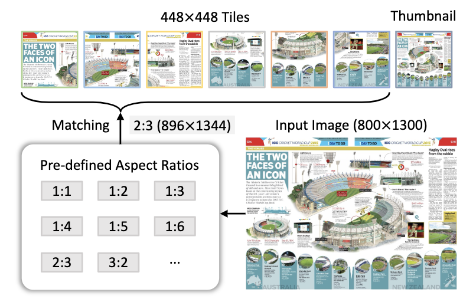

   1. **动态纵横比匹配**

   **从一组预定义的纵横比中动态匹配最佳纵横比**。该集合包括由 1 到 12 个patch形成的所有 35 种可能纵横比组合，例如 {1:1, 1:2,2:1,3:1,。.., 2:6}。在匹配过程中，**对于每个输入图像，我们计算其纵横比，并通过测量绝对差异将其与 35 个预定义的纵横比进行比较。**

   * **图像分割和缩略图**

   一旦确定了适当的纵横比，将调整大小的图像划分为 448×448 像素的patch，**还包括整个图像的缩略图来捕获全局上下文（448×448）**，在训练过程中，视觉标记的数量从256到3,328不等。在测试过程中，patch的数量最多可以增加到40个，有10,496个视觉tokens。

3. 训练

   * vit Pre-training：用Yi-34B训练intervit1.2-448

   * &#x20;Pre-training：训练vit+mlp

   * SFT：训练vit+mlp+LLM

#### 三、数据

1. 预训练数据

* 微调数据

* 高质量双语数据集翻译pipeline：利用 LLM或 GPT-3.5 将英语数据集转换为另一种语言（例如中文），保持双语标记的一致性和准确性{language} 表示目标语言，{text} 表示原始英文文本，{translation results} 表示翻译文本

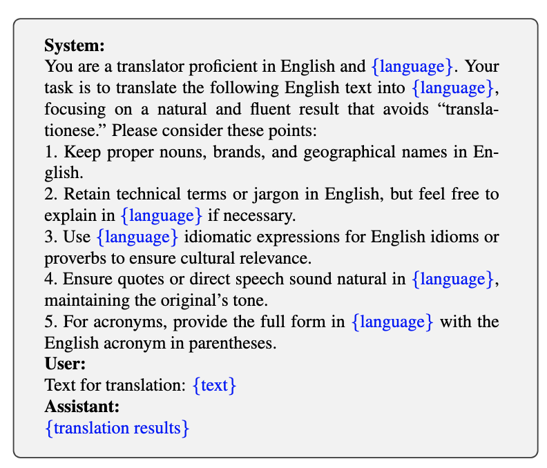

#### 四、评测

1. **不同图像分辨率的InternVL 1.5性能比较。**&#x5E76;非所有任务都需要高分辨率。具体来说，与 OCR 相关的任务，例如 DocVQA、InfoVQA、TextVQA 和 OCRBench，受益于更高的分辨率。然而，AI2D、MMMU、MMBench和HalconlusionBench等任务更高分辨率下性能略有下降。总体而言，I**nternVL 1.5 对动态分辨率具有很强的鲁棒性。它可以根据每个任务的具体要求调整分辨率，确保高分辨率有益。**

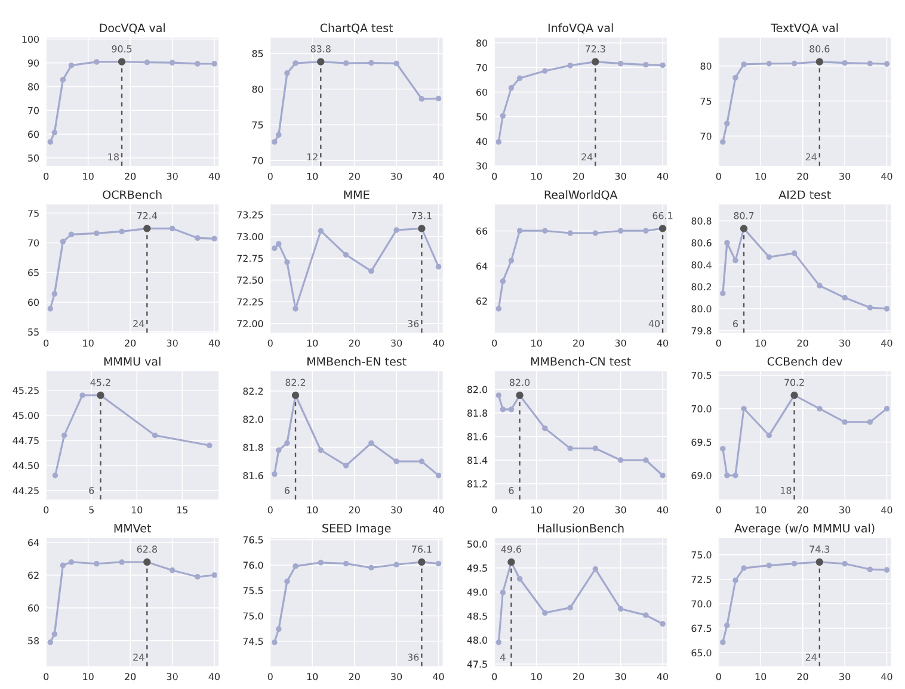

### InternVL 2.0

无论文，blog：https://internvl.github.io/blog/2024-07-02-InternVL-2.0/

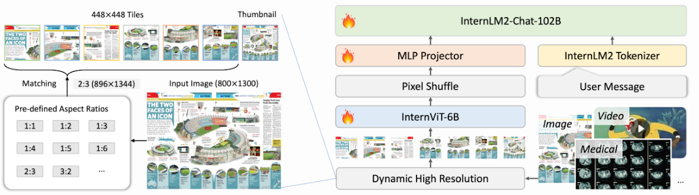

#### 一、改进点：

（1）渐进式训练：引入渐进式对齐训练策略，第一个与LLM对齐的视觉基础模型。通过采用渐进式训练策略，模型从小到大扩展，数据从粗到细细化，我们以相对较低的成本完成了大模型的训练。这种方法在有限的资源下展示了出色的性能。（这部分应该还是internVL 1.0和1.5的内容，对Vit先进行大规模clip类pretrain，再进行生成式pretrain，以及从低分辨到高分辨率到动态高分辨率）；

（2）多模态输入：支持包括文本、图像、**视频和医疗数据**的多种输入方式；

（3）多任务输出：在我们最近的工作VisionLLMv2的支持下，我们的模型支持各种输出格式，如**图像、边界框和掩码**，展示了广泛的多功能性。通过将MLLM与多个下游任务解码器连接，InternVL2可以推广到数百个视觉语言任务，同时实现与专家模型相当的性能。

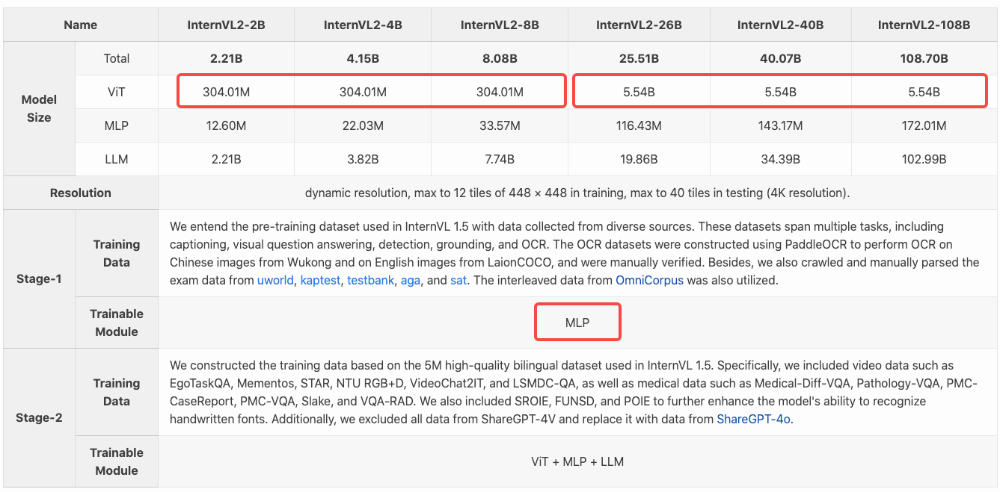

#### 二、数据：

* pretrain数据：相比internVL 1.5，增加了考试数据（[uworld](https://uworld.com/), [kaptest](https://www.kaptest.com/act), [testbank](https://testbank.zip/), [aga](https://www.aqa.org.uk/), and [sat](https://satsuite.collegeboard.org/sat)）和图文交错数据 [OmniCorpus](https://github.com/OpenGVLab/OmniCorpus)。

* sft数据：基于interVL 1.5使用的5M sft数据，以下几个改动：

  * 增加了视频数据（EgoTaskQA, Mementos, STAR, NTU RGB+D, VideoChat2IT, and LSMDC-QA）

  * 增加了医疗数据（Medical-Diff-VQA, Pathology-VQA, PMC-CaseReport, PMC-VQA, Slake, and VQA-RAD.）

  * 增加了手写体识别数据（SROIE, FUNSD, and POIE）

  * 把所有ShareGPT-4V数据换成了[ShareGPT-4o](https://huggingface.co/datasets/OpenGVLab/ShareGPT-4o)

#### 三、指标：

从网站开源的情况看，pro应该是一个至少大于108B的模型

### InternOmni

暂无paper，blog：https://internvl.github.io/blog/2024-07-27-InternOmni/

一、**数据：**

我们精心收集了涵盖常见场景和文档图像的高质量音频-图像数据集，该数据集用于**对图像进行音频问答**训练，提高模型在音频问答任务中的性能。

&#x4E8C;**、训练：**

* 第一阶段：训练Audio MLP + Whisper编码器？。为了确保音频数据的正确对齐，使用约26M数据进行训练，包括GigaSpeech、Common Voice、Libriheavy和WENETSPEECH等数据集。使用的格式是：**音频+文本=>文本**。在这个阶段，我们冻结ViT及其MLP，只训练音频相关组件。

* 第二阶段：训练Audio MLP。我们在大约1.9M开源的图像-文本指令数据集上进行训练，**用音频替换原始文本**，包括TextVQA、GQA、OKVQA、ALLAVA等。使用的格式是**音频+图像=>文本**。在这个阶段，我们冻结了ViT和Whisper编码器，只保留用于对齐audio MLP层。

（是基于internVL 2.0的后训练，并非原生omni大模型，从数据和训练来看，基本可以判断只是通过E2E完成了ASR的能力）

三、**指标：**

和internVL指标一样，应该是LLM没有参与训练。

### MiniCpm-V 2.0

blog：https://github.com/OpenBMB/MiniCPM-V（2024.04）

code：https://github.com/OpenBMB/MiniCPM-V

#### 一、Summary

**MiniCPM-V 2.0**

* MiniCPM-V 2.0 是 **第一个通过多模态 RLHF 对齐的端侧多模态大模型**（借助 [RLHF-V](https://rlhf-v.github.io/) \[CVPR'24] 系列技术）。

* 可以接受 **180 万像素的任意长宽比图像输入**（基于最新的[LLaVA-UHD](https://arxiv.org/pdf/2403.11703.pdf) 技术）

* 图像编码表示方面，我们**基于 perciever resampler 将每个图像压缩表示为 64 个 token**，显著少与其他基于 MLP 架构的多模态模型的 token数量（通常大于 512）。

* 提供**领先的中英双语多模态能力支持**。 该能力通过 [VisCPM](https://arxiv.org/abs/2308.12038) \[ICLR'24] 论文中提出的多模态能力的跨语言泛化技术实现。

#### 二、模型结构

**该模型基于预训练的SigLip-400M 和 [MiniCPM-2.4B](https://github.com/OpenBMB/MiniCPM/)构建，通过perceiver resampler(在交叉注意中使用可学习的潜在查询作为Q，而图像特征展开并与Q连接，作为交叉注意中的K和V)连接，该模型可以接受图像和文本输入，并输出文本内容**

* MiniCpm-V1.0 训练

  * 预训练阶段: 使用 300M 中英图文对数据进行视觉和语言基本概念的对齐

  * 指令微调阶段: 一共使用了 6M 多任务问答数据、1M 纯文本数据、1M 多模态对话数据进行指令微调

* MiniCpm-V2.0 训练数据未知

#### 三、数据

#### 四、评测

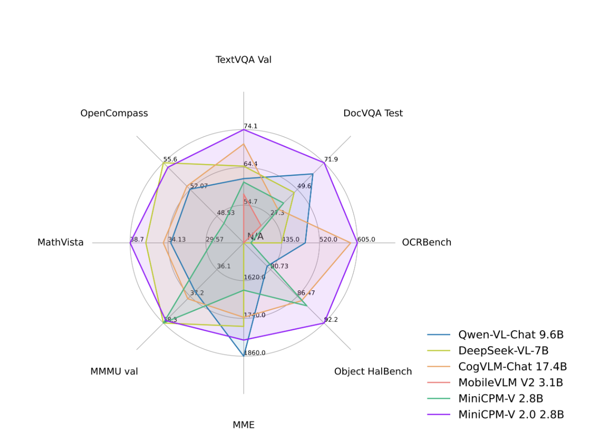

### MiniCPM-Llama3-V 2.5 -8B

blog：https://github.com/OpenBMB/MiniCPM-V（2024.05）

code：https://huggingface.co/openbmb/MiniCPM-Llama3-V-2\_5/tree/main

#### 一、Summary

视觉端用的siglip，切的图不用非得是正方形

#### 二、模型结构

1. 该模型包括三个关键模块：视觉编码器、压缩层和 LLM。使用 SigLIP SoViT-400m/14 作为视觉编码器。然后通过压缩层压缩视觉标记，压缩层采用具有一层交叉注意的感知器重采样结构

2. **每个子图**的token&#x7528;**\<slice>**&#x548C;**<\slice>**&#x5206;隔，llava-uhd用“，”分&#x9694;**，“\n”**&#x4F5C;为**行标**。

3. 切图：

   1. **确定切片数量**（设定最大值）：给定一个高分辨率图像（宽度  $$W_I$$,高度 $$H_I$$）和一个预训练ViT的标准分辨率（宽度 $$W_v$$和高度 $$H_v$$）

   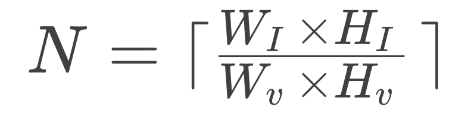

   * 选择最佳分区，**每个子图更接近vit标准分辨率长宽比**， $$C_N=\left \{ (m,n)|m*n=(N-1) or N or (N+1) \right \} $$

   

   

   * 按照网格切割，确保子图面积小于等于 $$H_v*W_v
     $$ ：

     * 面积大于 $$H_v*W_v$$（448\*448）时，进行缩小，尽量保持子图长宽比，能被patch\_size整除；

   $$h=H_V/(\sqrt{\frac{w_I}{h _I} } )$$

   $$w=h*\frac{w_I}{h_I}$$

   * 面积小于 $$H_v*W_v
     $$（448\*448）时，只需能被patch\_size整除即可

#### 三、训练

1. **预训练**

   1. **Stage 1：训练连接器，224×224**，**随机选择 200M 图像caption**数据；

   2. **Stage 2：扩展分辨率**，**448×448**。**200M 图像caption**数据，**训练整个视觉编码器**；

   3. **Stage 3：任何纵横比的高分辨率输入，**&#x6570;据包括**图像caption和OCR**，**训练连接器和视觉编码器**。

   4. **caption重写。**&#x4F4E;质量的数据会导致训练动态不稳定，引入一个低质量字幕重写的辅助模型，利用图像标题重写问答对。利用 GPT-4来生成少量样本，用于微调 LLM 以进行重写任务。

   5. **多语言泛化。**&#x591A;模态能力可以通过**强大的多语言 LLM&#x20;**&#x67A2;轴有效地跨语言泛化。只在英文和中文多模态数据上预训练模型，经过多种语言微调也能取得很好的效果。

   

2. **SFT：训练整个模型**，主要利用人类标注或 GPT-4 等强模型注释的高质量数据集。

   1. **多语言泛化。2.5中**将 **[Cauldron](https://hf.co/datasets/HuggingFaceM4/the_cauldron)(丹鼎)**&#x6570;据集中的 2M 数据集成到多模态知识增强中，在 36 种语言上集成了 90K 多语言数据。

   

#### 四、数据

1. 预训练数据

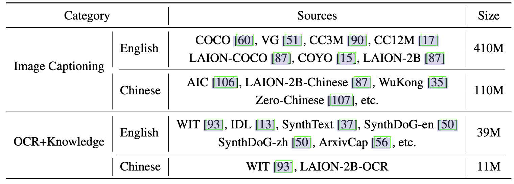

* SFT数据：第 1 部分**相对较短**的传&#x7EDF;**&#x20;QA/captioning** 数据集组成；而第 2 部分具有**复杂交互的长响应**的数据集。在SFT期间，这**两个部分数据被连接起来并依次输入到模型中**。

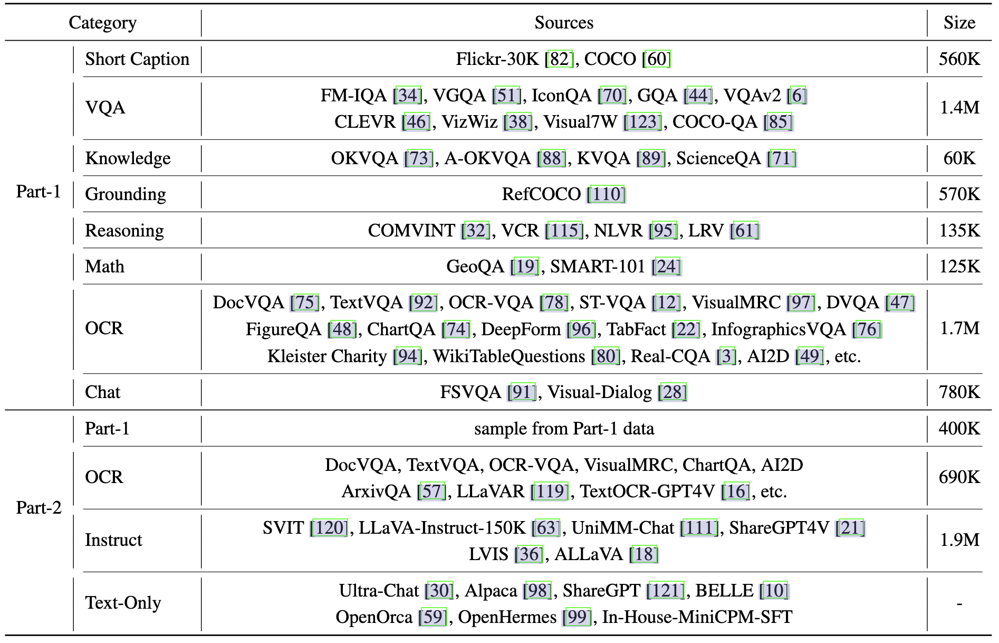

#### 五、多模态能力

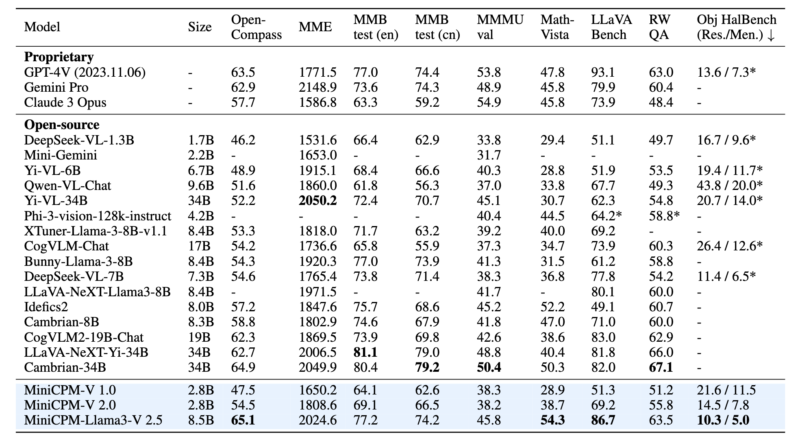

* OCR能力

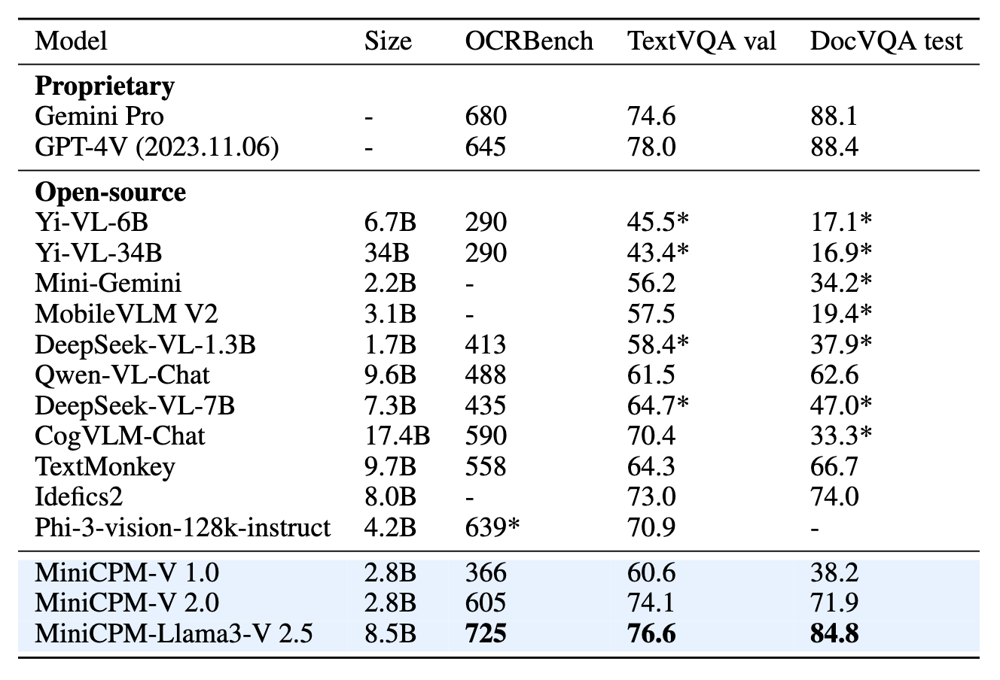

### MiniCPM-Llama3-V 2.6

code：https://huggingface.co/openbmb/MiniCPM-V-2\_6/tree/main

### [interLM-Xcomposer](https://github.com/InternLM/InternLM-XComposer)

[InternLM-XComposer: A Vision-Language Large Model for Advanced Text-image Comprehension and Composit](https://arxiv.org/abs/2309.15112) (2023.09 上海AI lab)

code：https://github.com/InternLM/InternLM-XComposer/tree/main/InternLM-XComposer-1.0

#### 一、Summary

视觉语言大型模型，**可实现高级图像-文本理解和组合**。**视觉编码器采用 EVA-CLIP** ，图像被调整为224 × 224，**基于BLIP2预训练的配备交叉注意力层的 BERTbase作为Perceive Sampler，将 224x224 输入总共 257 image token （stride 14）减少为 64 个，LLM为InternLM-Chat-7B**。

#### 二、模型结构

* 训练

  * **预训练阶段**对齐视觉和语言知识（ 感知器和 llm 学习率是不一样的，感知器学习率更大）

    **视觉编码器被冻结，优化感知采样器和大型语言模型**，模型的训练目标集中在下一个token的预测上，利用交叉熵损失函数。

  * **监督微调阶段**激发不同的模型能力（多任务训练和指令调整，两阶段学习率不一样）

    **多任务训练和指令微调：冻结LLM，使用低秩适应 (LoRA) 来增强架构以进行微调过程，训练感知采样器**

* **交错图像-文本组合pipeline/In-house data构造**

  1. **文本生成：**&#x5229;用 GPT-4 根据文章生成不同的指令，使我们的模型能够根据特定指令生成基于文本的文章。

  2. **图像定位和字幕**。使用 GPT-4 生成caption，GPT-4 提供基于文本的文章和图像位置，并指示为每个与总体主题和概念一致的图像位置生成标题。

  3. **图像检索和选择**。基于这些生成的图片 caption，从**数据池**里面通过 CLIP 图文相似度找出最相关的 topk 张图

  4. **将这些图片以及上下文都丢给模型，**&#x6A21;型通过考虑文章中前面的文本和先验图像来选择图像。最终就构成了一个排版比较好看的图文并茂文章

  我们的模型还经过训练，可以根据文章和图像位置从候选列表中选择gt图像以增强能力。训练数据直接由交错文本图像文章构成，并从图像存储库中随机选择否定候选。

#### 三、数据

1. 预训练数据（引入大量数据）：大规模的图像-文本对和交错的图像-文本数据（1.1 亿张图像和 770 亿个文本token），同时，从 InternLM 的预训练数据集中抽样出的约 100 亿个文本 token 被纳入以维护模型的语言能力

   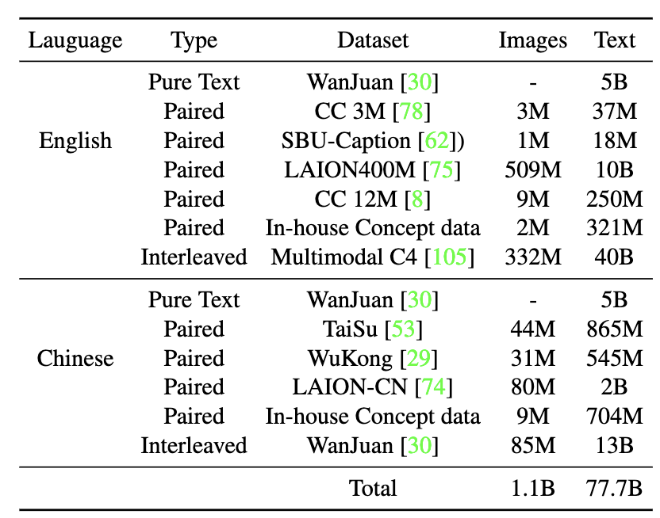

2. 监督微调数据

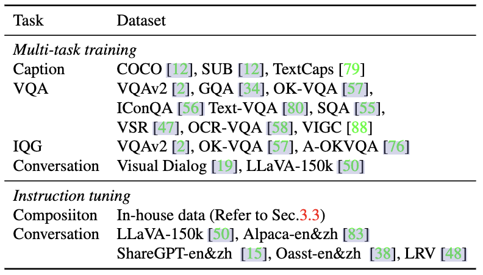

对于每张图像有多个问题的 VQA 数据集，将它们构建为具有随机排序问题的多轮对话，从而显着提高 SFT 的效率

**指令微调**：利用纯文本对话语料库和LLAVA-150k等数据进行基于指令的调优，并利用LRV数据集来减轻幻觉。

#### 四、评测

1. **预训练阶段使用的概念特定数据**

* **交错图像-文本组合pipeline的最后一步图像检索和选择的有效性。**&#x4F7F;用人工选择的图像作为基本事实，使用检索相似度最高的图像作为“Top-1”baseline，我们的模型选择的图像更符合人类的偏好。

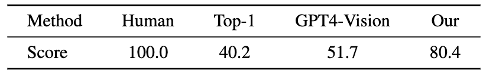

* **不同可学习组件在多任务监督微调阶段的影响。**&#x611F;知器采样器对多任务学习至关重要，这对大多数基准都有重大影响。对于LLM中的LoRA，注意力和FFN部分对于实现更好的性能也很重要。

* **LLM的选择**

### InternLM-XComposer2

[InternLM-XComposer2: Mastering Free-form Text-Image Composition and Comprehension in Vision-Language](https://arxiv.org/abs/2401.16420) （2024.01 上海人工智能实验室，香港中文大学，商汤科技）

code：https://github.com/InternLM/InternLM-XComposer

#### 一、Summary

InternLM-XComposer专注于使用 MLLM 进行文本图像合成和理解，但仅限于基于标题生成文本图像文章。InternLM-XComposer2使用部分 LoRA和高质量多样化的数据发现。**视觉编码器为OpenAI CLIP 预训练的ViT-L-14-336 ，大语言模型为 InternLM-2 ，projecter 层又换回了 MLP ，**（不少实验也证明 MLP 确实比 Perceive Sampler 好一些），这两个组件通过创新的**针对视觉token的Partial LoRA 模块**相互连接，旨在将知识从新模态对齐到 LLM

#### 二、模型结构

1. Partial-LoRA

* 部分低秩适应：结合了一个低秩适应，用于视觉token部分。W0和B0是LLM块中的每个线性层L0的权重矩阵和偏置，WB和WA是对应的 Parital LoRA 包含的两个低秩矩阵

* 训练

  * **预训练阶段**，**冻结LLM，训练视觉编码器和 Partial LoRA ，**&#x4EE5;使视觉 token 与 LLM 对齐，训练的过程和 v1 版本有点区别。v2 里面 vit 是放开训练的，但是 LLM 是固定的，并且 vit 采用的是 layer-wise learning rate (LLDR) decay strategy，作者说这样可以保留 vit 原始能力

    * **一般语义对齐**，预训练阶段的指令：Describe this image briefly/in detail.

    * **世界知识对齐，使用构建的概念数据集，**&#x91C7;用了更广泛的指令：Tell me something about this image.

    * **视觉能力增强**，OCR, 目标定位(grounding), 理解结构化图像 (charts, tables)

  * **监督微调阶段，共同微调视觉编码器、LLM 和 Partial LoRA，**&#x5E76;且每个组件都有自己的独特学习策略，vit 还是用的是 layer-wise learning rate (LLDR)，llm 则是线性学习率策略，固定缩放因子，可以缓慢更新 LLM。

    * **多任务训练，**&#x6570;据集来自各种来源。

    * **自由形式的文本-图像组合**。纯文本对话语料库和视觉-语言对话的数据

    **自由形式的文本-图像组合SFT阶段将图像输入分辨率下采样到224x224**。

#### 三、数据

1. 预训练数据集

Concept Data：从 InternLMXComposer 中使用的概念数据仔细过滤的

* 监督微调数据集

  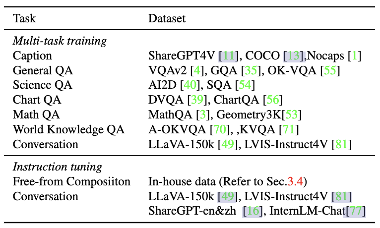

  * &#x20;**Free-form Text-Image Composition&#x20;**：最后的指令微调阶段， Free-form Text-Image Composition 数据进行了重新组织，文本内容和视觉元素以灵活且不受限制的方式的组合。在四个关键维度上收集了广泛的高质量和多样化的内部数据：不同的写作风格、灵活的文本编辑(例如重写的例子)、复杂指令、定制化材料。在生成文本内容后识别合适的位置进行图像插入，遵循InternLM-XComposer，不同的是当用户提供自己的图像材料时，这些图像材料用于插入，而不是*依赖于检索到的图像。*

  * 作者还观察到，具有高分辨率图像输入对于文本图像合成不是必需的。因此将 Free-form Text-Image Composition 数据训练时候输入是 224x224。

#### 四、评测

* **评估模型的写作能力，**&#x521B;造力 (C)、丰富度 (R)、用户需求填充 (UDF) 和逻辑连贯性 (LC)。

  * 当在没有GPT-4参考答案的情况下进行比较时，我们的方法总体得分为6.24。

  * 使用 GPT-4 参考进行评估，我们的方法也保持了强大的性能。

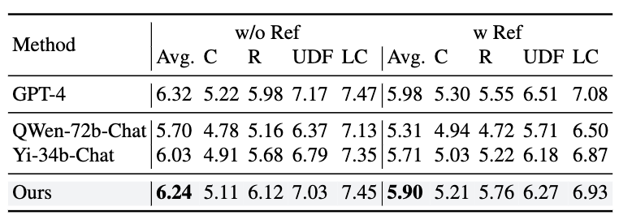

### InternLM-XComposer2-4KHD

[InternLM-XComposer2-4KHD: A Pioneering Large Vision-Language Model Handling Resolutions from 336 Pix](https://arxiv.org/abs/2404.06512) （2024.04上海人工智能实验室，香港中文大学，商汤科技，清华大学）

code：https://github.com/InternLM/InternLM-XComposer

#### 一、Summary

将 LVLM 分辨率能力提高到 4K HD (3840×1600) 及以上，支持从 336 像素到 4K 标准的广泛不同分辨率的范围，同时基于预训练的视觉转换器 (ViT) (336 × 336) 自动改变patch计数和配置布局，动态训练分辨率从 336 像素到 4K 标准。**模型设计遵循InternLM-XComposer2的设计，包括一个轻量级的视觉编码器OpenAI ViT-Large/14，大型语言模型InternLM2-7B和Partial LoRA，以实现高效的对齐**

#### 二、模型结构

1. **高分辨率输入处理**

   

   * **动态图像分区**

   输入图像在**保持长宽比**的情况下，被**随机放大到介于输入面积和最大面积**（不超过55x336x336，等价于3840 x1617分辨率）的一个中间尺寸。随后，图像**被自动切块成多个336x336的区域**，分别抽取视觉特征。给定一个最大patch数 H，大小为 \[h, w] 的图像 x 被调整大小并填充到大小为 \[ph × 336, pw × 336] 的新图像 ^x 。这个过程受到以下约束：

   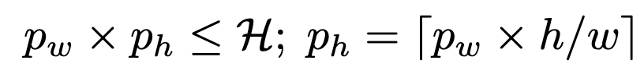

   * **全局-局部格式**

   **第一个是全局视图**，其中图像被调整为固定大小（在我们的例子中，336 × 336），提供宏观理解。

   **第二个是局部视图，**&#x4F7F;用动态图像分区策略将图像分割成patch，并提取特征，在一个**简单的token合并**过&#x7A0B;**(沿通道维度连接四个相邻标记)**&#x4E4B;后，特征图被**展平**为最终的局部特征。

   * **图像 2D 结构换行指示符**

   **展平之前在图像特征的每一行的末尾引入了一个可学习的新行 ('\n') 标记**。最后，我们**将全局和局部视图连接起来，在它们之间插入一个特殊的'separate'标记来区分两个视图**

2. 训练

   * 预训练

   **LLM被冻结，训练视觉编码器和partial LoRA，**&#x9884;训练数据专注于高分辨率（336\*336）和结构图像理解，对于动态图像分区策略，使用“HD-25”。对于每个图像或patch，通过简单的合并操作，图像令牌数减少到1/4（避免太多token，训练会炸）。我们**通过通道维度将相邻的 4 个token连接成一个新token**，然后通过 MLP 将其与 LLM 对齐。**‘separate’和 ‘\n’标记是随机初始化的**。

   * 监督微调

   **引入了一种混合分辨率训练策略**，**微调视觉编码器、LLM 和 Partial LoRA**。

   * 对于需要**高分辨率**的任务，我们在训练期间采用“**HD-55**”设置。这允许 4K图像输入，无需额外的图像压缩。

   * 对于**其他任务**，我们实现了动态分辨率策略。**图像大小调整为落在其原始大小和由“HD25”设置指定的大小之间的范围内**。

#### 三、数据

1. 预训练阶段数据

* 监督微调阶段数据

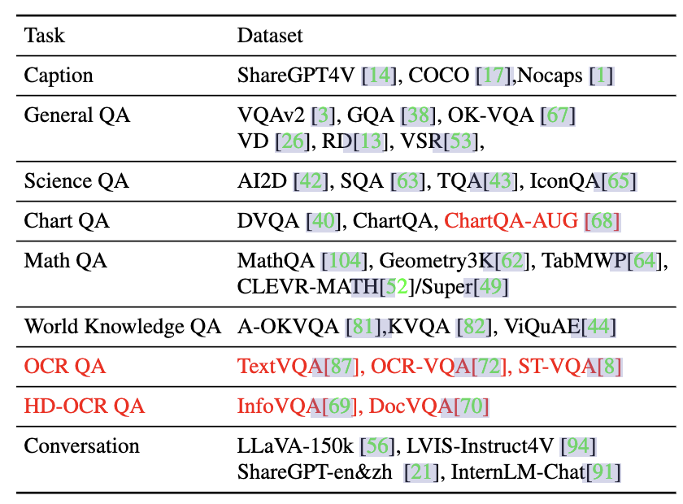

**HD-OCR QA 任务**：允许输入 4K（3840×1600）图像而不需要额外的图像压缩。

#### 四、评测

1. **训练分辨率的影响,高分辨率训练对于HD-OCR任务至关重要。**

   * **HD-OCR任务（infoVQA,DocVQA）**，随着分辨率的增加，性能继续提高，即使在 4KHD 设置中也没有观察到饱和。

   * &#x5728;**&#x20;其他OCR&#x20;**&#x76F8;关的任务上，**分辨率增加的性能增益相对较小。**

   * 在**感知**相关任务上，**性能在分辨率上饱和**。

* **推理分辨率的影响。较高的推理分辨率使文本相关任务更好**

增大推理分辨率，ChartQA 的结果始终会降低，这可能是由于模型在改变分辨率时对图表结构感到困惑。分辨率对感知相关基准的影响似乎非常小。

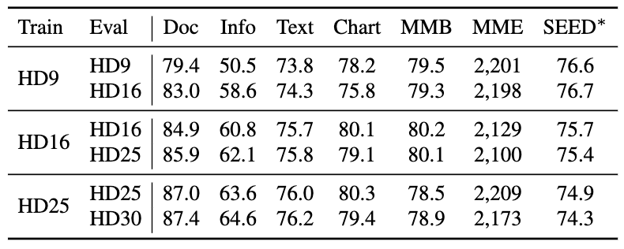

* **Global-View 在输入中的影响**。全局视图提供了对图像的一般宏观理解，从局部视图里很难得到

* **图像特征中行标“\n”的影响**。

  * 使用固定的高分辨率策略 HD-9 时，从**行标token**派生的好处很小。

  * 使用4KHD (HD-25(PT) + HD-55(SFT)) 策略时， 在没有'\n' 情况下表现出 OCR 相关任务的性能显著下降。因为**当图像标记直接展平为一维序列时，LVLM 很难理解图像的形状。换行标记可以帮助模型更好地理解图像的结构。**

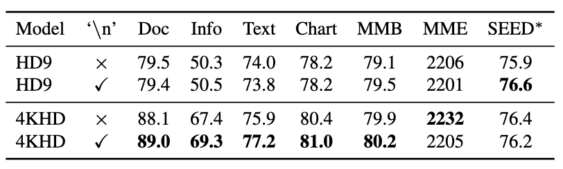

* **token合并策略消融实验。Contact沿通道维度连接四个相邻token，C-Abstractor和Re-Sampler 默认设置压缩率为0.25**

  * Contact和 C-Abstractor 都运行良好，因为连接器的影响很小。

  * Re-Sampler 的性能比其他方法差，这是因为我们的预训练数据对于它完全收敛有点轻量级    （token合并策略： [\[PDF\] Honeybee: Locality-enhanced Projector for Multimodal LLM](https://readpaper.com/paper/4832516705137721345)）

### InternLM-XComposer-2.5

[InternLM-XComposer-2.5: A Versatile Large Vision Language Model Supporting Long-Contextual Input and](https://arxiv.org/abs/2407.03320v1)（2024.07 上海人工智能实验室，香港中文大学，商汤科技，清华大学）

code：https://github.com/InternLM/InternLM-XComposer

#### 一、改进点

* 与之前的 2.0 版本相比，三个主要升级：（1）超高分辨率理解(IXC-4KHD),（2）细粒度视频理解，（3）多轮多图像对话。

* 除了理解之外，IXC-2.5 还使用额外的 LoRA 参数，用于文本图像合成：（1）制作网页和（2）合成高质量的文本图像文章。

#### 二、模型结构

* 遵循 IXC2 和 IXC2-4KHD的设计，包括视觉编码器 OpenAI ViT-L/14、大型语言模型 InternLM2-7B 和partial LoRA

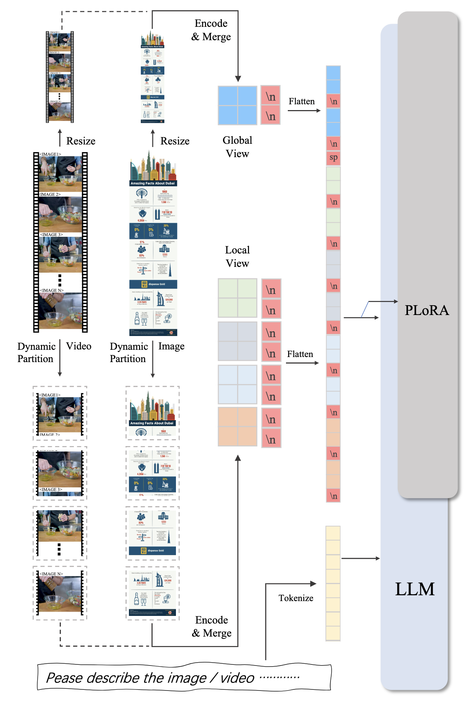

1. 多模态输入

   * **图像处理：**&#x9075;循IXC2-4KHD中使用的动态图像分区和全局局部格式设计，重用IXC2中使用的490 × 490分辨率的ViT，并将其分辨率进一步提高到560 × 560。

   * **视频处理**：采样并将它们沿帧的短边连接起来得到高分辨率图像，帧索引也写入图像中以提供时间关系。

   * **音频处理：**&#x49;XC-2.5 Web demo支持使用开源工具的音频输入和输出。对于音频输入，使用 Whisper将音频转录为文本。对于音频输出， MeloTTS将文本转换回音频。

2. 训练

   1. 预训练：在预训练阶段，LLM被冻结，微调视觉编码器和partial LoRA

   2. SFT:引入了一种混合分辨率训练策略，微调视觉编码器、LLM 和 Partial LoRA。

3. 网页生成

   1. &#x20;WebSight v0.1/v0.2 和 Stack v2数据集进行处理，将所有文件转换为截图，丢弃那些没有成功渲染的文件。

   2. 使用IXC2-4KHD模型对剩余的截图进行处理，以评估网页的质量，排除低质量的网页。保留了大约 250,000 个高质量网页，对 LoRA 模型进行训练。

   3. 指令微调数据构建，利用 GPT-4 为网页创建生成不同的指令，利用这些指令进行实际的网页生成过程。这种方法产生了 18,000 个高质量的指令感知样本，对 LoRA 模型进行训练。

4. 文本撰写

   1. 基于IXC-2.5 SFT之后的模型和IXC-2，生成高质量的图文文章。

   2. SFT阶段：采样5000对指令微调数据集。结合IXC-2.5SFT模型和CoT方法，来生成更多的训练数据。在原始模型的基础上，结合LoRA来进行训练。

   3. 偏好数据的采集：利用sft训练好的模型通过不同的随机种子来生成80000条数据，利用GPT-4o用选择或拒绝来标记2000条数据作为建立建模数据。然后训练一个奖励模型，来做决策，判定是否要拒绝prompt和respinse的pair对，最终获得30000对偏好数据进行DPO对齐。

#### 三、数据

1. Pre-train

相比增加的数据集，红色：IXC-2，绿色：IXC2-4KHD

* SFT

#### 四、结果

* 在细粒度视频理解任务上表现出具有竞争力的性能，

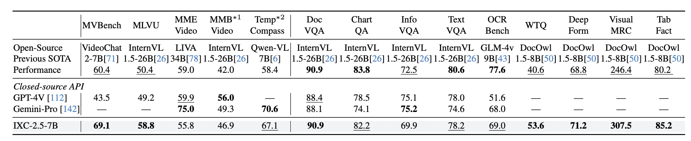

* 多图多轮对话，比之前的 SOTA 开源模型高出 13.8%

* Design2Code benchmark.从C4的验证集中直接找网页组成的数据，过滤掉一些没用和隐私的元素（自动+人工）。评估主要是增加了原始网页截图和生成代码得到的截图之间的相似度，高层次是借助CLIP，底层次就是元素（块、文本、位置、颜色）的匹配。

### GiT

[GiT: Towards Generalist Vision Transformer through Universal Language Interface](https://arxiv.org/abs/2403.09394) （2024.03 北京大学、马克斯普朗克信息学研究所、香港中文大学、苏黎世大学）

code：https://github.com/Haiyang-W/GiT

#### 一、Summary

* **采用单阶段训练方式训练模型，没有特定于任务的微调**，设计了一个**通用的语言接口，通过模型预测生成下个token预测的形式统一了视觉任务的不同输入输出，**&#x4F7F;得自回归解码能够灵活统一各种视觉任务。

* 模型是多层transformer，与SAM中使用的视觉编码器相同

#### 二、模型结构

1. GIT思路与[Fuyu](https://nio.feishu.cn/docx/NFxddS1A0oUVv5xn3L2cPP1in0g#part-LyIUdv5LkoP7NsxLKLmcIsVBntf)相近。输入方面直接将图像和切分patch后转换为视觉token，文本也通过分词编码的方式转换为相同特征尺度的token一起送入Transformer架构中，最后通过模型解码的方式将不同视觉任务的输出统一为文本表示的输出形式。

* **输入图像尺寸处理：**

  1. **对象级感知任务**，图像经过预处理步骤。最初，图像以 0.5 的概率水平翻转。随后，采用两种方法实现固定的输入大小。第一种方法涉及将图像直接调整为 1120 × 1120 的维度，而不考虑原始纵横比。第二种方法将图像随机调整为三个大小对之一：（400、4200）、（500、4200）或（600、4200），同时保留原始纵横比。在调整大小之后，图像被裁剪为 (384, 600) 的大小，然后再次调整为 1120 × 1120 像素。

  2. **语义分割**。在语义分割中，对图像应用特定的预处理步骤，以确保它们的大小标准化并增加多样性。最初，图像以 672 × 672 像素的大小获取，采用两种方法之间的随机选择。第一种方法直接将图像大小调整为672 × 672，不考虑原始纵横比。第二种方法涉及将图像缩放到从 100% 到 200% 不等的大小，同时保留原始纵横比。在此之后，应用随机裁剪来确保图像大小保持672 × 672像素。此外，为了增强图像的多样性，以 50% 的概率执行两个额外的操作：水平翻转和光度失真。这些步骤共同有助于更强大的分割任务数据集。

  3. **Image captioning**。至于这项任务，我们使用动态裁剪启动预处理，与原始图像相关的 \[3/4, 4/3] 中 \[0.08, 1.0] 中的大小比和纵横比变化。按照这个裁剪，图像被调整为 224×224 维度。此外，水平翻转图像以进行进一步增强的概率为 50%。

  4. **Visual grounding。**&#x89C6;觉基础增强包括概率为 50% 的颜色调整，从而能够改变亮度、对比度、饱和度和色调。随后，图像在原始大小的 (0.8, 0.8) 的相对范围内经历随机裁剪。最后，我们将图像大小调整为 224×224，同时保持原始纵横比。

* **词表外表示**，由于文本编码只有30000个token的词表，但是视觉概念往往有一些拼接得到的概念如信号灯，数字表示的坐标等等，如果直接分词会增大表达同一概念的所需要的token长度。使用了分词序列化然后对token和位置编码计算注意（单层注意力）得到新的token表示词表外的概念。**我们选择第一个输出token作为多词概念的最终表示。对于单个单词概念，我们直接使用原始文本嵌入。**

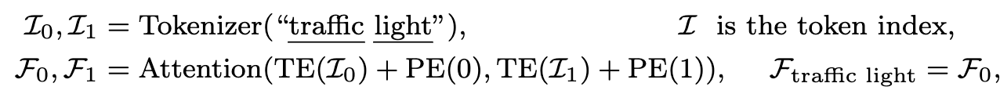

* **划分为三个任务：**&#x56FE;像级（image caption、visual grounding）、对象级（object detection、instance segmentation）、像素级（semantic segmentation）

**统一的模版：**&#x4C;ocal feature是通过其网格点位置双线性插值图像特征创建的,**N 可调整以匹配所需的预测分辨率,不同的任务可选地需要一些片段，例如image captione只需要图像输入和任务提示。**

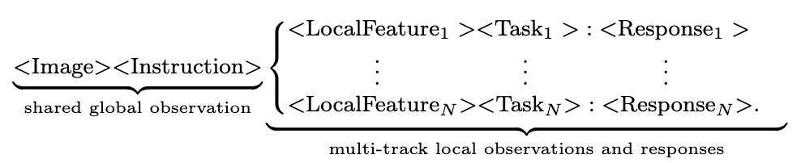

Image captioning： $${<image> "image  captioning": <text>}
$$

Visual grounding： $${<image> <instruction> "visual grounding": <bbox>}$$

对象级： $$<image> <local feature> <task identifier>:<sparse response>

$$

object detection：      $${<image><local feature> "object detection": <c><x1><y1><x2><y2>}$$

像素级： $$<image> <local feature> "semantic segmentation": <c1> <c2> · · ·<c15> <c16>$$

1. **图像级别任务**: 送入图像和指令, N设置为1 ，输出对应文本描述，图像尺度为224x224.

2. **对象级别任务:** 送入图像和指令, 对N个点的网格进行采样图像，其&#x4E2D;**&#x20;N 设置为 625，**&#x5BF9;应于 1120 × 1120 图像的 25 × 25 采样分辨率。子进程获取局部特征与task token进行坐标预测。

3. **像素级别任务:&#x20;**&#x9001;入图像和指令, &#x5C06;**&#x20;N 设置为 1764**，以实现大小为 672 × 672 的图像的 42×42 感知分辨率。每个子过程并行执行顺序像素级预测，从而提高效率。子进程获取局部特征与task token进行分割&#x20;

4. **并行解码**

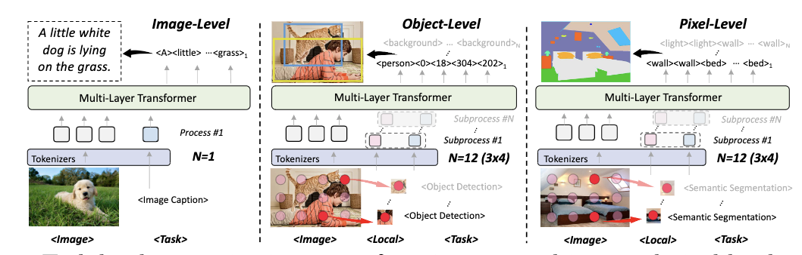

Window Attention.窗口注意的输入由多个部分组成，需要定制的注意掩码来确保网格独立性，同时实现自回归预测，在每个子进程组(即与同一网格相关的那些)中，交互从左到右的单向注意。此外，属于不同子进程的令牌被隔离，防止它们访问彼此的信息。

在visual grounding中，我们在网络转发过程中加入了图像到文本的注意力，增强了检测和视觉基础之间的任务区分。

Global Attention.在需要对象级和像素级分析的任务中，大量的局部预测会产生显著的内存和计算负担，特别是在全局注意层中，在所有网格点上处理注意是不必要的和低效的。因此，对于此类任务，我们优化了全局注意力层，只关注共享的全局观察（即输入图像和文本），从而消除了计算每个网格的目标的需要

应用双向自注意力来处理输入（即图像和指令），类似于典型的编码器。重要的是，我们启用图像到文本的注意力来增强其文本条件图像处理的能力（见表 7）。至于计算local和task prompts，以及每个子过程的目标预测，我们使用从左到右的单向注意力来建模因果关系，这与仅解码器的自回归方法一致。

&#x20;   &#x20;**&#x20;像素级多并行解码：**&#x8003;虑一个64×64图像被分成16个补丁，其中每个补丁都是16×16。对于N=16，每个网格点覆盖一个补丁来预测4×4语义图，然后将其上采样4×到原始大小以获得最终结果。

* 训练：采用llm中使用的**单阶段联合训练策略**，在27个公开可用的数据集上进行了训练，使用标准的 CrossEntropy 损失将所有任务视为下一个令牌生成问题

#### 三、数据

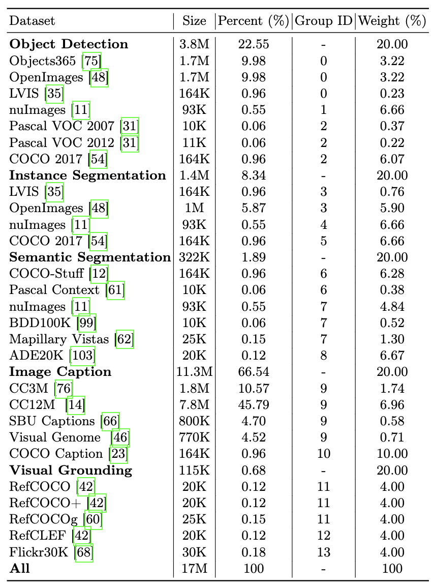

### PaliGemma

blog：https://huggingface.co/blog/paligemma （2024.05 谷歌）

model\_card：https://ai.google.dev/gemma/docs/paligemma/model-card?hl=zh-cn

code：https://github.com/huggingface/transformers/blob/4ef85fee718969f1703d7dffa134deb72f4de828/src/transformers/models/paligemma

#### 一、Summary

由SigLIP-So400m作为图像编码器和Gemma-2B作为文本解码器构成，单层线性投影层作为connector

1. 附带三种类型的模型：

* PT checkpoints: 可以微调到下游任务的预训练模型。

* Mix checkpoints: 对混合任务进行微调的PT模型。适用于带有自由文本提示的通用推理。

* FT checkpoints: 一组微调模型，每个模型都专注于不同的学术基准，具有不同分辨率。

* **单轮视觉语言模型，不用于会话**。

* 使用“detector”或“segment”等任务前缀配置模型执行不同的任务

#### 二、模型结构

**由SigLIP-So400m作为图像编码器和Gemma-2B作为文本解码器构成**

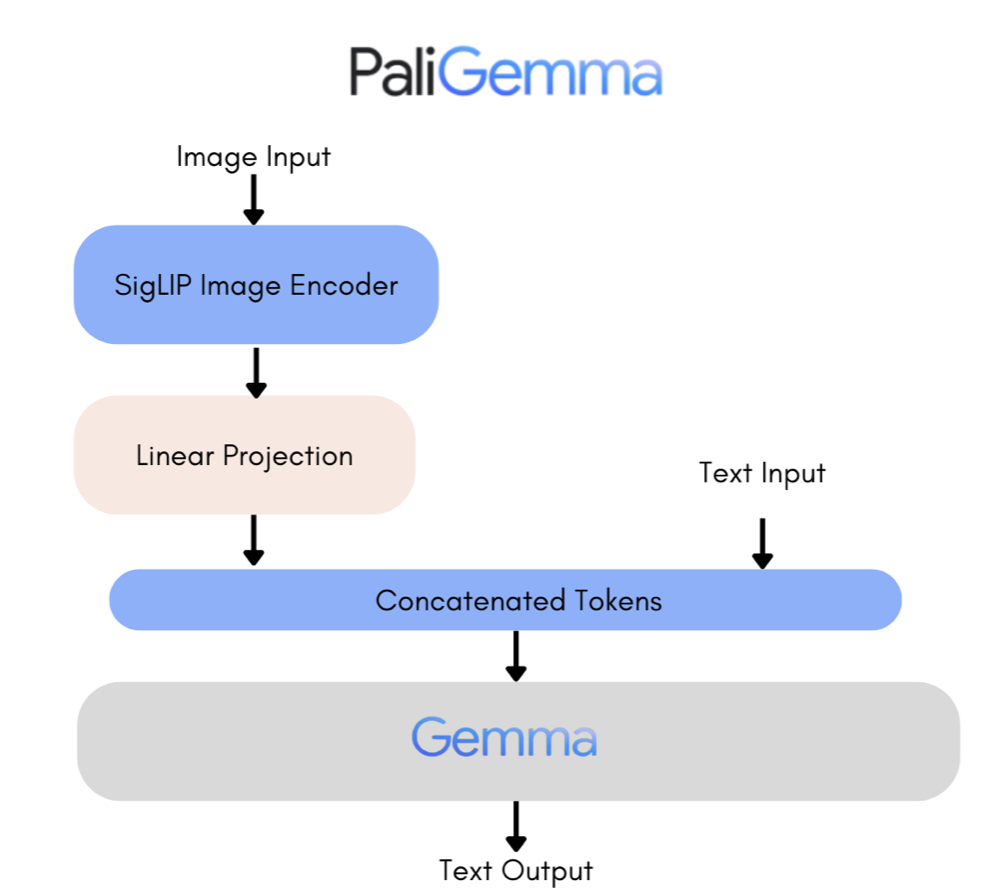

* PaliGemma模型在三种正方形尺寸（224x224、448x448或896x896）之一上进行预训练，patch尺寸为14。SigLIP图像编码器生成patch1152个维度的图像嵌入，通过线性投影层后获得每个patch2048个维度的表示。

* 训练方式([按照 PaLI-3 方法训练](https://ai.google.dev/gemma/docs/paligemma/model-card?hl=zh-cn))，以下是PaLI-3 的训练：

  1. 阶段 0：**单模态预训练。**&#x56FE;像编码器按照 SigLIP的方法进行训练，图像编码器的训练分辨率为 224×224 ；文本编码器 - 解码器按照混合降噪程序进行训练。

  2. 阶段 1：多模态训练。**冻结图像编码器**，将分辨率还是224×224的图像和文本混合（WebLI 数据集派生出）得到的tokens进行训练。

  3. 阶段 2：提升分辨率。**解冻图像编码器，微调整个模型，**&#x5C06;checkpoint保持在812×812和1064×1064分辨率，使用的数据侧重于涉及视觉定位和对象检测。

  4. 任务迁移。**冻结ViT图像编码器**，对于每个单独的任务，进行微调&#x20;

#### 三、功能演示

* 使用“detector”或“segment”等任务前缀配置模型执行不同的任务

  1. caption

  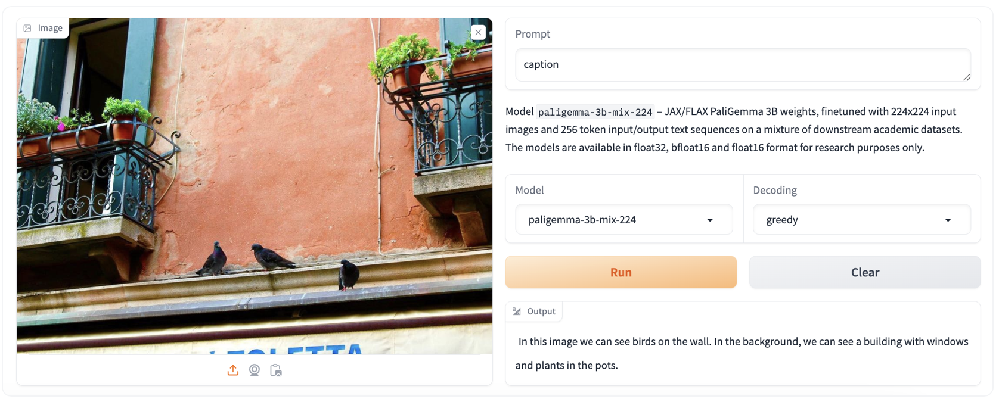

  * 视觉问题回答

  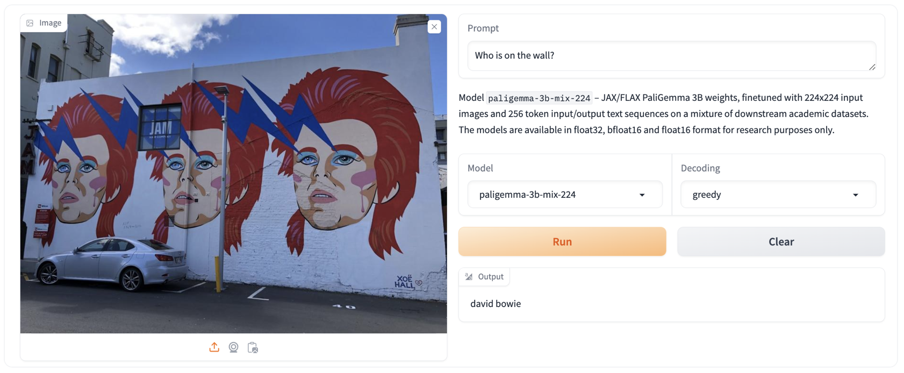

  * 检测

  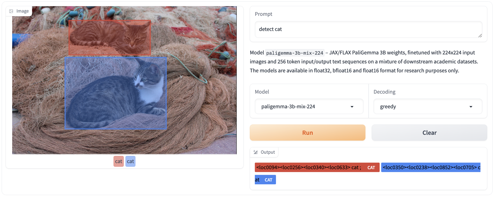

  * 分割

  

  * 文档理解

  

### CogVLM2

blog：[CogVLM2: Visual Language Models for Image and Video Understanding](https://arxiv.org/pdf/2408.16500)（2024.05 智谱）

code：https://github.com/THUDM/CogVLM2

https://huggingface.co/THUDM/cogvlm2-llama3-chinese-chat-19B/blob/main/visual.py

#### 一、Summary

* 支持1344\*1344的图像分辨率

* 设计了 Visual Expert 架构，不影响语言性能的情况下实现更深层次的视觉语言对齐

  1. QKV矩阵和FFN的形状与语言模型中的相同，并从中进行初始化。

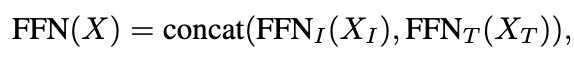

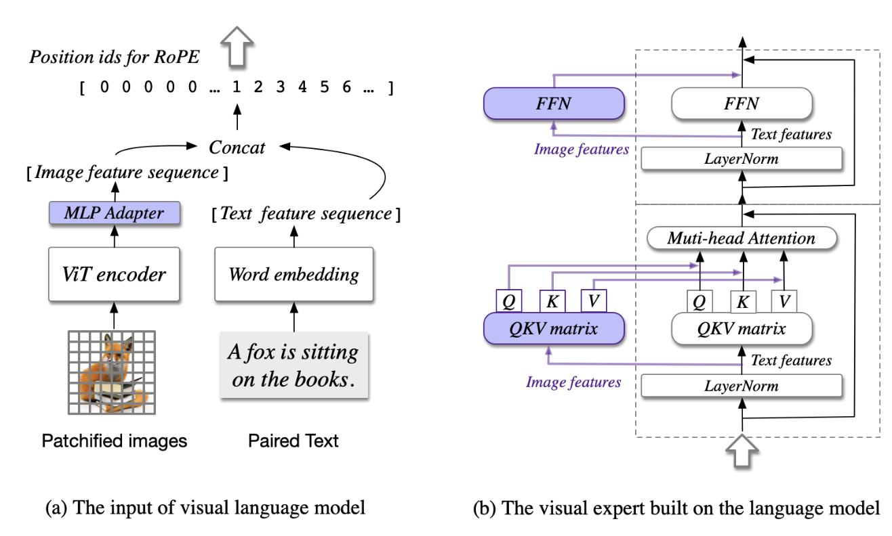

* **使用卷积算子的2 × 2下采样**几乎不损坏性能，**允许进一步缩短图像序列**(Q-former牺牲图像细节和空间信息，LLAVA单个线性层的表达能力有限)

#### 二、CogVLM2 model family

1. **GLM-4V：**&#x4E3A;了减少部署和计算成本，不用视觉专家来保留模型的语言知识， GLM-4V-Plus 使用相同的训练方式在图像和视频理解任务进行预训练。

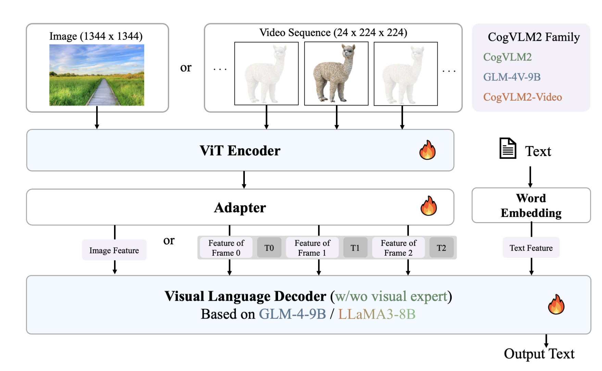

#### 三、CogVLM2

1. **训练**

   1. **预训练：探索了三种预训练方式**

      1. **分阶段训练**：初始阶段，只训练交叉注意力层。随着训练的进行，ViT或其他视觉专家的参数逐渐变得可训练。

      2. **同时训练所有参数**，但同时使用语言预训练数据和视觉语言预训练数据（GLM-4V）。

      3. **逐渐增加输入图像分辨率**。从低分辨率图像开逐步提高分辨率。

   2. **SFT：两阶段微调，微调所有参数**

      1. 利用所有 VQA 训练数据集和 300K 对齐语料库来增强模型的基本能力，解决了预训练对图像字幕任务的局限性。

      2. 选择了 VQA 数据集的子集和 50K 偏好对齐数据来优化模型的输出风格，与人类偏好密切相关。

2. 数据

   1. **预训练数据构建**

   LAION和DataComp包含噪声，**细粒度自然语言描述**，分布有限，缺乏多样性。

   * **迭代细化：**&#x521D;始模型在公开可用的数据集上进行训练，然后重新注释一批新数据，新数据经过手动校正，使用校正后的数据迭代地改进和增强模型的未来版本。

   * **合成数据生成：**&#x901A;过根据特定规则合成数据或利用高级工具生成高质量的图像-文本对来创建部分数据集。

   | **LAION-2B&#x20;**                  | 图像**caption**                                                                                                                                                                         |
   | ----------------------------------- | ------------------------------------------------------------------------------------------------------------------------------------------------------------------------------------- |
   | **COYO-700M**                       |                                                                                                                                                                                       |
   | **LAION-40M-grounding**             | 使用GLIPv2开发LAION-400M生成**grounding**数据集                                                                                                                                                |
   | **Digital World Grounding Dataset** | 由700万个英文和500万个中文条目组成。抓取网页创建，使用 Playwright 1 捕获屏幕截图以及所有可见的 DOM 元素及其相应的渲染框，创&#x5EFA;**&#x20;REC(Referring Expression Comprehension) 和 REG问答对**。                                         |
   | **Synthetic OCR Dataset**           | 包括 120 万个英文和 150 万个中文条目，关注四种特定的 **OCR&#x20;**&#x573A;景：（1）Python 生成的图片，图片上印有源文本； (2)  PaddleOCR提取真实图像中的文本； (3) 使用 Nougat 工具从学术论文中提取 LaTeX 代码； (4) 使用不同工具将 HTML 或 LaTeX 代码中的表格和公式渲染为图像 |
   | **CLAY-1B**                         | 基于LAION-2B和COYO-700M构建的数据集，经过微调的CogVLM模型为图像生成长而详细的**caption**。此数据集中的中文caption由经过微调的ChatGLM翻译。                                                                                         |

   1. **微调数据集**

      1. **VQA 数据：**

      

#### 四、CogVLM2-Video

1. **模型设置方面：q-former**压缩了视频信息，模型**缺乏时间定位、时间戳检测和总结关键时刻的能力**

2. **数据方面：现有**时间定位注释**数据受数据范围和问答的固定格式的限制** ，**缺乏开放域**问答和处理能力

   1. **视觉理解微调数据**

   

   * **TQA时间定位数据(30k)生成：**

     1. **从视频中提取帧，使用 CogVLM2 进行图像caption。**

     2. **用 GPT-4o&#x20;**&#x8FC7;滤掉场景内容变化较小的视频。

     3. **使用few-shot方法，GPT-4o根据图像标题生成与时间相关的问答对。**

   

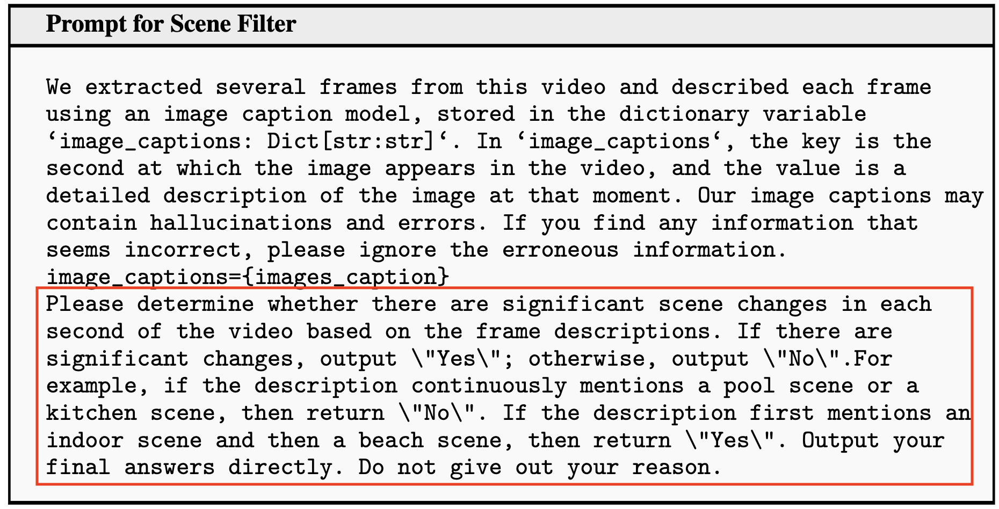

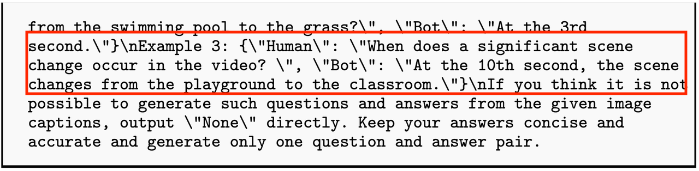

* 使用预训练CogVLM2

  1. sft：以24帧为输入，全参训练，训练过程包括两个阶段：

     1. 指令微调：全参训练，330k数据包含caption和问答对，VideoChat2

     2. 时间接地微调：内部视频TQA 数据集30k

#### 五、表现

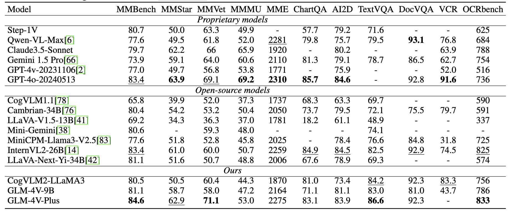

### AM-RADIO

[AM-RADIO: Agglomerative Vision Foundation Model Reduce All Domains Into One](https://arxiv.org/pdf/2312.06709)（2024.05 英伟达）

code：https://github.com/NVlabs/RADIO

#### 一、Summary

VFM 使用不同的目标进行训练，通过多教师蒸馏有效地将VFM合并到一个统一的模型中。

#### 二、模型结构

1. 模型结构

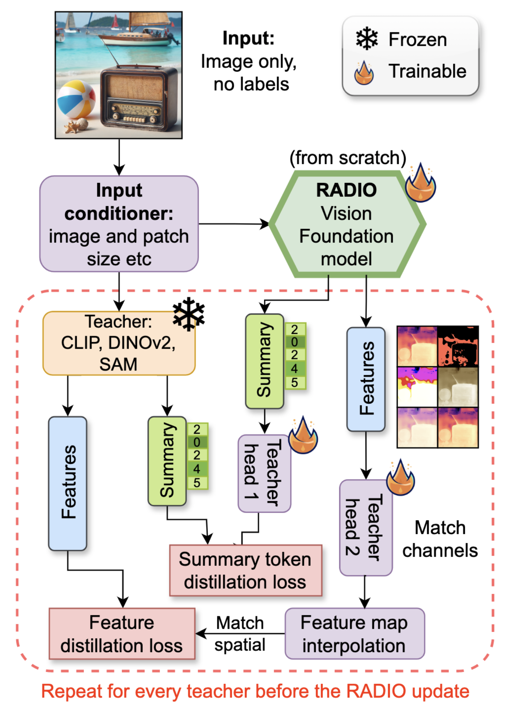

* 损失

**Teacher head：**&#x6211;们使用了一个简单的 2 层 MLP，中间有一个 LayerNorm 和 GELU。输入维度是学生嵌入维度，中间维度是所有教师的最大嵌入维度，输出维度与特定教师匹配。对于每个教师，我们使用两个头部，一个用于摘要向量，一个用于空间特征。

1. 摘要特征

   * 学生视觉特征

$$x^{'} =f(x|\Theta _{0} )$$

* 可学习的学生头输出的摘要特征

$$y_{i}^{(s)} =h_{i}^{(s)}(x^{'}|\Theta _{i}^{(s)}  )$$

* 教师的摘要特征（class\_token）

$$z_{i}^{(s)} =t_{i}^{(s)}(x|\Phi  ^{i}   )$$

* 余弦距离损失产生了更好的模型，通过匹配教师来监督模型的空间特征不仅对下游任务很重要，

$$L_{summary} (x)=\sum_{i}^{} \lambda _{i} L_{cos} (y_{i}^{(s)},z_{i}^{(s)}  )$$

&#x20;$$\lambda _{CLIP}=\lambda _{DINO}=1,\lambda _{SAM}=0  $$

2. 空间特征

   * 为了匹配空间特征，我们采用了余弦相似度和平滑 L1 的组合。，我们希望让我们的学生模型成为教师框架中的替代品，因此重要的是我们匹配教师向量的大小，因此我们包括平滑的 L1。展示了这种损失的公式。设 $$h_{i}^{(v)}(x^{'}|\Theta _{i}^{(v)}  )$$为教师特征向量匹配的可学习的学生头，对应的 $$t_{i}^{(v)}(x|\Phi  _{i}^{(v)}  )$$为教师特征向量， $$x^{'}=f(x|\Theta _{0} ) $$，则空间特征损失为:

$$L_{match} (x,y)=\alpha L_{cos}(x,y)+\beta  L_{smooth-11}(x,y) $$

$$L_{features} (x,y)=\sum_{i}^{} \gamma _{i} L_{match} (h_{i}^{(v)}(x^{'}|\Theta _{i}^{(v)}  ),t_{i}^{(v)}(x|\Phi  _{i}^{(v)}
))$$

$$\gamma _i=1,\alpha =0.9,\beta =0.1$$

* 训练

分两个阶段进行训练，首先使用 CLIP+DINOv2 进行 256px 的 300k 步，其次使用 432px 的 CLIP+DINOv2 和 1024px 的 SAM 进行 300k 步。

1. 多尺度教师模型：选择ViT-H/16作为学生模型时，为了匹配SAM特征的分辨率，我们将预期分辨率为1024^2。考虑到我们的CLIP和DINOv2教师是patch-14模型，我们选择输入学生432^2输入，与patch-14的有效分辨率相同。我们发现插值DINOv2特征不会降低结果，因此教师在224px上运行，我们对输出进行上采样以匹配学生。

2. 高效学生模型，不是很确定：使用 64 个 GPU 进行训练，其中一半获得每个 GPU 的批量大小为 32 的 CLIP+DINOv2 组，输入分辨率为 432，另一半获得 SAM，每个 GPU 的批量大小为 2，输入分辨率为 1024。这导致有效批量大小为 1,152。对于 CLIP+DINOv2 训练，我们使用 32 个 GPU，导致批量大小为 1024。

3. 学生架构。我们研究了学生模型架构的两种设置：

   1. &#x20;**标准 ViT 架构以匹配教师的架构**。最好的模型是 ViT-H/16。

   2. **高效的架构变体：ERADIO模型，混合的CNN-Transformer架构**

      1. 结构：由多个阶段组成：1）the stem，2）来自 YOLOv8 的 2 个卷积块，3）2 个具有多分辨率窗口自注意力的transformer块。除最后一个阶段外，每个阶段后面都是下采样块，为具有 3x3 内核和步幅 2 的跨步卷积，然后是批量归一化层。

      

      * Multi-resolution attention

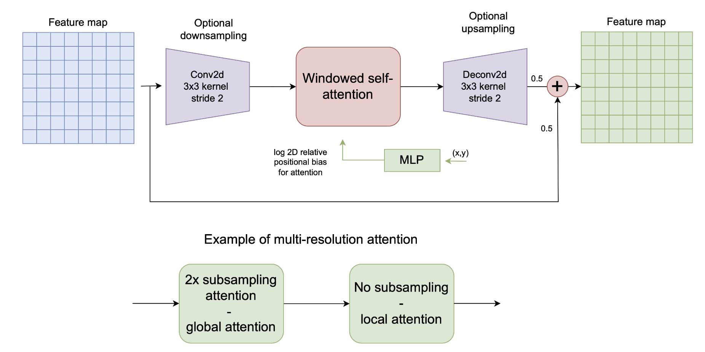

#### 三、数据

* 我们研究了不同数据集的对下游指标的影响。虽然使用 ImageNet-1K 作为训练数据集获得了最高的图像分类指标，但我们认为它不会公平地衡量“零样本”性能，因为学生直接学习评估域中的教师特征。出于这个原因，我们选择了 DataComp-1B 数据集。

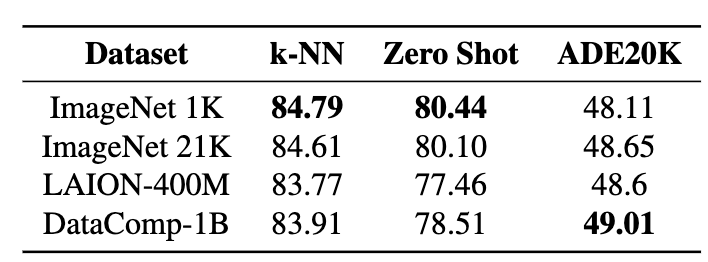

#### 四、消融实验

* 我们监督空间特征的教师消融。我们使用 ViT-L/14 学生模型并在 LAION400M 数据集上进行训练。添加这个损失项总是有益的。Dinov2似乎比CLIP提供更好的空间特征，但训练学生匹配两个教师会产生最好的结果。我们不会消融 SAM，因为我们只希望它用于其空间特征。

* 学生网络vit摘要特征选择：（i）“CLS”token 或（ii）平均patch token。我们观察到平均池化提高了摘要损失，但对特征损失有更显著的不利影响。鉴于后者的重要性，我们选择使用单独的 CLS token。

### Chameleon

[Chameleon: Mixed-Modal Early-Fusion Foundation Models](https://arxiv.org/pdf/2405.09818)（2024.06 Meta）

code：https://github.com/facebookresearch/chameleon

#### 一、Summary

* 完全token-based的架构，使用统一的transformer架构来处理图像和文本序列，而不需要单独的图像/文本编码器。从一开始就混合模型，并在所有模态的交错混合（即图像、文本和代码）上以端到端方式从头开始训练的统一架构

* 对 Transformer 架构进行了新颖的修改，例如查询键归一化和层规范修订放置，发现这对于混合模态设置中的稳定训练至关重要。

* 将用于纯文本llm的监督微调方法应用于混合模态设置，从而大规模实现强对齐。

* 既可以进行推理，也可以生成任意混合模态文档。

#### 二、模型结构

1. **训练**

   1. **预训练：**&#x8BAD;练的第一阶段就是让模型以无监督的方式学习，在训练期间展示了图像和文本的任何排序，范围从纯文本到单个文本/图像对到完整的交错文本图像文档。

      * **图像Tokenization**

      Chameleon使用图像tokenizer，tokenizer将一张512 x 512的图像转换为1024个离散的tokens，这些tokens来自于一个大小为8192的codebook。

      * **文本Tokenization**

      Chameleon使用了一个BPE tokenizer，这是一种将文本分解为更小的单元的编码方式。这个tokenizer在训练数据的一个子集上进行训练，词汇表大小为65,536，其中包括了用于图像的8192个代码本tokens。这个tokenizer使用sentencepiece库进行训练。

   2. **Alignment：**&#x4F7F;用基于精心策划的高质量数据集的监督微调的轻量级对齐阶段

2. 模型结构调整

* a:随着训练的进行，最后一个transformer层的输出规范，输出规范不受控制的增长，未来训练损失的不稳定。

  b:有和没有 QK-Norm 的 Chameleton-7B 的训练损失曲线，后者在训练 epoch 大约 20% 后发散

  c:通过控制范数增长来稳定7B，除了QK范数外，还需要在注意层和前馈层之后引入dropout

  

* a:Chameleon-7B和Chameleon-34B的前600k步的训练曲线

  b:禁用图像生成的训练损失曲线不会受到不稳定问题的影响。

  c:7B的dropout控制训练稳定性，但不适用于Chameleon-34B

2. 当将模型扩展到 8B 参数和 1T token以上时，保持稳定的训练具有挑战性，采用以下架构和优化配方来实现稳定性。

   * Softmax部分，使用QK-Norm：QK-Norm 通过对注意力内的query和key向量应用层归一化，直接控制输入到 softmax 的Norm增长。

   * 7B 使用 dropout 和 z 损失来实现稳定性

   * 扩展到34B时，不需要dropout，并添加Zloss损失：

   

   其中：

   

   * 扩展到34B时，需要对归一化进行额外的重新排序：

   

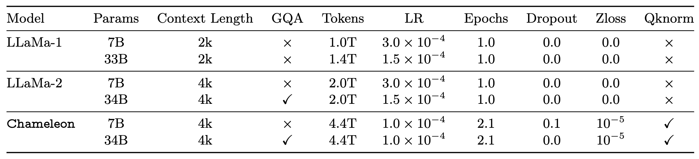

#### 三、数据

1. Pre-Trained Data

   1. stage1：

      1. text- only：包括用于训练 LLAMa-2 和 CodeLLaMa 的预训练数据的组合，总共 2.9 万万亿个纯文本标记。

      2. Text-Image:用于预训练的文本图像数据是公开可用的数据源和许可数据的组合，我们总共包含140亿个文本图像对（512\*512）， 14 亿对、1.5 万亿个 token。

      3. Text/Image Interleaved:从公开可用的 Web 来源获取，总共有 400 亿个交错文本和图像数据标记。

   2. stage2:在第二阶段，我们将第一阶段数据的权重降低了 50%，并在更高质量的数据集中混合，同时保持相似比例的图像文本标记。我们还包含大量指令调整集的训练集的过滤子集。

   

### Ferret

[Ferret: Refer and Ground Anything Anywhere at Any Granularity](https://arxiv.org/abs/2310.07704)（2023.10 苹果）

code：https://github.com/apple/ml-ferret

#### 一、Summary

* 视觉编码器为CLIP-ViT-L/14， 语言模型为Vicuna，投影层为线性层（LLAVA的第一阶段权值初始化）

* 提出了一种空间感知视觉采样器，它擅长处理不同形状，Ferret可以接受不同的区域输入，如点、边界框和自由形式的形状

* 策划了 GRIT数据集，这是一个全面的referring和grounding指令调整数据集，包括 1.1M 个样本

#### 二、模型结构

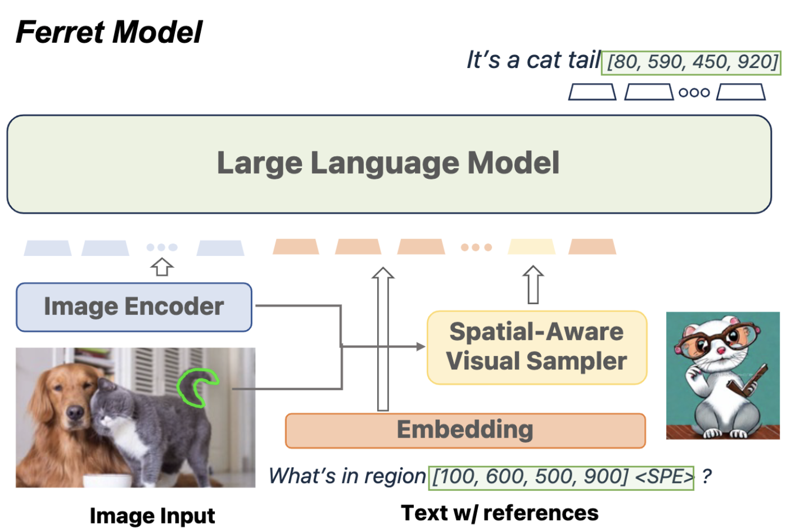

1. 输入输出

**输入：**&#x5BF9;于参考区域，我们将坐标和特殊标记附加到区域名称后连续特征的占位符：“⟨region name⟩⟨coord⟩⟨SPE⟩”。例如，“a cat\[100,50,200,300]⟨SPE⟩”。

**输出：**&#x4E3A;了实现grounding，我们在文本响应中的相应区域/名词之后生成框坐标。例如，"There is a dog \[100, 150, 300, 200] in the figure."

* **混合分区表示：**&#x5C06;离散坐标与连续的视觉特征协同，以引用一个特定的区域

  1. 对于坐标，将每个坐标量化为连续的视觉特征

  2. 对于给定的区域R

     1. 首先构造一个与图像相同大小的2D二进制掩码M，标记目标区域内的值为1，区域外部为0。

     2. **空间感知视觉采样器：**&#x7ED9;定提取的图像特征图 Z 和二值区域掩码 M，随机采样 M 内的 N 个正点。对于每个点，其特征是通过双线性插值获得的。N个点被馈送到级联块中，每个块包括三个步骤：采样、收集、池化，

        * (1)采样：通过最远点采样 (FPS) 算法，从 N 个点中采样 N r 个点，可以保证足够的覆盖范围。

        * (2)收集:对于每个采样点xi，我们从前N个点池中搜索其k个最近邻，得到一组点，将采样点的特征与其相邻点融合。

        * (3)池化:进行最大池化，将k个相邻特征融合为一个特征，作为采样点的表示

        将点特征展平为单个向量并将其投影到 LLM 嵌入的维度。最终特征用于替换输入中⟨SPE⟩token。

* 训练

- 除了图像编码器都可以训练，我们用CLIP-ViT-L/14@336p初始化图像编码器，用Vicuna初始化LLM，用LLAVA的第一阶段权值初始化投影层，使视觉采样器随机初始化。

- 训练包括两个阶段，图像标题对齐和指令调优

#### 三、数据

**GRIT：**&#x47;round-and-Refer Instruction-Tuning 数据集(同名)

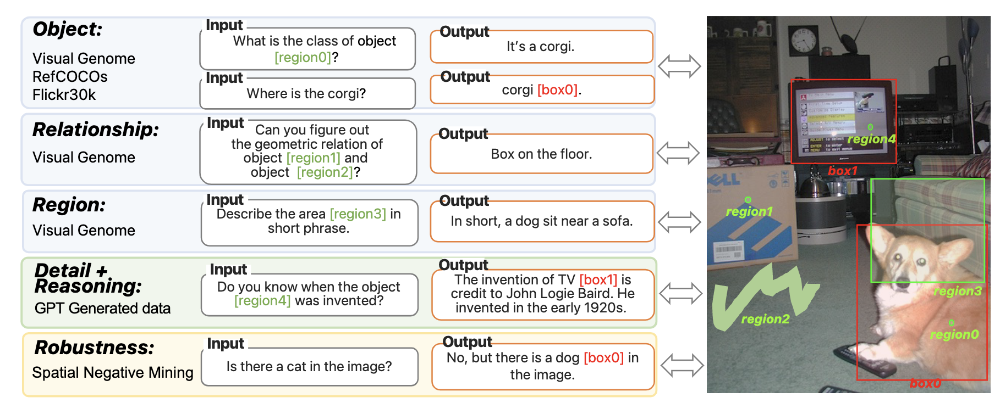

空间理解能力可以从两个层面来拆解：不同的细粒度（理解到什么程度）和任务类型（能解决哪些问题），因此数据集也基于这个方面来进行构造。

* 细粒度。将数据分成四个主要类别：

  * 独立的物体；

  * 物体间的关系；

  * 特定区域的描述；

  * 基于区域的复杂推理。

* 任务类型。将数据划分成三个类型：

  * 区域输入-文本输出数据（区域指定任务）；

  * 文本输入-区域输出数据（区域定位任务）；

  * 文本区域结合数据

**大约 1.1M 个多模态对话的 Ground-and-Refer Instruction-Tuning 数据集，包含以下三种类型的数据：**

1. **&#x20;转换为指令跟随格式的公共数据集**

   1. 独立的物体

      * 使用目标检测数据集Visual Genome，Object365和视觉定位数据集RefCOCOs，Flickr30k-Entities；

      * 为了让 Ferret 理解自由形状的物体，使用 SAM 获得每个物体的掩码；

      * 目标检测数据集Visual Genome转换区域输入-文本输出数据；

      * 视觉定位数据集和Object365也构成文本输入-区域输出数据；

      * 这部分一共有 678k 条数据。

   2. 物体间的关系 & 区域描述

      * 从Visual Genome中选择保留了物体关系和区域描述的数据；

      * 数据集采用区域输入-文本输出数据，一共有 177k条。

      * 同样通过 SAM 获取每个有关联关系的物体掩码数据。

   3. 基于区域的复杂推理

      * 采用文本区域结合的数据，在 GPT4 的帮助下生成数据集

2. **通过 ChatGPT 和 GPT-4 生成的指令调整数据**

   1. 图像和人工注释对话的文本场景描述作为few-shot演示提供，提示ChatGPT/GPT4基于新图像的文本描述生成新的对话。

3. **来自空间负挖掘的额外数据，以增强模型的鲁棒性**

   1. 为了解决幻觉问题，通过以下两种方式进行负样本挖掘：（i）图像条件类别定位以及（ii）语义条件类别定位。他们都要求模型定位特定的对象类别，从而使模型能够识别和潜在地识别某些对象的缺失。它们在如何选择负面类别方面有所不同。对于 (i)使用了 Object365 数据，我们从给定图像中没有显示的词汇中随机选择对象类。对于 (ii)使用 Flickr30k 数据，负面类别通过利用 ChatGPT/GPT4 来查找与原始类别、属性或数量最相似的实体，例如“man”与“woman”、“blue”与“yellow”、“two”与“three”。我们整理数据以保持两种类型中正负样本之间的平衡

#### 四、消融实验

* grounding data and referring data的有效性

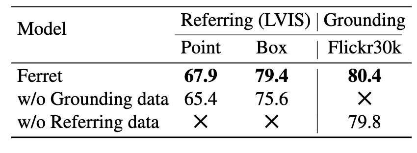

* 空间感知视觉采样器有效性的消融研究。

### Ferret-v2&#x20;

[Ferret-v2: An Improved Baseline for Referring and Grounding with Large Language Models](http://arxiv.org/abs/2404.07973)（2024.04 苹果）

code：

#### 一、Summary

* 整体架构和训练过程遵循 Ferret，投影层由线性层改为两层MLP

* 任何分辨率grounding和referring：一种轻松处理更高图像分辨率的灵活方法，提高了模型处理和理解图像的能力。

* 多粒度视觉编码:通过整合额外的DINOv2编码器，模型学习更好、多样化的底层上下文，用于全局和细粒度的视觉信息。

* 三阶段训练范式：除了图像-字幕对齐之外，还提出了在最终指令调整之前用于高分辨率密集对齐的附加阶段。

#### 二、模型结构

* **高分辨率缩放，直接上采样 vs任何分辨率**：

**“直接上采样”，**&#x5E94;用位置嵌入插值，并在微调阶段将CLIP编码器调整到这个新分辨率。**“任何分辨率”**，预定义了一组分辨率来支持6个网格{1x1, 1x2, 1x3, 1x4, 1x5, 1x6, 2x2, 2x3及其转置}。图像尽可能紧密地拟合原始图像的纵横比和大小来选择最佳分辨率，同时最小化浪费的分辨率，并将输入图像的大小调整为最佳分辨率，并将图像分割成这些网格。∗ 表示编码器在微调期间被冻结

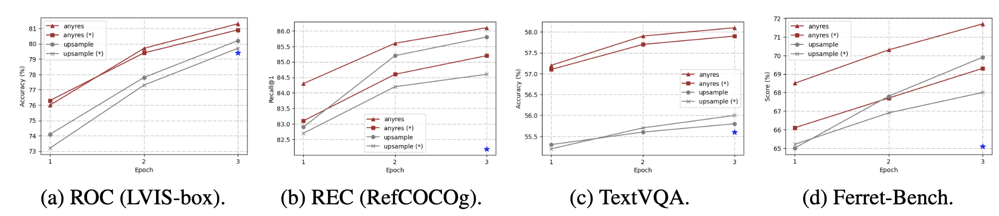

* 模型结构

* 在获得全局图像和局部 patch

  * 按照其原始空间排列将局部patch的特征图合并为一个大特征图，

  * 通过插值对全局图像特征图进行上采样，以对齐合并特征图的大小。

  * 将两个序列连接起来，输入到LLM中作为视觉token

* **任意分辨率referring：**

  * 按照其原始空间排列将局部patch的特征图合并为一个大特征图

  * 通过插值对全局图像特征图进行上采样，以对齐合并特征图的大小。

  * 通过按通道方式添加两个处理后的特征图，并获得具有强语义和局部意识的高分辨率特征图输入到空间感知视觉采样器中以提取连续区域特征。

  * 然后将连续特征与离散坐标组合为混合区域表示，以引用图像中的任何区域。

* **任意grounding：**&#x5982;果没有特定的适应，Ferretv2与 Ferret 中的grounding设计无缝对齐。

* **训练：**&#x8BE5;模型分三个阶段进行策略训练，增强分辨率处理，同时以“粗到细”的方式保持视觉语言对齐。

  

  1. stage1- Image-Caption对齐:在低分辨率图像上进行训练，以实现高效的图像标题对齐。

  2. stage2-高分辨率密集对齐:将图像的每个可能的局部对象与具有密集参考和检测数据的详细语义对齐。

  3. stage3:模型经过视觉指令微调以更好地解释用户意图。

#### 三、数据

1. stage1：Image-Caption Alignment.

   * ShareGPT4V 1.4M的capton图像文本对

2. stage2：High-resolution Dense Alignment.

   * 数据来自于LVIS，设计了两种类型的任务和输入数据。

   * (1)密集参考：给定图像，输入问题逐个指代所有对象的区域，并询问它们的类别；模型需要相应地输出预测的类别。一个例子是：“Question: Please classify the objects in the following locations.1：⟨region\_1⟩，2：⟨region\_2⟩，.... Answer: Here are the categories: 1: cat, 2: dog, ...”。

   * (2) 密集检测：给定图像，输入问题要求定位所有对象。一个例子是：“Question: Please localize visible objects in the image in a raster scan order. Answer: The objects are: 1: cat ⟨coordinate\_1⟩, 2: dog ⟨coordinate\_2⟩, ...”。

3. stage3：Intent-Enhanced Instruction Tuning.

   * 数据来自GRIT，并增加了VQA和OCR领域的数据

   * 还确定了两种额外的策略，有助于提高性能：

     1. **数据统一**：为了促进模型从基于纯文本的全局理解向使用混合表示的区域理解的无缝过渡，我们采用开放词汇量对象检测器GLIPv2，在VQA数据集上定位文本中的可grounding的名词，并使用公共OCR模型（MMOCR）在OCR数据集上获取文本边界框。

     2. **任务泛化**：为了减少需要指代和定位能力的任务与不需要这些能力的任务之间的歧义，我们采用了类似于LLaVA 1.5的方法，即在提示中添加“包括每个提及对象的坐标”，以进一步明确任务要求。

#### 四、消融实验

* **任意分辨率ground和refer**：能够处理任意分辨率的图像对于提升模型在指代和定位任务上的表现至关重要。这表明在高分辨率图像中，更丰富的细节信息对于精确识别和定位对象是非常有帮助的。

* **多粒度视觉编码**：引入DINOv2编码器来专门处理高分辨率图像块，与CLIP编码器提供的全局图像语义相结合，可以显著提升模型在视觉理解任务上的性能。这说明了在处理视觉信息时，同时考虑全局和局部信息的重要性。

* **第二阶段预训练**：在预训练过程中增加一个专注于高分辨率密集对齐的阶段，可以进一步提升模型在指代和定位任务上的表现。利用CLIP第一阶段的投影权值进行初始化，然后在第三阶段进行微调。这表明分阶段训练，逐步引导模型学习不同粒度的视觉信息，是一种有效的训练策略。

### Ferret UI

[Ferret-UI: Grounded Mobile UI Understanding with Multimodal LLMs](https://arxiv.org/pdf/2404.05719)（2024.04 苹果）

code：

#### 一、Summary

* 在 Ferret 之上结合“任何分辨率”来放大细节并利用增强的视觉特征，根据原始纵横比（即水平划分和垂直划分）将每个屏幕划分为 2 个子图像。

* 为了灵活适应 UI 屏幕纵横比，将“任何分辨率”（任何分辨率）集成到Ferret 中，但使用预定义的网格配置将整个图像划分为子图像。除了全局图像特征外，还使用子图像特征来帮助放大细节并提供增强的视觉特征。

#### 二、模型结构

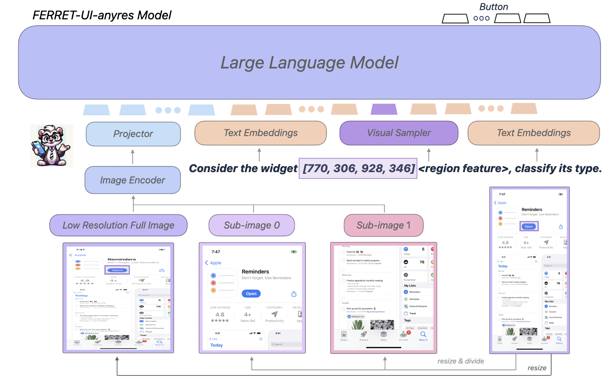

* 切图：基于手机的原始纵横比，他们选择了两种网格配置：1x2 和 2x1。给定一张屏幕图像，选取最接近其原始纵横比的网格配置。之后，调整屏幕图像大小，使其匹配所选的网格配置，然后再将其切分为子图像（sub-image）。很明显，纵向屏幕会被水平切分，而横向屏幕会被垂直切分。

* 训练：在训练期间，LLM和投影层被更新，而视觉编码器保持冻结。所有训练数据都格式化为指令跟随格式，训练目标与 Ferret 中的相同。训练总共有 250K 个样本。

#### 三、数据

1. **调整 Spotlight 的格式**。取用了 Spotlight 中的三个任务：screen2words、widgetcaptions 和 taperception，并将它们的格式调整为了对话式的一对问答对，具体来说，我们使用 GPT-3.5 Turbo 根据我们为相应任务编写的基础提示创建多种提示：

   1. Screen2words：为这个屏幕截图提供一个摘要；

   2. Widget Captions：对于交互元素 \[bbox]，提供一个最能描述其功能的短语；

   3. Taperception：预测 UI 元素 \[bbox] 是否可点击。

对于每个训练示例，我们为相应任务采样一个提示，并将其与原始源图像和真实答案配对。

* **基础任务**。除了 Spotlight 任务，该团队还创建了 7 个新的 UI 任务，这些任务被分为两类：指代任务（referring tasks）和定位任务（grounding tasks）。

  1. **指代任务（Referring Tasks）**：这类任务涉及识别输入中的特定元素，并通常使用边界框（bounding boxes）来标识这些元素。具体来说，包括：

     * **OCR**：识别图像中的文字并将其转换为文本。

     * **图标识别（Icon Recognition）**：识别界面中的图标并确定其功能或含义。

     * **控件分类（Widget Classification）**：将界面中的控件（如按钮、文本框等）分类到预定义的类别。

  2. **定位任务（Grounding Tasks）**：与指代任务相对，关注的是确定输出中特定元素的位置，同样使用边界框来标识。这些任务要求模型不仅要理解元素的语义，还要能够在图像上精确地定位它们。具体任务包括：

     * **控件列表（Widget Listing）**：列出界面上所有可识别的控件。

     * **查找文本（Find Text）**：根据文本内容在界面上找到对应的文本区域。

     * **查找图标（Find Icon）**：根据描述或功能找到对应的图标。

     * **查找控件（Find Widget）**：根据控件的类型或功能找到特定的控件

* **高级任务**。为了让新模型具备推理能力，跟随 LLaVA 的做法并使用 GPT-4 额外收集了四种其它格式的数据，设计了四个任务：详细描述、对话感知、对话交互和功能推理

  1. **详细描述（Detailed Description）**：这个任务要求模型生成对用户界面元素的详细描述。

  2. **功能推理（Function Inference）**：这个任务涉及对用户界面元素功能的推断。

  3. **对话感知（Conversation Perception）** 和 **对话交互（Conversation Interaction）**：这两个任务与对话相关，要求模型能够理解和生成与用户界面相关的多轮对话。

#### 四、消融实验

* 高级任务消融。iPhone 和 Android 高级任务的性能。训练配置是将高级任务与其他数据混合，仅使用 iPhone 基本任务、仅 Android 基本任务或两者兼而有之。

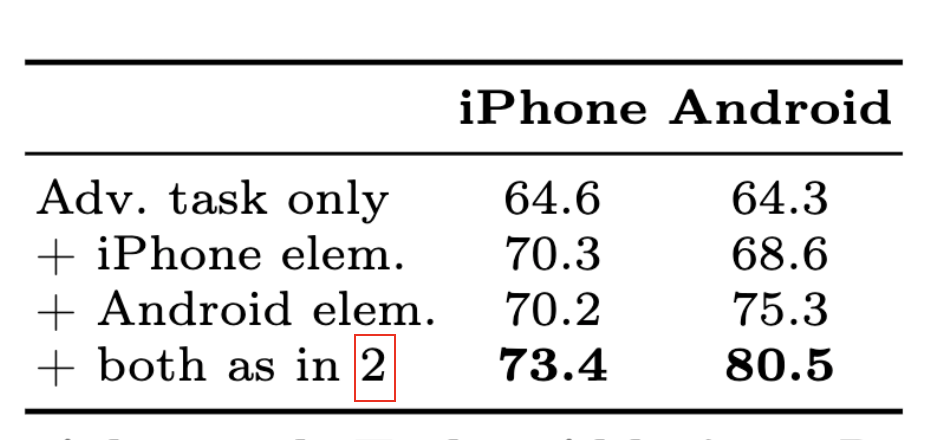

* &#x20;Spotlight任务消融。研究了添加基本任务数据是否可以增强模型的性能，因为这些任务旨在提高屏幕的视觉和空间理解。添加基本任务数据——无论是完全来自 Android、iPhone 还是两者的组合——并没有显着改变三个 Spotlight 任务的性能。

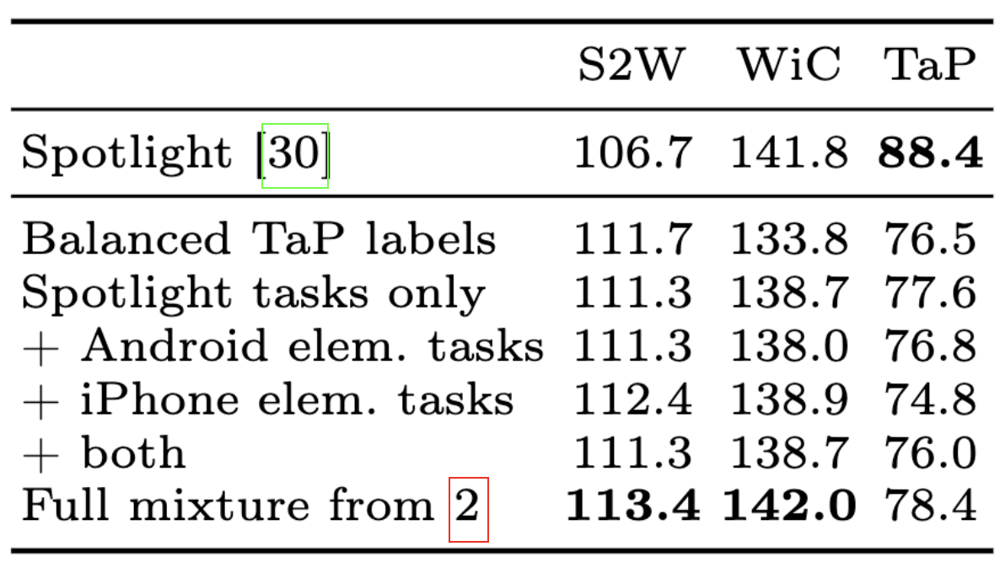

### vision LLM v2

pdf：https://arxiv.org/abs/2406.08394（2024.07 OpenGVLab，上海AI lab）

code：https://github.com/OpenGVLab/VisionLLM

#### 一、Summary

* 端到端的通用多模态大型模型 ，从视觉问答扩展到图像生成、图像编辑和开放式对象检测/实例分割/姿态估计。

* 建立了MLLM和下游解码器之间的梯度反馈

#### 二、模型结构

* 主要包括四个部分:(1)图像编码器CLIP和区域编码器;(2)大型语言模型Vicuna-7B;(3)一系列解码器;(4)routing token和Super-Link Queries

* 下游任务模型：

  * 1）目标定位：Grounding DINO；

  * 2）图片分割：mask decoder；

  * 3）姿态估计：UniPose；

  * 4）图片生成：Stable Diffusion v1.5；

  * 5）图片编辑：InstructPix2Pix

* **image input**，优先纵横比动态分辨率将图片切分为多个336\*336的patch，提取视觉特征。

* **visual prompt**，使用二进制掩码结合特征图提取区域特征，作为visual prompt。

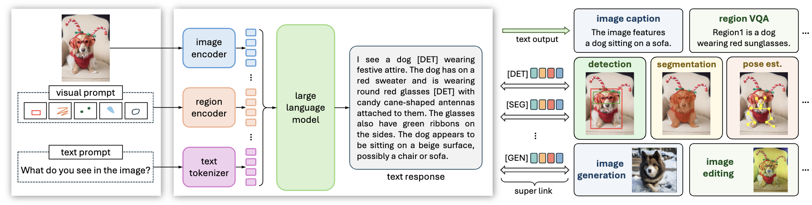

* **超链接:**&#x5C06;下游模型与MLLM链接，来实现端到端训练

  * **routing token：**&#x6DFB;加到 MLLM 词汇表中的特殊标记（例如\[DET], \[POSE], \[SEG], \[GEN], \[EDIT]）,选择对应的decoder。

  * &#x20;**Super-Link Queries**，随机初始化。当LLM预测出Routing Token时，对应的Queries会添加到Routing Token后面，作为下游任务decoder条件输入，不同的任务对应着不同的forward方式：

    * **Visual Perception&#x20;**(目标定位，图像分割，姿态估计)：LLM 输出类别名称，特殊标记 \[DET] 和 Super-Link Queries。Super-Link Queries对应的MLLM最后一层的输出池化后作为条件特征。训练中总损失包括LLM的交叉熵损失和下游任务损失。

    * **Visual Generation**（图像生成，图像编辑）：放弃文本encoder，Super-Link Queries通过MLP层和Q-Former投影作为图像生成条件。总损失包括下一个token损失，CLIP的编码文本特征和投影特征的损失，以及真实图像和预测图像之间的损失。

  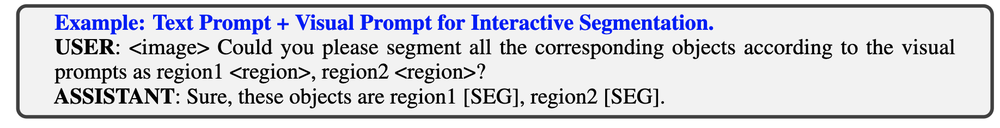

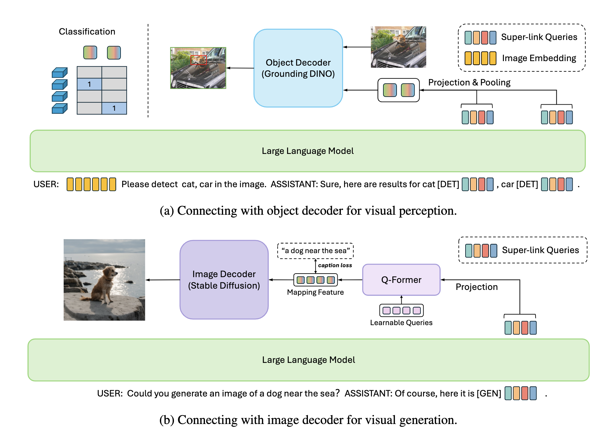

#### **三、训练**

1. **Stage-1: Mutimodal Training.**

   1. **预训练**阶段视觉语言对齐，**只训练区域编码器和投影器**。

   2. **指令调优**阶段**解冻LLM**，具有良好对话能力的强大的 MLLM，&#x5373;**&#x20;VisionLLM v2-Chat**。

2. **Stage-2: Multi-capacity Fine-tuning.区域编码器和所有解码器都进行训练，LLM 使用 LoRA进行微调。**

3. **Stage-3: Decoder-only Fine-tuning.解码器微调，Super-Link Queries也继续训练**。不能在单个 epoch 内收敛，训练12 个 epoch，得到**VisionLLM v2**。

#### 四、数据

1. **Stage-1: Mutimodal Training.**

* **Stage-2: Multi-capacity Fine-tuning.**&#x7B2C; 2 阶段使用的数据集是阶段 1 和阶段 3 数据集的组合

* **Stage-3: Decoder-only Fine-tuning.**

* MMIC（multimodal in-context dataset）

#### 五、消融实验

1. **Super-Link Queries Number.**&#x5B9E;例分割 (COCO)、视觉grounding(RefCOCO)、姿态估计 (COCO) 和交互式分割 (COCO)。更多的queries可以导致更丰富和更强的表示。

* **Super-Link Queries v.s. Token Embeddings.**(Token Embeddings:在 LLM 词汇表中引入了一个token\[SEG]，直接用作条件来实现像素级分割)

  1. 实例分割中差别不大。作者假设是因为在训练期间看到了类别名称，允许token embedding有效地捕获类别语义，超级链接查询方法具有更大的灵活性。

* **不同解码器的共享与非共享Super-Link Queries**。下图是Box AP(对象解码器)和Keypoint AP(关键点解码器)在COCO上的性能。

#### 六、结果

* 引入下游任务后对多模态benchmark没有很大的影响

* 图像生成和图像编辑

### Llama 3

pdf：[The Llama 3 Herd of Models](https://ai.meta.com/research/publications/the-llama-3-herd-of-models/)

code：https://llama.meta.com/

https://zhuanlan.zhihu.com/p/710779376

#### 一、Summary

联合图像与视频训练，利用多层视觉特征

#### 二、模型结构

* **图像编码器**。ViT-H/14-224变体，多层特征提取，除了最后一层特征之外，还提供了第 4、8、16、24 和 31 层的特征。

* **图像适配器。**&#x5728;LLM中的每第四个自注意力层之后应用交叉注意力层。**（不用训LLM的，这个参数量相当于LLM的1/4）**

* **视频适配器。**&#x4ECE;完整视频中均匀采样64帧作为输入，每个帧由图像编码器处理。通过perceiver resampler（视频聚合器）将32 个连续帧合并为一个，在每第四个图像交叉注意力层之前添加额外的视频交叉注意力层。

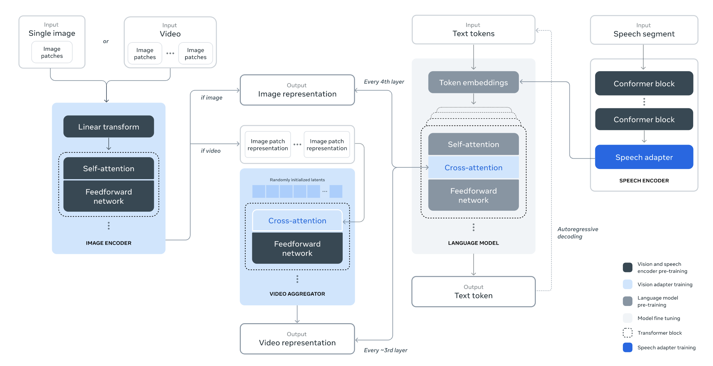

#### **三、训练**

1. **预训练**：预训练的文本模型和视觉编码器权重进行初始化。

   1. **图像预训练**。**训练图像适配器和图像编码器**。将图像的大小调整为最多四个 336 × 336 的patch内，排列成不同纵横比的patch，例如 672 × 672,672 × 336 和 1344 × 336。

   2. **退火**。**训练图像适配器和图像编码器，**&#x589E;加了每块图像分辨率。

   3. **视频预训练。** **训练perceiver resampler和交叉注意力层**，从完整视频采样 16 帧，使用 16 的聚合因子获得一个有效的帧，四个块表示每一帧，每个块的大小为 448 × 448 像素。

2. **SFT：**

   1. **图像SFT：只更新视觉编码器和图像适配器权重**，将预训练的语言模型的权重替换为经过SFT的语言模型的权重，使用多个随机数据子集、学习率和权重衰减值，对模型的性能进行排名，对 top-K 模型的权重进行平均以获得最终模型。

   2. **视频SFT**：**训练perceiver resampler和交叉注意力层，**&#x5C06;视频长度增加到 64 帧，并使用 32 的聚合因子来获得两个有效的帧。

3. **奖励模型：**&#x5728;视觉SFT模型和语言RM之上训练视觉奖励模型(RM)。**视觉编码器和交叉注意力层从视觉 SFT 模型初始化并在训练期间解冻**，而自注意力层从语言 RM 初始化并保持冻结。

4. **直接偏好优化：**&#x4E0E;语言模型类似，**使用偏好数据进一步训练具有直接偏好优化的视觉适配器，**&#x4EE5;指数移动平均 (EMA) 方式更新参考模型。

5. **拒绝抽样：**&#x5927;多数可用的问答对只包含最终答案，缺乏训练一个能够很好地泛化推理任务的模型所需的思维链解释。使用拒绝抽样来生成此类示例的缺失解释，启发式或LLM法官将生成的答案与基本事实进行比较，为每个问题保留多个正确答案，将这些正确答案添加回微调数据组合中来重新训练模型。

6. **Quality Tuning：**&#x7CBE;心策划了一个小型但高度选择性的SFT数据集训练DPO模型。

#### 四、数据

1. **预训练**

   **预训练图像数据**：

   * **用于图像编码器和适配器训练的图像-文本对**

     1. **质量过滤**：去除非英语和低质量caption，删除了低于某个 CLIP 分数的图像-文本对。

     2. **重复数据删除**： SSCD 模型将图像转化为512 维表示，余弦相似度度量，KNN，将高于某个阈值的示例定义为重复项，对这些重复项进行分组，只保留一个图像-文本对。

     3. **重采样**：如果caption在词汇表中出现的次数少于 T 次就保留。否则就以一定概率采样。

     4. **OCR**：使用专有光学字符识别 (OCR) pipeline提取。

   * **转录文件：**&#x5C06;文档中的页面渲染为图像，并将图像与其各自的文本内容配对。

   * **退火数据：**&#x4F7F;用n-gram重采样采样图像caption对到较小数量∼350M，来自五个额外来源的约 150M 个示例扩充结果数据 。

     1. **Visual Grounding**：使用文本中的标记作为参考或者将归一化 (xmin, ymin, xmax, ymax) 坐标直接插入到文本中；

     2. **屏幕截图解析**：将一段HTML代码渲染成网页，然后对这个网页进行截图，并让模型预测屏幕截图中产生特定元素(边界框标注)的代码。

     3. **问答对**：大量问答对。

     4. **合成caption**：包括由模型早期版本生成的合成caption的图像。

     5. **合成生成的结构化图像**：包括各种领域的综合生成的图像，例如图表、表格、流程图、数学方程和文本数据。

**预训练视频数据**

* 对于视频预训练，使用大量视频-文本对数据集。清洗过程：

  1. 清理相关文本，确保固定大写等，语言识别模型来过滤掉非英语文本，OCR 检测模型来过滤重叠文本过多的视频。

  2. 确保视频-文本对之间的对齐，过滤掉单帧图像-文本低相似性对和视频-文本低相似对。

* **视频比较长，像素比较高，具有不同纵横比。**&#x6570;据集包含平均持续时间为 21 秒且中位数持续时间为 16 秒的视频，超过 99% 的视频处于一分钟之内。空间分辨率在320p和4K之间，超过70%的视频的短边大于720像素。视频具有不同的纵横比，几乎所有视频在 1:2 和 2:1 之间纵横比之间，中位数为 1:1。

- **SFT数据**

  * **学术数据集**。使用模板或通过 LLM 重写将大量过滤的**现有学术数据集集合转换为问答对**。

  * **人工注释**。通过人工注释者为广泛的任务收集多模态对话数据。

  * **合成数据**。利用文本输入llm的推理能力在文本域中生成问答对，并将文本表示替换为其对应的图像，生成合成的多模态数据。

- **偏好数据**：为奖励建模和直接偏好优化构建了多模态成对偏好数据集

#### 五、结果

* 图像识别， Llama 3 的视觉模块在不同的模型容量下在广泛的图像识别基准上具有竞争力。

  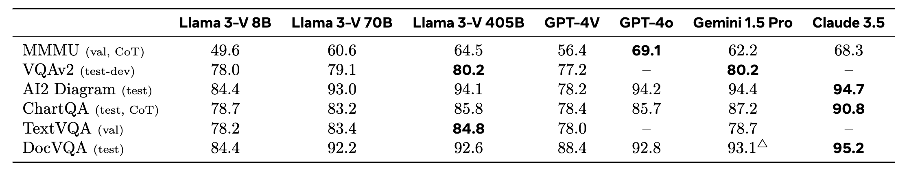

* 视频理解，在训练期间通过微调小型视频适配器的Llama 3模型非常具有竞争力

  

### [A Survey on Multimodal Large Language Models](https://arxiv.org/pdf/2306.13549)

#### 一.上下文学习

1. ICL是llm的重要涌现能力之一。ICL 有两个很好的特征：

（1）ICL是从类比中学习，LLM 从几个例子以及可选的指令中学习并外推新问题，从而以少样本方式解决复杂和看不见的任务&#x20;

&#x20; (2) ICL通常以无训练的方式实现，与 ICL 密切相关的技术是指令调整，经验表明它可以提高 ICL 能力&#x20;

* **多模态上下文学习指的是给定少量样例作为Prompt输入，激发模型潜在的能力并规范化模型的输出**。M-ICL 可以通过将演示集（即一组上下文样本）添加到原始样本来实现

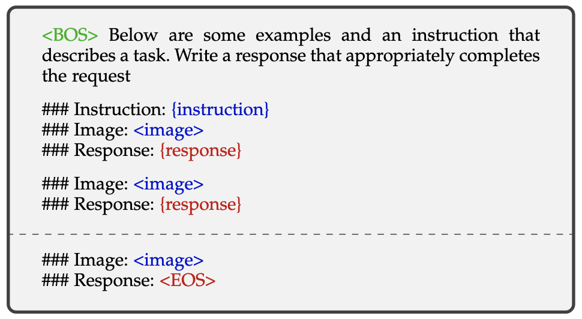

* 具体方法

  1. **[MIMIC-IT: Multi-Modal In-Context Instruction Tuning](http://arxiv.org/abs/2306.05425)（2023.06 南洋理工，微软）：**&#x6784;建一个格式为多模态上下文的指令数据集，将上下文学习与指令调整相结合。在引入的数据集上调整的模型指令在caption任务中显示出改进的少样本性能。有四个任务，为每个任务创建上下文学习数据

  

  我们的数据集包含超过 280 万个指令-响应对，其中每对至少包含一个多模态上下文示例和一个仅语言上下文示例。

  1. &#x20;LLaVA-Interleaved.&#x20;

     通过检索LLAVA-Instruct-150K中每个指令-响应对的十个上下文示例来细化LLAVA-Instruct-150K数据集，构建LLAVA-Interleaved (LA-I)。我们根据指令文本到文本的相似性或图像-图像相似性来识别每个数据的上下文示例

  2. Spot The Difference.&#x20;

     1）通用场景差异，涉及通过使用COCO2017\[27]的图像到图像的相似性关系来确定与当前图像最相似的图像来创建一对图像，使用原始图像标题和对象检测注释提示 ChatGPT

     2）细微的差异，来自从监控镜头中提取的 Spot-the-Diff的细微区别的类似图像的特征对。对于第一种类型，使用自然语言差异描述作为注释。

     生成的指令-响应对侧重于识别成对图像之间的差异

     

  3. Visual Story Telling.&#x20;

     扩展视频理解的范围，DC 特征来自的密集字幕，对应于较长视频中的剪辑。指令提出了一组不同的问题，解决了视频的一般视觉内容、人类行为和行为、事件的时间顺序和因果关系。这种方法鼓励VLM更深入地研究视频内容的复杂性。

     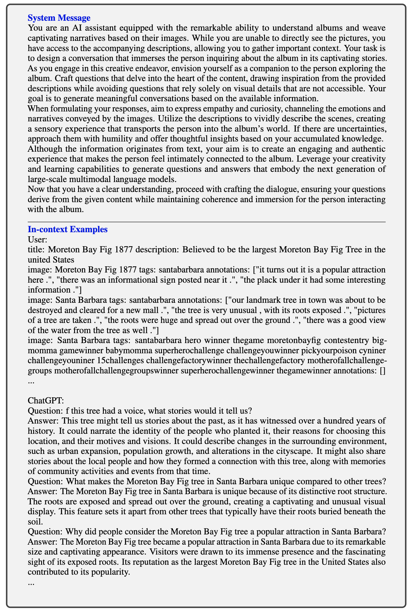

  4. Dense Captions.

     将具有高级字幕的电视节目片段整合到 VLM 训练过程中的主要目的是增强他们的社会推理能力并加深他们对复杂角色动态的理解。通过组织中的戏剧片段来分析人物关系和动机，我们旨在挑战VLM 超越单纯的感知，并在电视节目叙述的背景下展示他们的推理能力。这种聚焦方法对于促进能够有效处理各种现实世界情况和用户查询的高级VLM至关重要。

     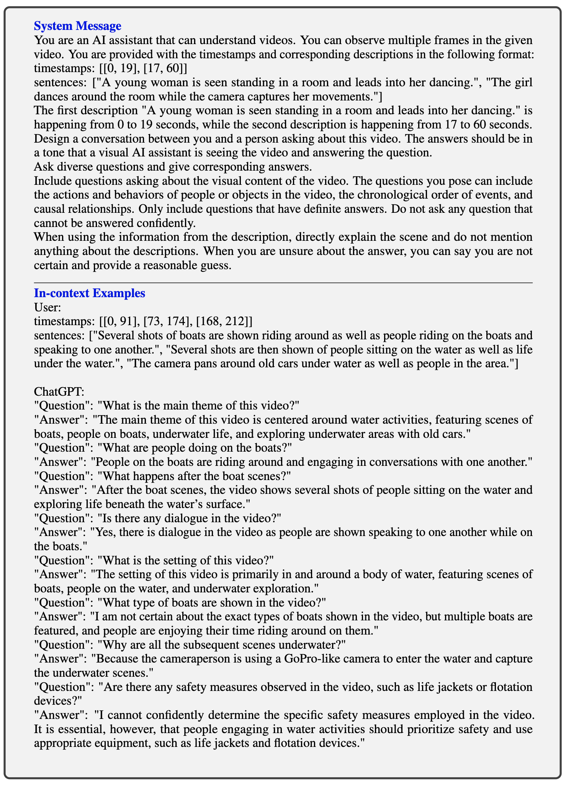

  5. **[Emu: Generative Pretraining in Multimodality](http://arxiv.org/abs/2307.05222)（2024.05 北京人工智能研究院）：**&#x901A;过在模型生成和相应的训练语料库中引入额外的模态来扩展。在引入的视觉解码器的帮助下，该模型从额外的视觉监督中学习，并支持输出格式和上下文推理更大的灵活性。具体来说，除了纯文本中的回答外，模型还可以以图像的形式给出响应。

     这种全向模型可以通过一次性自回归训练过程不加选择地（例如交错图像、文本和视频）接受任何单模态或多模态数据输入。首先，视觉信号被编码到嵌入中，文本标记形成一个交错的输入序列。Emu 是端到端训练的，目的是对下一个文本标记进行分类或回归多模态序列中的下一个视觉嵌入。这种通用的多模态允许大规模利用不同的预训练数据源，例如具有交错帧和文本的视频、具有交错图像和文本的网页以及网络规模的图像-文本对和视频-文本对。Emu可以作为图像到文本和文本到图像任务的通用多模态界面，支持上下文图像和文本生成。

  

  * **[Towards More Unified In-context Visual Understanding](http://arxiv.org/pdf/2312.02520)（2023.12 中科大）**&#x5C1D;试将输出模式扩展到文本和图像中。这项工作不是为图像采用专门的编码器，而是采用了具有共享嵌入层的统一量化方案。将文本和视觉提示量化为一个统一的表示空间，结构化为交错的上下文序列。然后使用仅解码器的稀疏转换器架构对它们执行生成建模，从而促进上下文学习。

  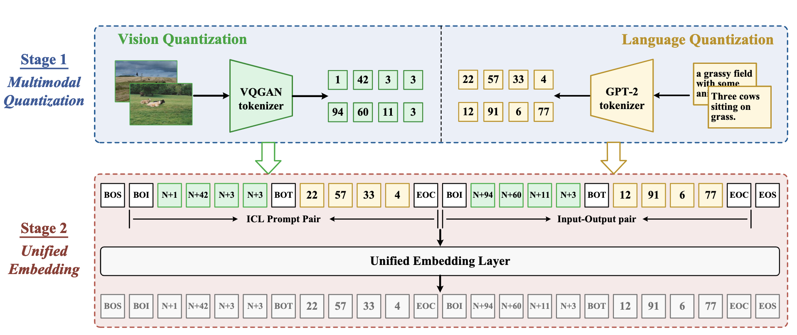

  * **[Link-Context Learning for Multimodal LLMs](http://arxiv.org/pdf/2308.07891)（2023.08 SenseTime Research）**&#x5728;特定设置下提高小样本学习性能，链接上下文学习侧重于加强图像标签对之间的因果链接，并通过制定正负图像描述对来投射对比训练方案。上下文学习涉及为演示提供不相关的任务，而链接上下文学习的演示阶段和推理阶段之间存在直接因果关系。通过提供因果链接的演示，LCL 引导模型不仅识别类比，还识别数据点之间的潜在因果关联，这使得 MLLM 能够更有效地识别看不见的图像并理解新概念。

  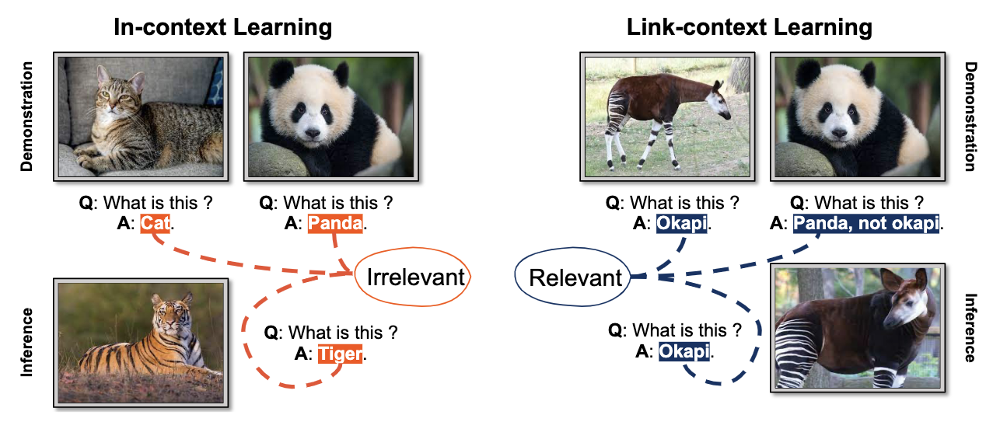

  * [MMICL: Empowering Vision-language Model with Multi-Modal In-Context Learning](http://arxiv.org/html/2309.07915v3)（2024.05 北大）旨在增强使用多个相关图像进行推理的能力。为了增强图像和文本之间的联系，本文提出了一种上下文方案，将交错的图像-文本数据转换为统一的格式。发现当插入一小部分不连贯的图像/文本作为噪声时，MLLM 可能会被误导以给出与上下文不一致的响应。基于观察，这项工作相应地提出了一种预过滤方法来去除不相关的上下文并促进更连贯的响应。

  

* M-ICL主要用于两种情况:(1)解决各种视觉推理任务；(2)教llm使用外部工具。

#### 二.思维链

1. CoT的主要思想是促使LLM不仅输出最终答案，还输出导致答案的推理过程

2. 学习范式

   1. **微调**：涉及为 M-CoT 学习设定的数据集，ScienceQA，可以作为学习CoT推理的来源，以两步方式生成输出，即基本原理（推理步骤链）和基于基本原理的最终答案。

   2. **无训练少样本学习**：few-shot 学习通常需要**手工制作一些上下文示例**，以便模型可以更容易地逐步推理。

   3. **无训练零样本学习**：模型学习使用嵌入的知识和推理能力，而**无需显式指导**，**提示设计的指令**，如“让我们逐帧思考”或“这两个关键帧之间发生了什么”

3. Chain Configuration

   1. **单链**进行推理，逐步推理过程形成了一个单一的问题理性答案链

   2. **树形链**，将问题分解为多个子问题，每个问题都由 LLM 本身或视觉专家解决以生成基本原理。然后LLM根据基本原理聚合和推理以形成最终答案

      1. **[DDCoT: Duty-Distinct Chain-of-Thought Prompting for Multimodal Reasoning in Language Models](http://arxiv.org/pdf/2310.16436v1)（2023.10 上海科技大学）：** Duty-Distinct Chain-of-Thought Prompting (DDCoT)，包括三个步骤：（1）我们利用 LLM 的内在知识来生成多模态基本原理。(2) 我们明确提示 LLM 逐步区分推理和识别步骤的责任。(3) 我们明确标记了不确定部分的负空间，强调基本原理生成中的批判性思维。我们的DDCoT联合利用了llm中的推理能力和视觉问答模型对一般多模态基本原理生成的图像理解能力。

      

4. 链配置

   1. **基于填充**的模式，需要推导周围上下文（前后步骤）之间的步骤来填补逻辑空白

      * **[VISUAL CHAIN-OF-THOUGHT: BRIDGING LOGICAL GAPS WITH MULTIMODAL INFILLINGS](http://arxiv.org/pdf/2305.02317v3)（2024.04 加州大学）：**&#x5229;用思维链提示和视觉语言基础来递归地弥合顺序数据中的逻辑差距。我们的方法使用视觉引导来生成合成多模态填充，这些填充添加了一致和新颖的信息，以减少可以从时间推理中受益的下游任务的逻辑差距，并为模型的多步推理提供可解释性。

      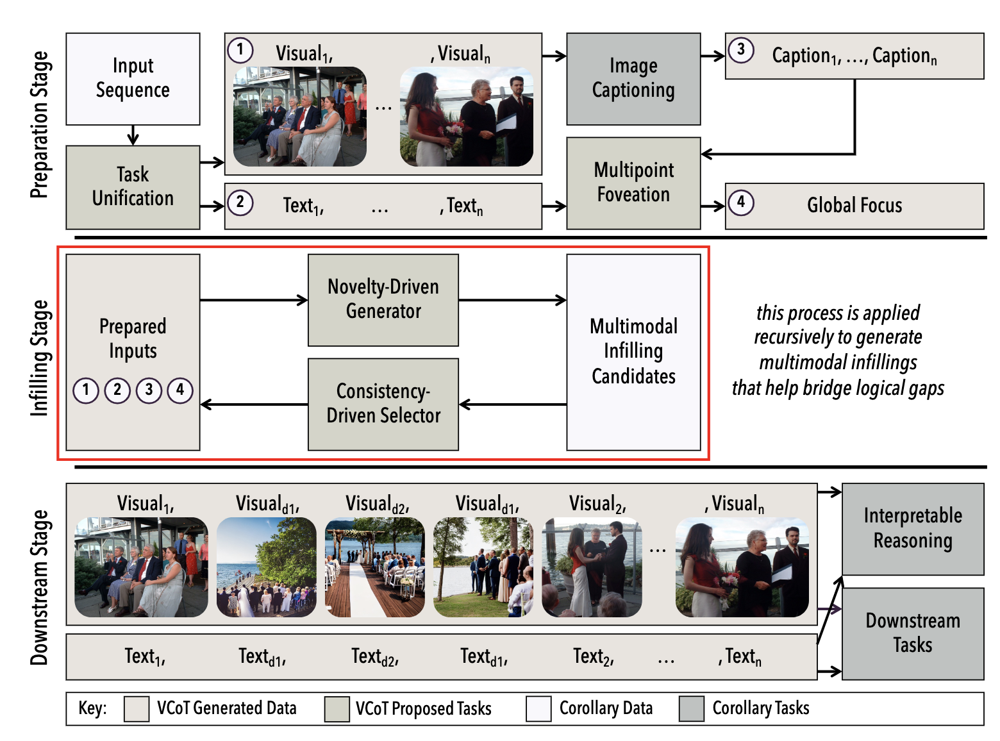

   2. **基于预测**的模式。需要扩展给定条件的推理链，例如指令和先前的推理历史&#x20;

      * **[MM-REACT: Prompting ChatGPT for Multimodal Reasoning and Action](http://arxiv.org/abs/2303.11381)（2023.05 微软Azure AI）：**&#x4F7F;用ChatGPT增强视觉理解的MM-REACT。用户输入可以是文本、图像或视频的形式，后两者表示为文件路径字符串。如果需要视觉专家来解释视觉输入，则 ChatGPT 被指示在动作请求中说出特定的观看词。正则表达式匹配用于解析专家的名称和文件路径，然后用于调用视觉专家（动作执行）。专家的输出（观察）被序列化为文本并与历史相结合以进一步激活 ChatGPT。如果没有需要额外的专家，MM-REACT 将返回对用户的最终响应。右图显示了单轮视觉专家执行，它是构建图 3 所示的完整执行流程的组件。

      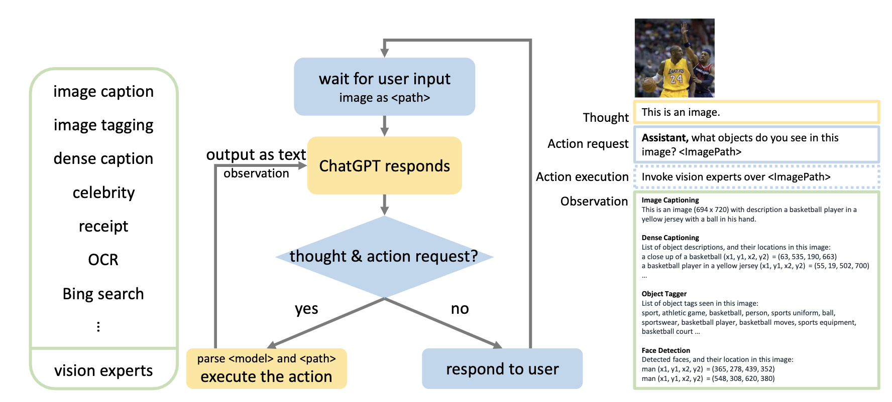

#### 三.**LLM辅助视觉推理**

1. 训练范式

   1. **无训练**：在这种范式下，利用预训练的LLM中存储的丰富先验知识，直接冻结预训练模型并直接指示LLM完成各种需求。根据设置，推理系统可以进一步分为：

      * **Few-shot模型**：这些模型使用少量手工制作的上下文样本来指导LLM生成程序或执行步骤序列。这些程序或执行步骤**作为**对应基础模型或外部工具/模块的**指令**。

      * **Zero-shot模型**：这些模型更进一步，直接利用LLM的语言/语义知识或推理能力。例如，PointCLIP V2利用GPT-3生成具有3D相关语义的**描述**，**以更好地与对应的图像对齐**。

   2. **微调**：另一些工作采用进一步的微调策略，以提高系统的规划能力（如工具使用）或改进定位能力。例如，GPT4Tools引入了指令调优方法，收集并使用新的与工具相关的指令数据集来微调模型。

      * &#x20;**[Visual ChatGPT: Talking, Drawing and Editing with Visual Foundation Models](https://arxiv.org/abs/2303.04671)（2023.09 微软亚洲研究院）**&#x63CF;述了任务和工具使用，以将复杂任务分解为子任务。结合了不同的视觉基础模型，使用户能够通过 1) 发送和接收语言以及图像 2) 提供复杂的视觉问题或视觉编辑指令与 ChatGPT 交互，该指令需要多个 AI 模型与多步协作。3) 提供反馈并要求更正的结果。我们设计了一系列提示，将视觉模型信息注入 ChatGPT，考虑多个输入/输出的模型和需要视觉反馈的模型。

      

2. Function

   1. **LLM作为控制器（与coT相关）**：

   LLM主要有两个作用：(1) 将复杂任务分解为简单的子任务或步骤；(2) 将这些任务分配给适当的工具或模块，这通常通过利用LLM的CoT。

   * [Visual Programming: Compositional visual reasoning without training](https://arxiv.org/abs/2211.11559)（2022.11 Allen Institute for AI）它使用大型语言模型的上下文学习能力来生成类似python的模块化程序，然后执行该程序以获得解决方案和全面且可解释的基本原理。生成的程序的每一行都可以调用几个现成的计算机视觉模型、图像处理子程序或python函数之一，以产生可能被程序后续部分消耗的中间输出。

   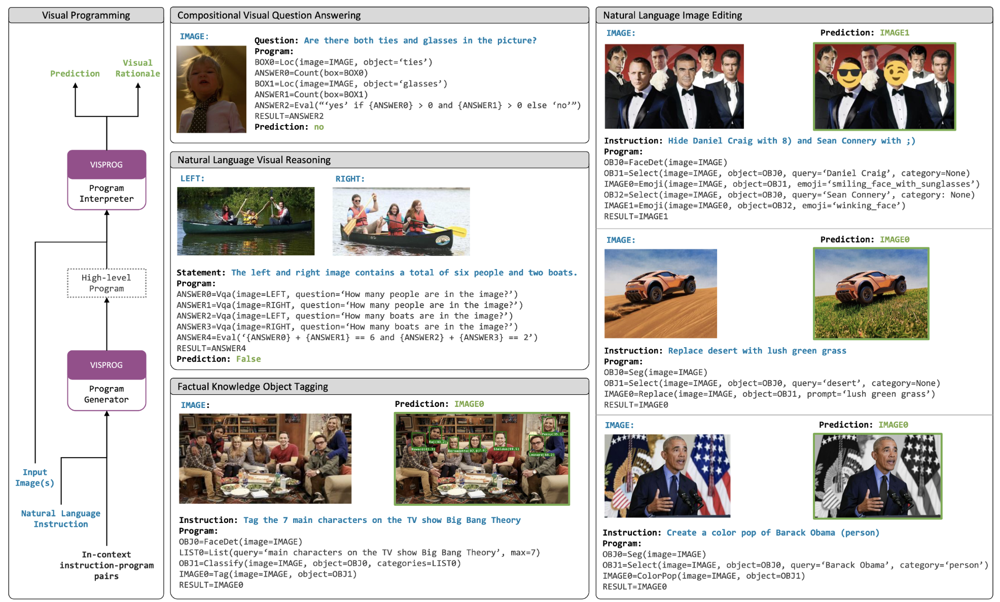

   * **LLM作为决策者（与coT相关）**：

   复杂任务通常以多轮方式进行，常常是迭代的。决策者通常承担以下责任：(1) 总结当前情境和历史信息，并决定当前步骤可用的信息是否足以回答问题或完成任务；(2) 组织和总结答案，以用户友好的方式呈现。

   * **[IdealGPT: Iteratively Decomposing Vision and Language Reasoning via Large Language Models](http://arxiv.org/pdf/2305.14985v1)（2023.05 哥伦比亚大学）:**&#x49;dealGPT 利用 LLM 生成子问题，VLM 提供相应的子答案，另一个 LLM 进行推理以实现最终答案。这三个模块迭代地执行分而治之的过程，直到模型对主要问题的最终答案有信心。

   

   * **LLM作为语义调优器**：

   当LLM被用作语义调优器时，研究人员主要利用其丰富的语言学和语义知识。具体来说，LLM经常被指示将信息集成到一致和流畅的自然语言句子中，或根据不同的具体需求生成文本。

   * **[Caption Anything: Interactive Image Description with Diverse Multimodal Controls](http://arxiv.org/abs/2305.02677)（2023.05 南科大VIP Lab）:**&#x56;anilla 图像字幕方法缺乏明确的控制，这使得它们不适合与用户进行交互。以前的可控图像字幕方法主要依赖于具有特定控制信号的有限尺度人工注释数据，它们仅支持预定义的控制信号。所提出的 CAT 是无训练的，并支持不同的视觉控制和语言控制。

   

####

### Cambrian-1

[Cambrian-1: A Fully Open, Vision-Centric Exploration of Multimodal LLMs](https://arxiv.org/pdf/2406.16860)（2024.06 纽约大学）

code：https://github.com/cambrian-mllm/cambrian

Cambrian-10M:https://huggingface.co/datasets/nyu-visionx/Cambrian-10M

Adapter data:https://huggingface.co/datasets/nyu-visionx/Cambrian-Alignment

CV-Bench:https://huggingface.co/datasets/nyu-visionx/CV-Bench

Cambrian-7M：未开源

#### 1. 概述

虽然更强的语言模型可以增强多模态能力，但视觉组件的设计选择往往没有得到充分的探索，并且与视觉表示学习研究脱节。这项工作的目标是通过从以视觉为中心的角度探索MLLM来弥合视觉表征的差距。

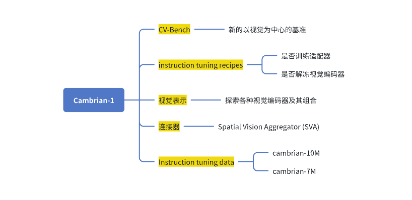

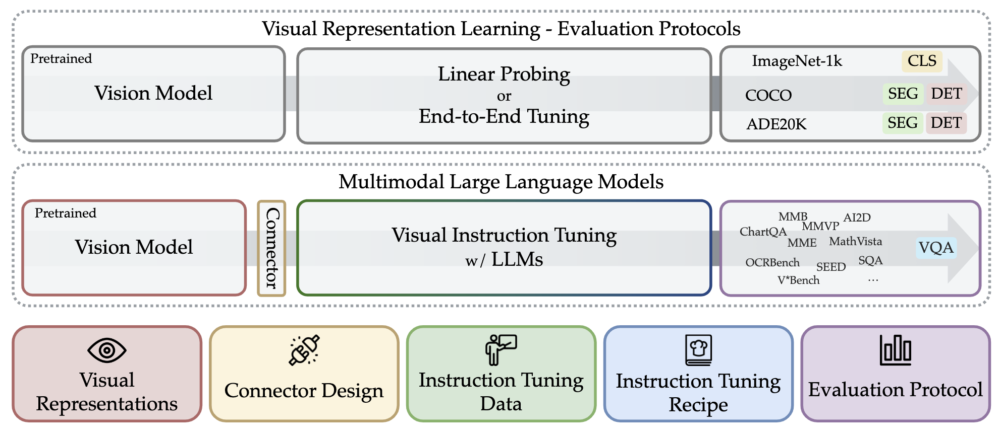

#### 2. Cambrian Vision-Centric Benchmark (CV-Bench)

* **motivation：**

  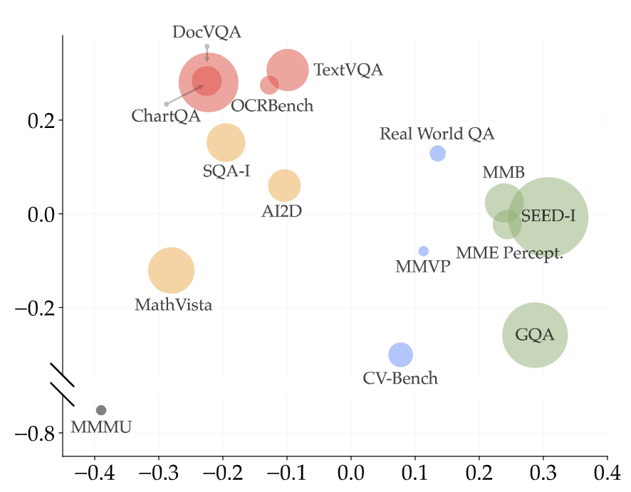

  1. **大多数基准未能准确地度量以视觉为中心的能力，少数能度量这些能力的基准也只有非常少的样本。**&#x4E14;不能反映现实世界分布中发现的各种感知挑战。

  2. 现有的以视觉为中心的基准的大小不足，此外，这些基准并不涵盖关键的视觉元素，如深度和空间意识。

  3. **可以将现有视觉基准有效地调整用于 VQA 任务，实现对以视觉为中心的 MLLM 能力的评估。**

* **确定一个基准是否真的需要视觉输入，**&#x57FA;于 23 个不同视觉骨干网络，使用两阶段指令微调过程训练了 MLLM：首先基于 ShareGPT-4V 的 1.2M 适应器数据训练连接器，之后在 737K 指令微调数据上同时微调该连接器和 LLM。

  1. SQA-I、MMMU、MathVista 和 AI2D 显示视觉启用和禁用之间的差距不到 5%，这表明这些基准可能并不完全依赖于视觉输入，而是严重依赖基础 LLM。

  2. TextVQA 和 GQA 都展示了随机猜测和视觉禁用分数之间的几乎 40% 的差距，这意味着这些基准测试中模型能从问题文本中提取出显著的有用信息。

  3. MMVP 和 MME 感知等基准上的视觉禁用性能明显低于随机猜测，这表明强大的视觉基础尤其重要。

* **CV Bench：**&#x4F7F;用 2638 个手动选择的示例，将传统的视觉基准转换为VQA格式，以视觉为中心的MLLM基准。CV-Bench 提供了比其他以视觉为中心的 MLLM 基准更多的示例——比 RealWorldQA多 3.5 倍，比 MMVP 多 8.8 倍。CV-Bench 通过空间关系和对象计数评估 2D 理解，以及通过深度顺序和相对距离进行 3D 理解。

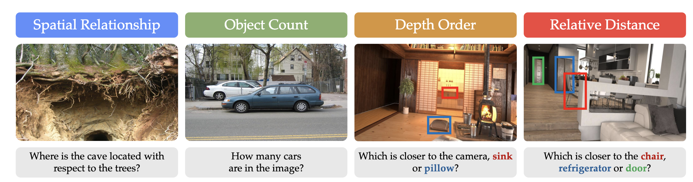

* **CV-CB Benchmark Filtering：**

  1. 针对特定任务量身定制的：使用COCO和ADE20K数据集的2D相关任务，以及使用Omni3D的3D相关任务。使用原始基准及其相关的基本事实注释，生成查询和答案对。

  2. 在生成查询和答案对后，我们让人类专家手动筛选出任何不正确或不明确的查询，以提高基准的质量。每个查询都被分配三种状态之一：接受（按原样使用）、修改（修改了不正确的答案）和拒绝（不明确的询问，如太小或难以辨别的询问，即使是人类专家也不例外）。

* 为了确保2D和3D任务具有同等的重要性，使用了一个评估度量，该度量是从这些任务中获得的精度的平均值。

#### 3. Instruction Tuning Recipes（基于LLaVA）

* **训练配方对模型性能的影响（是否训练适配器 和是否解冻视觉编码器）：**。箱线图显示了不同训练策略和视觉编码器类型（语言监督、自我监督和其他）的基准类别之间的基准分数分布。**四个训练配方包括使用不同数量的适配器数据 (0M , 0.5M , 1.2M ) 训练并冻结视觉编码器，并使用 1.2M 适配器数据解冻视觉编码器。**

  1. **预训练适配器的数据量**：所有模型类型在具有更多适配器数据的通用和以视觉为中心的基准上都表现出更高的性能；

  2. **解冻：**&#x7528; 1.2M 适配器数据解冻视觉编码器通常有利于所有类别的好处。语言模型全面受益于解冻；自监督模型在以视觉为中心的基准测试中特别有利，但在 OCR 中表现并没有那么好。

  

  * **One Stage vs Two Stage Training：**&#x9884;训练适配器提高模型性能，并且更多的适配器数据进一步提高了所有域的性能。

  * **Freeze vs Unfreeze Vision Encoder：**&#x89E3;冻视觉编码器是非常有益的。语言监督模型总是有好处的；自监督模型特别有利于以视觉为中心的基准。

#### 4. 视觉表示

##### 4.1 探索各种视觉编码器，提升MLLMs在处理复杂视觉任务时的表现

* 虽然语言监督模型优于自监督模型或其他模型，但像DINOv2这样训练有素的自监督模型也可以在以视觉为中心的任务上取得有竞争力的表现。

  1. 分辨率的模型特别提高了图表和视觉中心基准的性能，同时在通用 VQA 和基于知识的 VQA 上保持中立。

  2. 基于 ConvNet 的架构本质上非常适合高分辨率图像处理 ，并且可以在 OCR \&chart; Chart 和 Vision-Centric 基准上产生更好的结果。

  3. 在以视觉为中心的基准测试中，语言监督和其他类型的视觉模型之间的差距更小，训练有素的自我监督 Dinov2 模型甚至优于一些语言监督模型。

  

  * **高分辨率编码器大大提高了以图表和视觉为中心的基准测试的性能，基于convnet的架构本质上非常适合此类任务。**

  * Dinov2 在通用模型和知识基准上和语言监督模型差距不大，甚至在以视觉为中心的基准上优于一些语言模型。

* **缩小语言和自我监督模型之间的差距，研究基于自监督模型的MLLM的持续微调是否可以达到与语言监督模型相似的性能**。考虑到与CLIP相比，DINOv2的训练数据要少得多，因此将指令调优数据从737K扩展到5M

  1. 通过解冻视觉骨干，使用5M数据微调的基于dinov2的MLLM优于使用0.7M数据的CLIP模型训练的MLLM。

  2. 在5M设置下，DINOv2和CLIP模型之间的差距减小了。

  3. 随着数据的增加和解冻，DINOv2显示出显著的性能改进——在几个基准测试中超过了0.7M CLIP模型，并在以知识和视觉为中心的任务中缩小了与5M模型的差距。

  

  * **语言监督的视觉模型提供了强大的优势，但在给定足够的数据和适当的调整的情况下，视觉自监督方法可以缩小性能差距。**

##### 4.2 组合比较

不同的视觉编码器在MLLM性能的不同方面表现出色，探索组合多个视觉编码器以利用它们的独特表示的潜力，旨在构建一个更强大的 MLLM。

* **探索不同视觉模型组合：**&#x5177;有 1.2M 适配器数据 + 737K 指令调优数据的模型集成的所有基准测试结果，将视觉token插值到固定数量576，然后沿特征维度连接这些token

  1. 随着更多模型的添加，性能得到了一致的改进。

  2. 然而，这种朴素的策略有两个局限性:

     1. 它使用插值，这可能导致信息丢失，特别是对于具有高分辨率特征图的视觉编码器;

     2. 通过简单的连接平等地对待每个模型。因此，我们寻求一种更有效的策略，可以更灵活地利用模型组合，减少信息损失。

  

  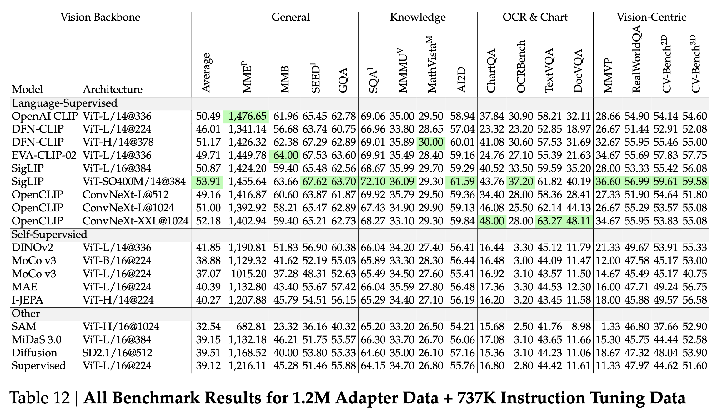

**结合多个视觉编码器，包括视觉SSL模型，增强了MLLM在各种基准测试中的性能，特别是在以视觉为中心的任务中。**

#### 5. Spatial Vision Aggregator (SVA)

* 具体来说，新方法引入了两种新的以视觉为中心的**设计原理**：

  1. SVA 采用了动态和空间感知的设计，能够在多个视觉编码器之间进行特征整合，同时保持视觉特征的空间信息。

  2. 跨 LLM 层多次聚合视觉特征，让模型能够重复访问和集成必要的视觉信息，能够处理高分辨率图像中的丰富信息，而不会导致信息损失。

* **具体流程**

  1. **Spatial inductive bias：**&#x4E3A;了在交叉注意过程中保持空间结构，我们将query中的每个token与所有视觉编码器中特征映射的特定子区域对齐。 query维度为 $$L^{2}\times C $$，第k个视觉编码器特征图分辨率为 $$m_{k}L \times m_{k}L \times C
     $$，$$  {\textstyle \sum_{k}^{}m_{k}^{2} }  $$个特征被聚合到单个token中，有效地减少了token的数量。

  

  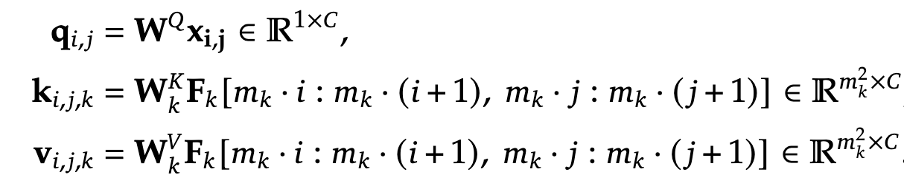

  * **Multi-layer vision aggregation：**&#x5728;整个LLM层中插入交叉注意力——**允许对未压缩的视觉信息进行访问。**

* **消融实验**

  1. **使用前面的最佳视觉模型组合: OpenAI CLIP ViT-L/14@336, SigLIP ViT-SO400M/14@384, OpenCLIP ConvNeXt-XXL@1024, and DINOv2 ViT-L/14@518和Vicuna-1.5-7B来证明SVA模块的有效性。**&#x4E0D;同的连接器，SVA中交叉注意层数D=3，不同可学习query组数G=1，并在LLM中插入交叉注意块，层步长为3，对于LLM层内的交叉注意层，D和G总是设置为1。SVA-no-multi-agg中D=3，G=3，它在LLM内部不添加交叉注意块。

     1. SVA在所有基准类别中都优于两个基线，OCR和图表类别有了显著的改进(需要高分辨率的特征理解)

  

  * **SVA超参数选择的研究。使用 OpenAI CLIP ViT-L/14@336 + OpenCLIP ConvNeXt-L@1024 作为基础模型组合，专注于 OCR 和图表类别，以评估对高分辨率视觉理解的影响。**

    1. 更大的**交叉注意层数(D)**&#x5141;许更多的堆叠交叉注意操作来促进聚合过程

    2. 更大的**不同可学习query组数(G)**&#x5141;许捕获更广泛的聚合模式。query组并行聚合视觉信息，然后将它们连接起来形成LLM的最终视觉标记。

    3. 通过𝐷或𝐺增加容量可以提高性能，并且通过在LLM中添加跨注意层来允许多层视觉聚合也可以提高性能

  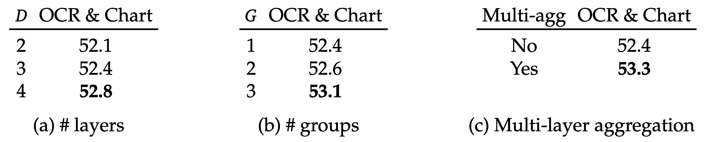

  **空间归纳偏置以及 LLM 和视觉特征之间的深度交互有助于更好地聚合和凝练视觉特征。**

* 模型设置

  * &#x20;"siglip/CLIP-ViT-SO400M-14-384", "openai/clip-vit-large-patch14-336", "facebook/dinov2-giant-res378", "clip-convnext-XXL-1024"

  * D=3，G=1，LLM内D=1，G=1；对于Cambrian-8B、Cambrian-13B和Cambrian-34B，LLM内部交叉注意层的步长分别为3、4和9，输入全局特征与query拼接在一起。

  * 除了 ConvNext 之外，所有视觉编码器的特征图都被插值到 576×576（ $$m_k$$= 1 ， $$L$$ =24）。对于 ConvNext，我们首先将特征图从其 4 个阶段插值（Mini\_gemini）到 96 × 96（ $$m_k$$= 4， $$L$$ =24）。

#### 6. Instruction Tuning Data

##### 6.1 数据选择

* **从现有数据源收集指令调优数据：**&#x5DE6;：内圈显示寒武纪-10M的原始分布。外圈显示策划的 Cambrian-7M。右图：Cambrian 数据集中的所有数据源以及数据管理中过滤的数据源。通过增强多样性、平衡源和改进混合来检查数据管理。

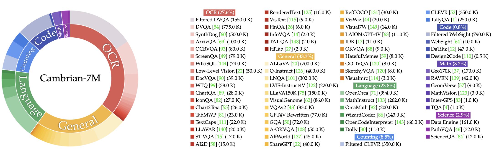

* **数据的分布是不平衡的。有些类别，如Science，有很少的数据来源，每个来源都有有限的样本。**

* **有针对性的互联网数据收集引擎（Data Engine ）：**

  * 引入数据引擎，引擎选择一个目标字段和子字段，例如“Physics”，并使用像GPT-4这样的LLM来识别主题(例如“Newton’s Laws”)。

  * 它会为每个主题搜索像维基百科这样的可靠来源。解析器提取图像标题元组，并将标题文本提供给LLM，如GPT-3.5，以使用工程提示符生成关于图像的指令型问答对。这些问答对和图像构成了我们的VQA数据集。

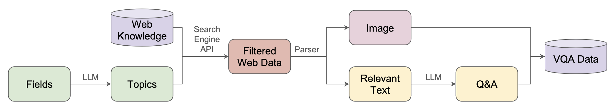

##### 6.2 数据配置

Cambrian-10M 是来自各种数据源的大量指令调整数据，类别之间的数据比率不平衡。通过改进数据平衡和调整数据比率来研究数据管理的初步步骤。实验涉及使用Vicuna-1.5-7B和OpenAI CLIP vitl /14@336px视觉编码器进行微调。

* **Data Balancing：**&#x8BBE;置来自单个数据源的数据点数量的阈值t，发现250k和350k之间的阈值最适合Cambrian-10M。

* **Cambrian-7M：**&#x901A;过使用我们确定的数据比率对Cambrian-10M应用数据过滤，创建了一个更小但质量更高的数据集，称为Cambrian-7M。

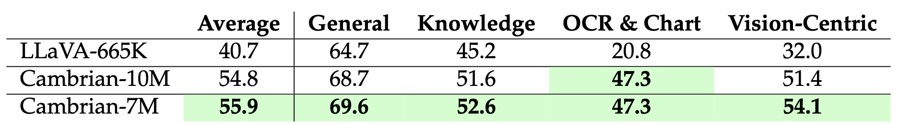

##### 6.3 通过系统提示缓解“答录机现象”

**我们怀疑这个问题源于指令调优数据包含过多的短响应VQA任务，导致LLM中的灾难性遗忘。**&#x6211;们在训练过程中加入了额外的系统提示，例如在回答中生成单个单词或短语的问题之前**附加诸如“使用单个单词或词组回答问题”之类的提示**。在集成这些系统提示后，虽然模型的基准性能保持不变，但其会话能力显著提高。

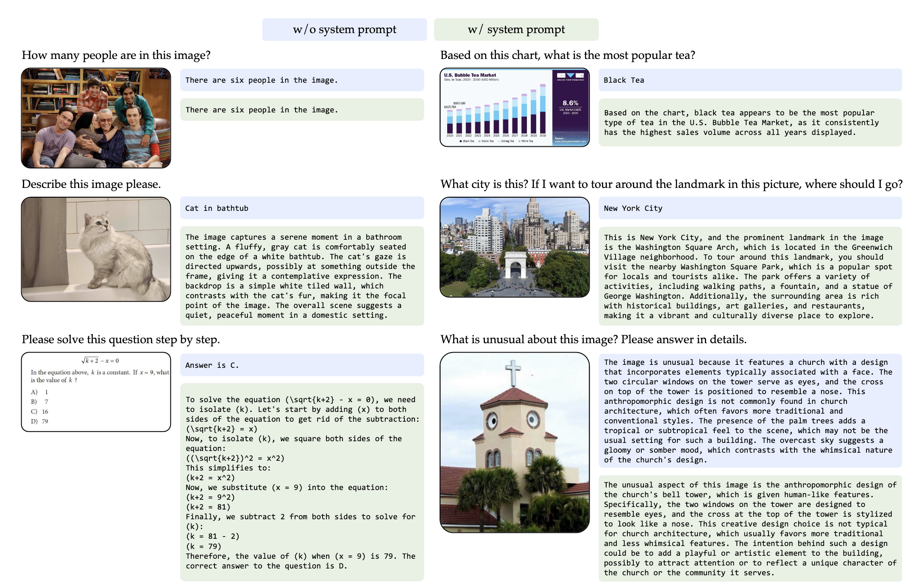

#### 7. Summary

* 使用各种尺度的LLM主干训练模型:LLaMA-3-Instruct-8B、Vicuna-1.5-13B和Hermes-2-Yi-34B，视觉组件结合了四个模型- OpenAI CLIP vit/L-14-336, SigLIP vit-so400m/14-384, OpenCLIP ConvNeXt-XXL-1024和DINOv2 vit-L/14-518。**使用2.5M数据（Cambrian-Alignment:shareGPT4V和Mini-Gemini captioning data）预训练连接器，并使用Cambrian-7m数据微调模型**

1. 以视觉为中心的多模态大语言模型设计：

* 现有模型：主要依赖于语言模型的强大能力，在视觉方面的设计和优化相对较少。

* Cambrian-1：重点放在视觉表征学习上，系统性地评估和整合多种视觉编码器，更好地捕捉和利用视觉信息。

- 训练配方：

* **One Stage vs Two Stage Training：**&#x9884;训练适配器提高模型性能，并且更多的适配器数据进一步提高性能。

* **Freeze vs Unfreeze Vision Encoder：**&#x89E3;冻视觉编码器是非常有益的。语言监督模型总是有好处的；自监督视觉模型特别有利于以视觉为中心的基准。

- 新的基准测试（CV-Bench）：

* 现有基准测试：通常无法全面评估模型在真实世界中的视觉能力，存在样本量小和评估维度单一的问题。

* CV-Bench：通过重新设计经典的视觉任务，如2D和3D空间理解任务，提供更丰富和全面的视觉基准测试，能够更准确地评估模型的视觉理解能力。

- 空间视觉聚合器（SVA）：

* 现有连接器设计：通常是简单的投影或重新采样方法，无法充分利用高分辨率视觉特征，导致信息损失。

* SVA：引入动态和空间感知的连接器设计，能够在LLM层中多次进行视觉特征聚合，减少信息损失并提高模型的视觉感知能力。

- 高质量的指令调优数据：

* 现有数据集：多模态数据集通常规模较小，缺乏多样性，数据质量参差不齐。

* Cambrian-1数据集：通过系统的收集和策划，创建了Cambrian-10M和Cambrian-7M数据集，确保数据的多样性和高质量，增强模型的泛化能力。Cambrian-10M：包含大约978.4万个数据点，是一个非常大的数据池，提供了丰富的视觉和语言指令微调数据。Cambrian-7M：通过对 Cambrian-10M 数据集进行筛选和策划，生成了一个更小但质量更高的数据集，包含约700万个数据点。

> code：https://github.com/cambrian-mllm/cambrian
>
> Cambrian-10M:https://huggingface.co/datasets/nyu-visionx/Cambrian-10M
>
> Adapter data:https://huggingface.co/datasets/nyu-visionx/Cambrian-Alignment
>
> CV-Bench:https://huggingface.co/datasets/nyu-visionx/CV-Bench
>
> Cambrian-7M：未开源

### MammothModa

字节跳动。2024.7。（这个paper像是初稿，很多细节写的不清楚）

#### 一、Summary

MammothModa，旨在从基本基线开始实现最先进的性能。我们关注三个关键的设计见解：

（i）在保持复合语言理解的同时集成视觉能力：除了视觉编码器之外，我们还将**视觉注意力专家（Visual Attention Experts）**&#x6574;合到LLM中，以增强其视觉能力；

（ii）为**高分辨率**和**长时间**视觉特征**扩展上下文窗口**：我们探索**视觉合并模块**，以有效减少高分辨率图像的令牌数量，并结合**帧位置ID**，以避免位置内插法；

（iii）高质量双语数据集：我们精心策划和过滤了高质量双语多模态数据集，以减少视觉幻觉。

#### 二、模型

* Global-Local High-Resolution Splitting (GLHR)：比较简单直接的基于长宽比的动态分辨率方法，w/336、h/336向下取整，然后对整图resize到336整数倍大小，再切分。实验中最大patch数为12。此外，同样也是有global缩略图。

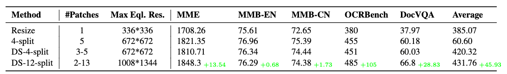

* Visual Merger：在MLP之前，使用二维平均池化降低token数。此外，该方法还支持，在测试时进一步使用更大池化窗口以进一步降低计算量。

* Shared Frame Position ID：在处理长时长视频时，大量的视觉标记很容易耗尽LLM的预训练positional embedding。一个潜在的解决方案是对位置嵌入执行内插法操作。然而，插值会引入不期望的副作用。本文认为，视觉Transformer已经将MLLM中视觉标记的空间位置信息封装在视觉特征中。因此，对于大量高分辨率的长时间视觉特征，LLM的有限位置嵌入被不必要地浪费了。为此，我们提出了Frame Position ID（FPID），其中**每个视频帧被分配同一个用于LLM输入的共享位置编码**。正式地，对于每帧有L个标记的视频输入的F帧，FPID仅保存该视频的F位置嵌入，而不是原始的L×F。

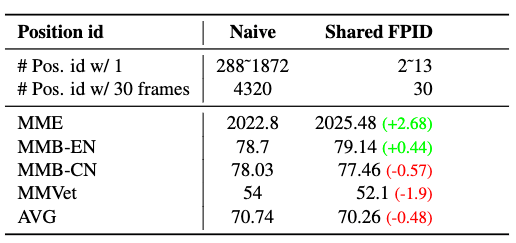

* Visual Expert：为了避免语言退化并获得最先进的视觉语言能力，我们在预训练的纯文本LLM中插入视觉专家（VE）模块。VE去做视觉token的转换，而文本token由原始LLM层转换。具体来说，VE模块由一系列QKV矩阵组成，旨在有效地处理视觉输入，而不会干扰原始模型的文本能力。从效率的角度来看，我们没有在FFN添加视觉专家。

#### 三、数据和训练

* 第一阶段：使用caption数据，训练MLP

* 第二阶段：使用双语caption、图文交错数据、OCR、grounding、视频caption，训练MLP和VE；

* 第三阶段：使用细粒度caption、conversation、VQA、图表、文档、数学、外部知识（例如维基百科）、双语OCR REC和识别、纯文本数据集（双语对话、数学、逻辑推理和代码），所有参数都训练。对于Vit使用layer-wise learning rate decay。

#### 四、结果

没说Vit用的什么，猜测是clip large；没说LLM用的什么，参数量多大

### EVLM

快手。2024.7

#### 一、Summary

我们的方法主要包括：

（1）采用类似于Flamingo的图像-文本交互的交叉注意。好处在于即使使用长视觉标记，控制交叉注意力中的特征维度也不会导致过多的计算开销；

（2）利用分层ViT特征。好处在于有助于理解不同颗粒度的任务；

（3）引入混合专家模型（MoE）机制以增强模型有效性。

#### 二、模型

* Visual Encoder：EVA2-CLIP-E-Plus，4.4B。从Transformer的最后40层中统一采样了8个特征序列，作为分层特征；

* Gated Cross-Attetion Layer: 与Flamingo类似，我们使用门控交叉注意在视觉和文本之间进行交互。与Flamingo不同的是，我们使用一组序列长度为16的learnable tokens ，希望这些learnable tokens能够类似于Qformer一样更好提取视觉特征。注意掩码如图所示，其中每组learnable tokens只能与对应图像交互，文本序列只能与多模态序列中的前面的图像交互；

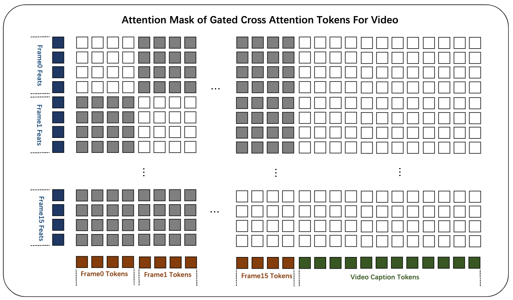

* Large Language Model：使用 Qwen-14B-Chat 1.0。我们在语言模型的每个Transformer层之前插入一个Gated Cross-Attetion Layer来额外处理视觉token。

#### 三、训练

* 第一阶段Multi-modal Pre-training

我们的多模态预训练主要针对两个目标：1）图像和文本的跨模态对齐，以及2）对多模态数据中的内在关系进行建模。我们基于这些目标收集了image-text caption和网络类型多模态数据的大规模数据集。值得注意的是，60%的数据由中文组成，包括大量自建的中文字幕数据。这样做是为了增强我们的多模态模型的细粒度对齐能力，涵盖特定的视觉概念，如名人、地标建筑。

**在训练的前25%阶段，只训练了Cross-Attetion Layer。在随后的75%阶段，我们解冻了视觉编码器后半部分的参数进行训练。在此阶段输入图像大小为224×224。**

图文交错数据清洗：

1.删除了包含损坏图像和纯色图像的数据。

2.删除了具有异常纵横比的数据。

3.删除了包含极低分辨率图像的数据。

4.删除了Web数据中图像数量过多的数据。

5.删除了文本长度超过2048个字符的数据。

6.应用了类似于MMC4的**相关性过滤**，以保留高度相关的图像。

* 第二阶段Multi-task Continual Pre-training

在持续预训练阶段，我们的训练数据来源分为五个不同的部分：视觉问答（VQA）数据、自然语言处理（NLP）数据、OCR数据、检测数据和从第一预训练阶段采样的数据（以防止灾难性遗忘）。VQA数据主要来自开源数据。OCR和检测数据集结合了开源数据和通过我们的模拟生成的数据。OCR的详细数据处理程序记录在附录A.2中。NLP数据是从内部资源中获得的。在这个阶段，我们**解冻了视觉编码器的后半部分和门控交叉注意力层**进行训练。**图像分辨率从224×224提高到448×448。**

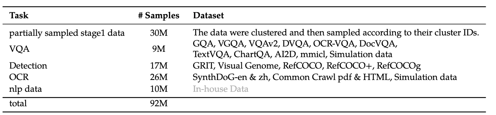

* 第三阶段Supervised Fine-tuning

  * Dense Baseline Model：sft总计2.3 M个样本，如表所示：1）用户指令数据：我们合并了ShareGPT-4V和LLaVA-ZH数据集。2）文档/图表数据：我们使用DocVQA和SynDog-EN来增强模型的文档理解能力，ChartQA、DVQA和AI2D来更好地理解图表和图表。3）数学问题：我们使用了MathInstruct、MathPlus和Geoqa+数据来提高模型的数学推理能力。在这个阶段，我们冻结了LLM，只调整了**交叉注意力层和最后四分之一的ViT层；**

  

  * Scaling via Mixture-of-Experts：我们采用了细粒度的MoE架构。我们将EVLM-Base的FFN的参数复制N次。随后，每个复制的FFN被分割成M个细粒度专家，从而产生总共N个\*M个细粒度专家。我们选择一个路由层，该层选择适当的k个细粒度专家集合来计算当前令牌的输出。我们在配置中设置了n=4，m=4和k=4。我们引入了负责学习常识性知识的世界专家。这位专家参与了每个令牌的处理。然后将来自世界专家的输出与来自细粒度专家的输出相结合以导出最终结果。我们采用密集基线模型的相同训练数据和配置，我们冻结LLM并仅调整交叉注意层和最后四分之一ViT层。

  

  * 高质量详细caption数据生成方法（只有定性的例子没有实验）：

    * 1.多种描述生成：生成多种描述，确保全面覆盖所有图像细节：用了各种VLM，包括interVL、GPT-4V和GPT-4o；

    * 2.真实性检查：将这些描述拆分成短句，用于真实性验证：使用Llama2-70B模型将其拆分为多个短语，拆分后的短语在Llama2-70B的帮助下进行重复数据删除，确保每个短语都是独一无二的。随后，强大的多模态大型语言模型（MLLM），如GPT-4o，检查这些短语的真实性，保留那些准确匹配图像细节的短语。

    * 3.连贯描述重组：在真实性检查之后，GPT-4o将这些短语集成到连贯流畅的图像描述中。这一步确保生成的描述既准确又低错觉。

    * 4.使用GPT-4风格化：最后，我们使用GPT-4对语言表达进行细化，使生成的图像描述更加流畅、优雅，并且符合人类的表达偏好。

* pretrain阶段收敛性的监控方法：

  * 为了更好地监控模型在图像和文本之间的对齐，我们从ImageNet-1K验证集中的每个类中随机采样了10个示例，以评估模型的判别能力。在评估过程中，我们输入提示并计算了1000个候选类中每个类的损失，选择损失最低的类作为模型的预测类别来计算准确率。从图5b可以观察到，随着训练的进行，ImageNet-1K验证集上的识别准确率不断提高，这是一种有效的监控机制；

  * 我们构建了一个更细粒度的评估集，以更好地监控大规模多模态预训练带来的信息增益。该集包括七个细粒度类别，包括POI、游戏等。我们使用类似于ImageNet-1K使用的方法评估了这七个类别。图5c显示了这些类别的平均准确率，表明随着训练的进行，细粒度识别的准确率急剧提高。这强调了大规模多模态预训练的必要性；虽然粗粒度对齐可以通过有限的图像-文本数据实现，但全面理解许多细粒度概念需要广泛的多模态知识。附录C.1展示了七个细粒度类别中每一个类别的准确率的可变性。尽管进行了广泛的预训练，但“明星”类别的准确率仍然相对较低，这表明我们目前的多模态预训练数据可能不足以涵盖全面的多模态知识，因此需要进一步扩展数据集规模。

  

四、结果：

看上去效果不算太好

### VITA

[VITA: Towards Open-Source Interactive Omni Multimodal LLM](https://arxiv.org/pdf/2408.05211)（2024.08 腾讯）

code：https://github.com/VITA-MLLM/VITA/tree/main

#### 一、Summary

1. 解决两个问题：传统的音频交互需要一个预定义的唤醒词，当模型生成输出时人机交互被阻塞

2. 解决方法：

   1. **非唤醒交互：**&#x901A;过**引入状态标记来端到端识别**输入查询的类型，无需音频唤醒即可交互。

   2. **音频中断交互：**&#x5F15;入了一种双工方案。同时部署了两个VITA模型：**一个负责对当前音频查询生成响应，另一个持续监控新查询。**

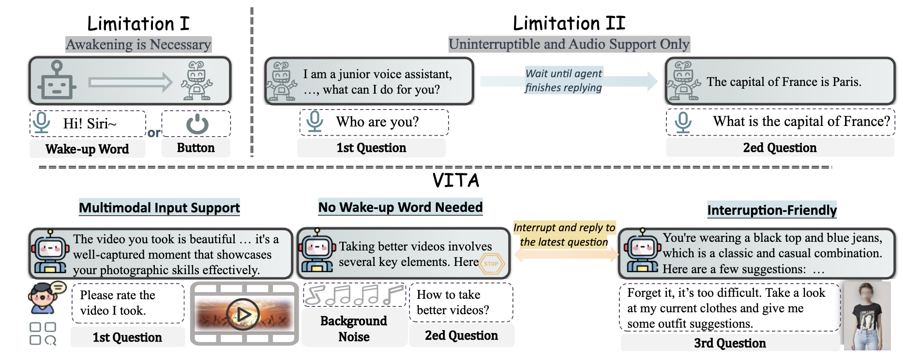

#### 二、模型

* &#x20;InternViT-300M-448px 作为视觉编码器，Mixtral 8x7B作为文本编码器，两层MLP作为连接器（256个token），音频 Mel Filter Bank 块处理，利用4×CNN下采样层，然后是24层transformer。

* 高分辨率图像输入，**internvl1.5的动态切图**来捕获局部细节。

* 视频处理：

  * 视频长度小于 4 秒，统一采样 4 帧。

  * 在 4 到 16 秒之间，每秒采样一帧。

  * 超过 16 秒的视频，我们统一采样 16 帧

* 音频，每 2 秒的音频输入被编码为 25 个token。

#### 三、训练

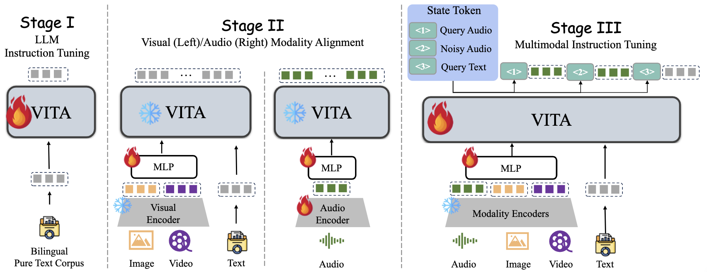

1. **Stage 1: LLM 双语指令调优，500M中英双语文本语料库**进行微调LLM；

2. **Stage 2: 多模态对齐**

   1. **视觉对齐阶段**训练视觉编码器和连接器；

   2. **音频对齐阶段**训练音频编码器和连接器。

3. **Stage 3: 多模态指令调优，**&#x89C6;觉和音频编码器都被冻结，**训练连接器与LLM**。**专门设计的状态标记:**

   1. **状态token <1>** 表示输入是查询音频。

   2. **状态token <2>** 表示输入是嘈杂的音频。训练期间将噪声音频对应的文本发送到LLM，并使用其输出文本作为训练目标。**在推理过程中，<2> 作为另一个特殊的 EOS 令牌。**

   3. **状态token <3>** 表示纯文本的问题。

4. **双工管道**

   **音频中断交互：同时部署两个VITA模型**，生成模型回答用户查询，监控模型则负责实时检测。当监控模型检测到新的查询时，系统会**停止当前的生成任务**，生成模型和监控模型交换角色

   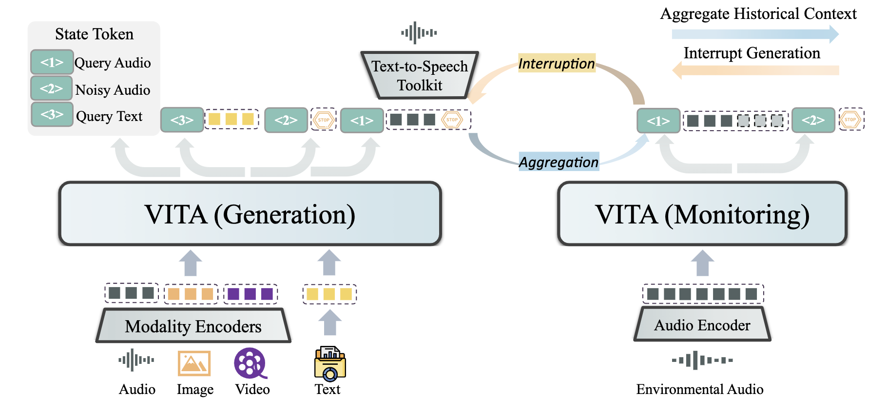

#### 四、数据

* **Stage 2: 视觉对齐**

  * (1) 对于一般的**caption**，从ShareGPT4V生成的GPT-4V，对于 **AllavaCaption&#x20;**&#x548C; **ShareGTP4o-Image3**，用**现有 MLLM** **生成**的**中文图像caption**来补充。

  * (2) 对于一般的**QA**，**LLAVAMixture-sample** 、**Lvis-Instruct**和 **ScienceQA** 。使用**现有的 MLLM** 来**生成**额外的 21.8K **中文 QA** 数据。此外，从 LlaVA-150K中删除了标题子集，并将其余部分翻译成中文。

  * (3) 对于 **OCR 和图表**，包括 **Anyword-3M 、ICDAR2019-LSVT4、ICDAR2017-RCTW5、Open-Chart（ChartQA、DVQA、InfoVQA、Pew和 OpenCQA的集合）**， ICDAR2019-LSVT、ICDAR2017-RCTW 和 Open-Chart，使用现有的 **MLLM 生成详细描述和 QA 对**。

  * (4) 对于一般**视频描述**，使用 ShareGemini。

  * (5) 对于一般**视频 QA**，使用现有&#x7684;**&#x20;MLLM** **从 Video-ChatGPT 和 VideoChat2 中重新标记开源数据**。

  * (6) 从 500 万个**纯文本**数据中对 **800k** 个条目进行采样，以保持 LLM 的文本理解能力。

* **Stage 2: 音频对齐**

  * **语音识别 ，Wenetspeech** (10,000 小时)主要关注**中文任务，Gigaspeech**(10,000 小时)大部分**面向英语语音识别任务**。

  * **音频caption**，Wavcaps的 AudioSet SL 子集（400k）。

* **Stage 3:多模态指令调优 ,**&#x6307;令调优阶段的数据源与表中的对齐阶段相同:

  * (1)使用GPT-SoVITS6等TTS技术，将问题随机(约一半)替换为音频版本

  * (2)设置不同的prompt，避免不同类型数据之间的冲突

  * (3)**嘈杂的音频构建**。从现有多模态和单模态 QA 数据的答案中随机抽取 474K 个句子，**这些负样本文本专注于不需要用户响应的非查询相关内容。**

  

#### 五、多模态能力

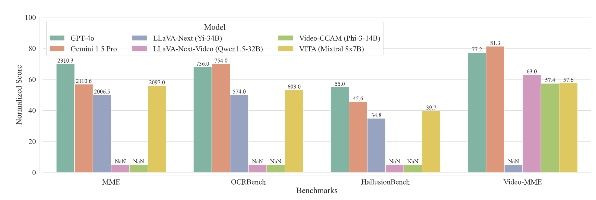

### Idefics2

[What matters when building vision-language models?](https://arxiv.org/pdf/2405.02246)（2024.05 Hugging Face）

#### 一、Summary

难以区分哪些决策真正对模型性能负责

#### 二、分析VLM中的体系结构选择

1. vision encoder：SigLIP-SO（400M） 优于 EVA-CLIP（4.4B） 优于 CLIP-VIT-H（600M）；

* 图像预处理：固定高分辨率768输入，和保证图像原始分辨率和长宽比从378-768输入，后者效果未出现明显降低并且加快了训练和推理时的效率；

* 高分辨率：SFT阶段使用图像切分多个子图可以提升性能（切成4个子图+原图共5个patch），尤其是ocr相关的指标，并且仅在训练中对于50%的数据切子图也不会影响性能，进一步提升子图本身分辨率可以获得轻微提升；最终第一阶段pretrain最大分辨率设置为384，第二阶段pretrain最大分辨率增加到980（加入PDF文档数据）；

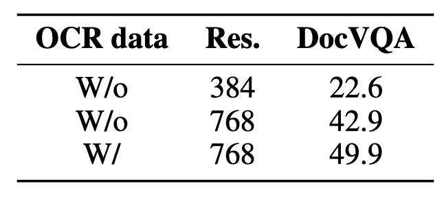

* LLM：当视觉编码器和LLM固定住时，交叉注意力架构下，从llama1更换到Mistral，效果提升显著（替换LLM比替换vision encoder提升更大）；

* 对比了在LLM中加cross attention 和直接projection的方案，如果都冻结LLM，前者效果更好，如果不冻结LLM，后者效果更好，最终选择使用后者；发现使用lora训练LLM更容易稳定，全参容易训崩；

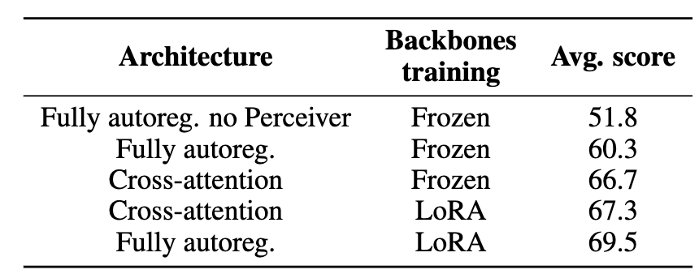

* projection：对比了mlp和perceiver（使用的是flamingo的perceiver结构），发现后者效果更好，最终论文使用2层mlp+perceiver的方式；

* 在使用perceiver的情况下，对比了token数量的影响，说明并非token数量越多效果越好；

#### 三、模型结构

&#x20;SigLIP-SO400M 和 Mistral-7B-v0.1&#x20;

1. **预训练：**

   1. stage1:训练整个模型（384）

   2. stage2:训练整个模型（980），随机缩放图像，覆盖整个范围

2. **指令微调：**&#x4F7F;用 DoRA 对基础模型进行指令调整

DoRA 将预训练权重分解为其幅度和方向分量，并对两者进行微调。由于方向分量在参数数量方面较大，进一步用 LoRA 对其进行分解以实现高效微调。

#### 四、数据

1. **预训练：1.5B**

   1. 第一阶段：**图文交错：caption = 70%:30%**

      1. **交错的图像-文本文档OBEELICS** ，具有 3 亿个图像和 115 亿个文本标记的交错图像-文本文档

      2. **图像-文本对**

   2. 第二阶&#x6BB5;**：图文交错：caption：pdf文档= 45%：35%：20%**

      **PDF 文档&#x20;**&#x20;：OCR-IDL 的 19 亿个行业文档、PDFA的 1800 万页、 Rendered Text7 （各种字体和颜色以及不同背景编写的文本）

2. **指令微调：多模态：纯文本=3:1**

   1. **Cauldron：**&#x35;0 个视觉语言数据集的大量集合，涵盖了广泛的任务：一般视觉问答、计数、字幕、文本转录、文档理解、图表/图形理解、表格理解、视觉推理、几何、发现 2 张图像之间的差异或将屏幕截图转换为功能代码。

   2. 纯文本数据

#### 五、结果

### Idefics3

[Building and better understanding vision-language models: insights and future directions](https://www.arxiv.org/pdf/2408.12637) （2024.08 Hugging Face）

code：暂无

#### 一、Summary

&#x20;Idefics3目标是增强 OCR 能力，从架构和数据上来说，目标都是这个

#### 二、分析VLM中的体系结构选择

##### 2.1 单模态连接器选择

1. **Cross-attention架构**

   * **在LLM中的每四个Transformer块之后插入一个交叉注意块**，添加新初始化的参数相当于LLM大小的大约**1/4**。参数的增加**增强了模型的表达能力**，**不解冻 LLM** 的情况下**实现强大的性能**，**保留了纯文本任务上的性能。**

2. **Self-attention架构**

   * 视觉编码器的输出token与文本token连接，作为LLM的输入

* 哪种架构更好（Mistral-7B和SigLIP-SO400M）

  |         | 参数量                 | 效果 |
  | ------- | ------------------- | -- |
  | 自注意力架构  | 8.3B 参数，包括 740M 初始化 |    |
  | 交叉注意力架构 | 10B 参数，包括 2.5B 初始化  |    |

> 当单模态预训练主干保持冻结时，交叉注意架构的性能优于完全自回归架构。然而，在训练单峰主干时，完全自回归架构优于交叉注意力架构，即使后者具有更多的参数。

##### 2.2 其他架构选择

1. **需要视觉编码器**

   * 绕过预训练视觉编码器可能会导致更长的训练时间才能达到类似的性能。

   * 大多数VLM 没有在纯文本基准上进行评估，不清楚省略视觉编码器是否会影响文本基准性能。

2. **token数量：**

   * **单增加视觉标记数量对于OCR 任务至关重要**；

   > 使用学习池减少视觉标记的数量显着提高了训练和推理的计算效率，同时提高了下游任务的性能

3. **图像分割策略**

   * 对于更简单的任务，需要更少的视觉token，对于OCR 任务，需要更高分辨率，更多token

   * **开发一种视觉编码器，可以原生处理不同分辨率的图像，不改变原始纵横比，不需要将其裁剪成多个子图像。**

##### 2.3 训练策略选择

* **为了保持LLM的初始性能**，先冻结backbone，只训练连接器。之后，**视觉编码器和/或语言模型可以逐渐解冻**。如果出现不稳定性或者需要增强模型的表达能力，**LoRA方法即使在预训练阶段也能有效。**

> 在完全自回归架构下解冻预训练的主干会导致训练分歧。利用 LoRA 增加了训练的表达能力并稳定它。

#### 三、模型结构

* **SigLIP-SO400M作为视觉编码器，Llama 3.1-Instruct作为语言模型，pixel shuffle作为连接器**，其他还是常规的切图，添加缩略图

* 类似于mPLUG-DocOwl-1.5 ，**每个子图添加\<row\_x\_col\_y>**

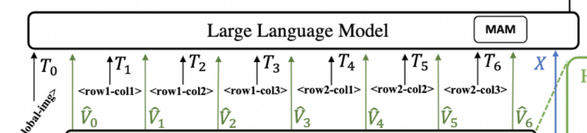

#### 四、训练

1. **多阶段预训练：**

   1. **stage1：仅训练连接器**。逐渐将最大图像分辨率从 364² 增加到 1820²。

   2. **stage2、3：**&#x4F7F;&#x7528;**&#x20;[DoRA](http://arxiv.org/html/2402.09353v5)**&#x8BAD;练，**stage3**侧重于使用大型合成数据集进行训练。**stage3学习率线性衰减为零。**

2. **监督微调**阶段，**学习率线性衰减为零**。

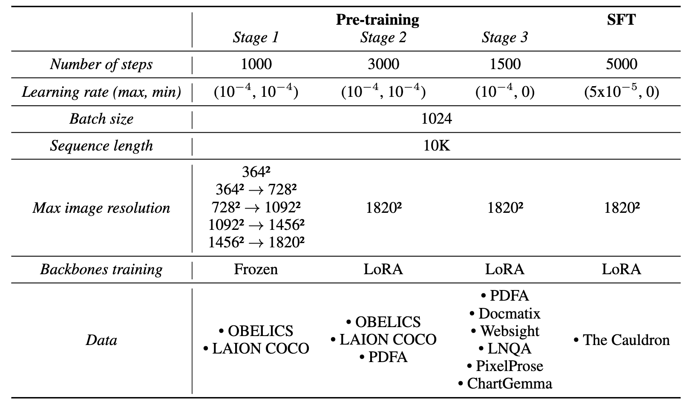

#### 五、数据

1. **SFT数据**

Cauldron是现有文献中 50 个高质量数据集的集合，添加另外 6 个数据集来扩展该集合：

* **Cordv27&#x20;**：用于训练模型**以 JSON 格式输出信息**，

* **&#x20;LNQA、ShareGPT-4o 和 IIW-400：**&#x7528;于大规模现实世界视觉问答来**生成详细caption**

* **Geo170K：** 用于涉及**几何任务**

* **Docmatix ：**&#x7528;于**文档理解**

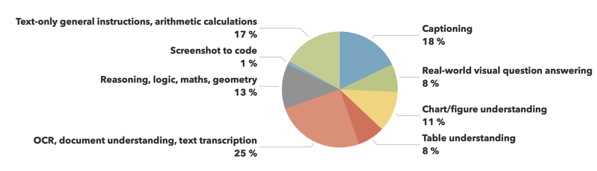

* [**Docmatix**](https://huggingface.co/datasets/HuggingFaceM4/Docmatix/tree/main)

  **生成数据的pipeline：**

  * 从**英语 PDFA&#x20;**&#x8F6C;录，使用 **Phi-3-small&#x20;**&#x751F;成 QA 对。

  * **使用了五种不同的提示，通过使用正则表达式来检测代码和删除包含关键字“unanswerable.”的答案，**&#x4E22;弃 15% 的 QA 对。

  * **生成Docmatix**包括来自 **1.3M PDF 文档的 2.4M 图像和 9.5M QA 对**，与以前的开放数据集相比，其规模增加了 240 倍。

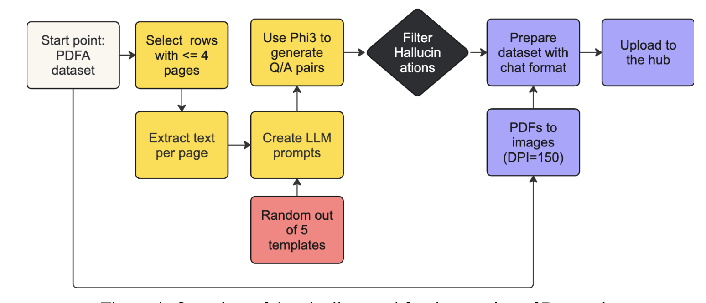

**数据消融实验：**&#x8BAD;练了两个版本的Florence-2模型（0.7B）进行了消融研究：

* 在 DocVQA 上训练多个epoch，

* 在 Docmatix 的子集（20% 的图像和 4% 的 QA 对）上训练单个 epoch，再在 DocVQA 上训练一个epoch确保评估格式；

#### 六、结果

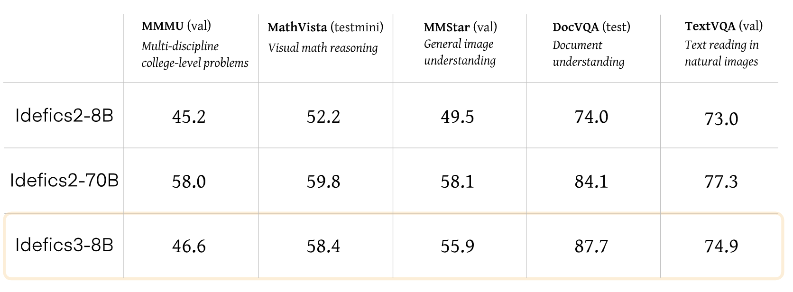

### **mPLUG-DocOwl&#x20;**

### **mPLUG-DocOwl 1.5&#x20;**

* **H-Reducer：**

  

* **训练：为什么替换成现在的三阶段**

  在统一结构学习期&#x95F4;**，冻结 LLM 参数并调整视觉编码器和 H-Reducer，**&#x5E2E;助 LLM 更好地区分从图像中解析的视觉特征和文本。

  多任务微调阶段，**视觉编码器被冻结，其他模块微调**。

  

### mPLUG-DocOwl2

[MPLUG-DOCOWL2: HIGH-RESOLUTION COMPRESS-ING FOR OCR-FREE MULTI-PAGE DOCUMENT UN-DERSTANDING](https://www.arxiv.org/pdf/2408.12637)（2024.08 阿里巴巴）

code：https://github.com/X-PLUG/mPLUG-DocOwl

#### 一、Summary

* 更少的token，提出了一种高分辨率DocCompressor模块，在低分辨率全局视觉特征的指导下，将每个高分辨率文档图像压缩为324个token。

* 能够提供包含证据页面的详细解释以及文档的整体结构解析

#### 二、模型结构

* 利用全局低分辨率图像的视觉特征作为query。全局特征图中的每个视觉特征只捕获部分区域的布局信息。

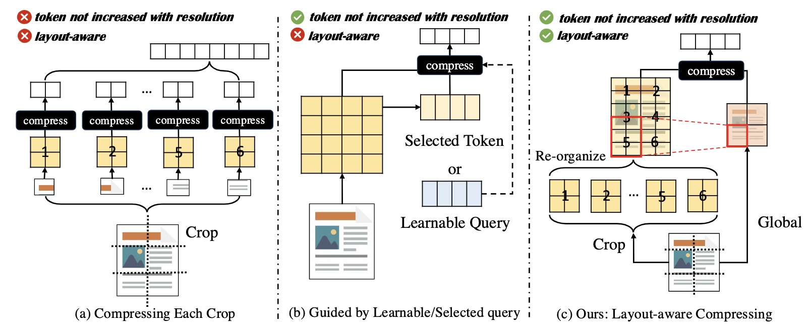

* **DocOwl2：切图(max\_num=12，504\*504，\)——>H-Reducer集成特征（324个token）——>Docompressor特征压缩——>LLM**

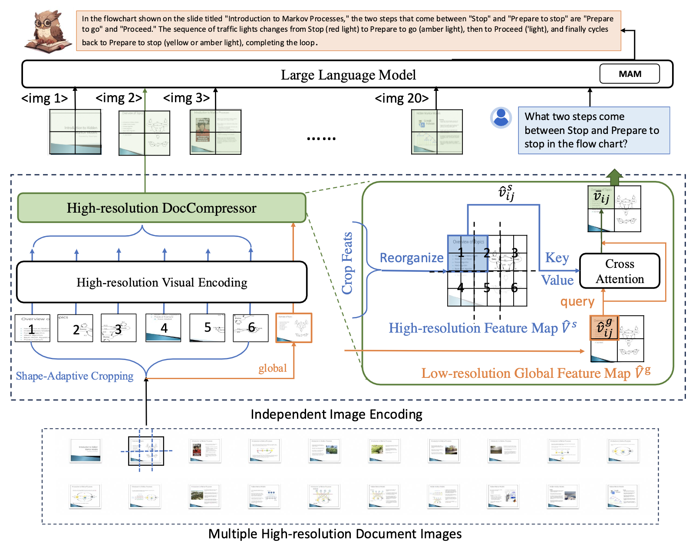

* **切图：UReader**

  * （1）网格应尽可能保留图像的分辨率

  * （2）网格应拟合输入图像的纵横比

  $$\left \{ g=n_h*n_w|n_h*n_w\le N_c \right \} $$

  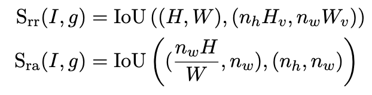

* **H-Reducer：**&#x5BF9;于每个子图像或全局图像(resize为子图分辨率)，通过卷积层集成水平 4 个特征，**并将特征维度与大型语言模型维度对齐**

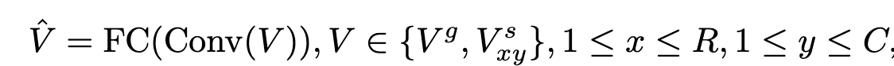

* **Docompressor：**&#x48;-Reducer减少token到1/4，但还是太长，**2层交叉注意，利用全局图像中的视觉特征作为query，子图像的集成特征图作为key和value。对于全局图像的特征图中的每个视觉标记，从拼接后的子图中收集其对应的 R × C个token作为键和值(子图的总token数是局部图的R × C倍)**

  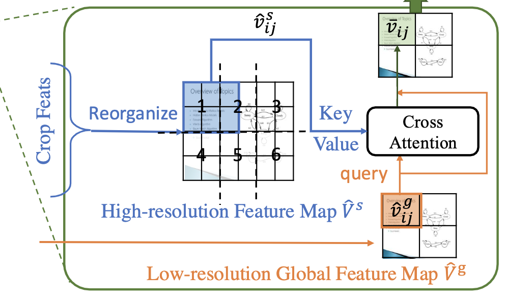

  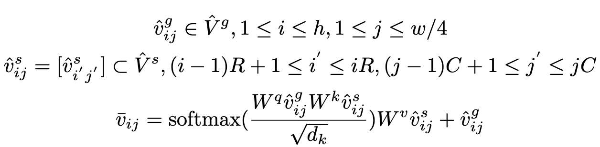

  * **消融实验：**&#x5355;图像文档基准上压缩器架构的消融研究。

  

#### 三、三阶段训练

1. 单图预训练：训练视觉编码器 (ViT/L-14)、**H-Reducer、**&#x9AD8;分辨率 DocCompressor和MAM&#x20;

2. 多图预训练：训练H-Reducer、高分辨率 DocCompressor 和 MAM&#x20;

3. 多任务微调：除视觉编码器之外的所有参数。

#### 四、数据

1. **单图预训练(4M)：**[DocStruct4M](https://huggingface.co/datasets/mPLUG/DocStruct4M/tree/main)，涵盖学习单个图像的文档解析、表解析、图表解析和自然图像解析，多粒度文本定位

   * 多粒度文本定位

     * 多粒度文本grounding：给定视觉基础文本的情况下预测边界框

     * 多粒度文本识别：给定边界框的情况下给出文本

   两个任务设置了四个粒度的文本：单词、短语、行和块

   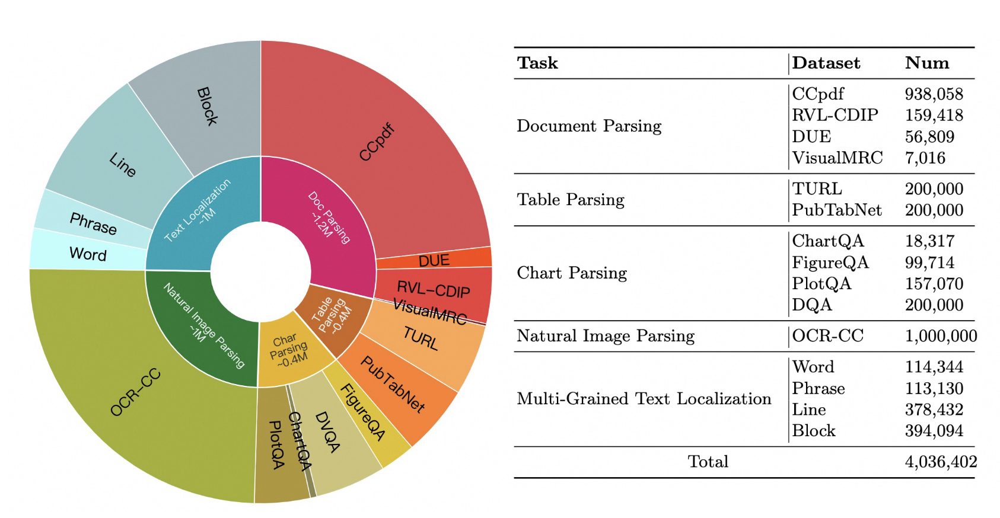

2. **多图预训练(1.6M)：**

   1. **单图(0.5M )**：从 DocStruct4M 中随机选择 0.5M

   2. **多图(1.1M )：[MP-DocStruct1M](https://huggingface.co/datasets/mPLUG/MP-DocStruct1M/tree/main)&#x20;**，使用来自 PixParse中两个数据集的部分文档，设计了两个对称的多图像理解任务：

      1. **多页面文本解析：**&#x7ED9;定文档中的连续页面图像，指示模型解析指定一个或两个页面的文本，'**Recognize texts in image 2 and image 10.**'。

      2. **多页面文本查找任务：**&#x4EE5; 1-2 页的文本作为输入，模型预测包含这些文本的图像，**'Looking for the image with text \<doc> ...\</doc> and \<doc> ...\</doc>.'**。

3. **多任务微调**

   1. **单图像数据集(0.6M)：**&#x44;ocDownstream-1.0（ DocVQA 、InfoVQA 、DeepForm 、KLC 、WTQ 、TabFact 、ChartQA 、TextVQA 、TextCaps  和 VisualMRC ）、DocReason25K&#x20;

   2. **多图像理解：**

      1. 文档数据集 MP-DocVQA(46k) ：具有丰富的表格、图表、图片以及手写和印刷文本。

      2. DUDE(41k)：包括医学、法律、技术、金融等文档

      3. 新闻视频数据集 NewsVideoQA(8k)：世界各地的不同英语新闻渠道（例如 BBC、CNN 等）中收集具有丰富视觉定位文本的新闻视频。

      4. &#x20;**[MP-DocReason51K](https://huggingface.co/datasets/mPLUG/MP-DocReason51K)：带有证据页面的详细解释能力，**&#x57FA;于 DocReason25K 构建

         * 基于 DocReason25K 中的单图样本，构建多图样本，其中包含从相同或不同的类别中随机选择的噪声图像。

         * 在将证据图像随机插入噪声图像后，在原始回答中添加了一个额外的证据描述（'According to the 5th image,'）

      5. **[DocGenome12k](https://huggingface.co/datasets/mPLUG/DocGenome12K)：**&#x5927;多数问答样本只关注文档的 1-2 页，**为了进一步增强对文档的全面理解的能力**，利用 DocGenome的一小部分注释来构建 JSON 格式的文本序列，表示科学论文的层次结构和部分详细文本。

4. 消融实验：DocOwl2 训练阶段的消融研究。&#x20;

   1. “Single”和“Multi”是指利用单个或多个图像作为输入的训练样本。

   2. 'Page Num' 和 'Evidence Page' 分别指输入页面图像的数量以及包含标准答案的页面的序号。

#### 五、结果

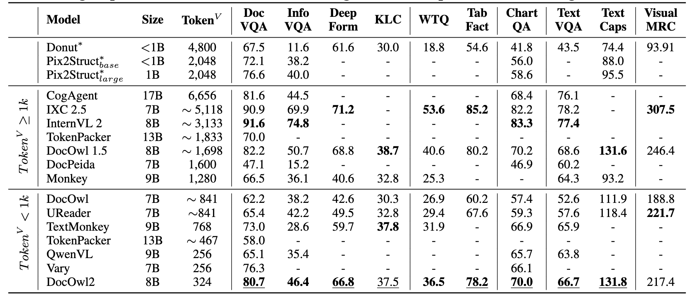

### NVLM

[NVLM: Open Frontier-Class Multimodal LLMs](https://arxiv.org/pdf/2409.11402)（英伟达 2024.06）

code：https://nvlm-project.github.io/（未开源）

#### 一、Summary

* 提出了混合架构，高分辨率特征，策划了一个高质量的纯文本数据集

#### 二、讨论

1. 视觉编码器：InternViT-6B-448px-V1-5，**保持视觉编码器冻结在训练的所有阶段**，当视觉编码器相对较弱和预训练数据集足够多样化时，MLP投影仪和视觉编码器的联合预训练是有益的。

2. 架构设计

   1. **Decoder-only MLLMs**

   2. **Cross-attention-based MLLMs**

3. 高分辨率输入：切子图

#### 三、三种模型结构

* **高分辨率**：使用**intervl1.5的切图方式**，设定max\_num=6，设定一系列grid优先长宽比找到最合适的，每个子图分辨率为448\*448，再通过**pixel shuffle**沿通道维度连接四个相邻图像标记，下采样1,024个图像token到256。

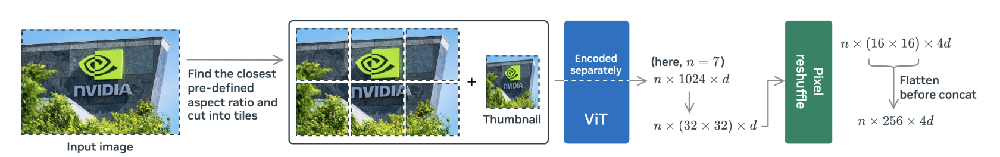

* **三种模型结构**

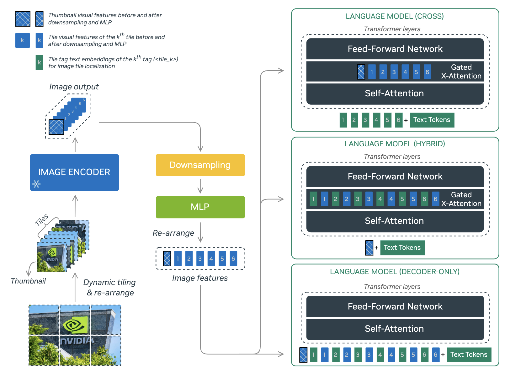

|         |                      | 投影仪                          | 训练                        |                                             |
| ------- | -------------------- | ---------------------------- | ------------------------- | ------------------------------------------- |
| NVLM-D  | 仅解码器(self-attention) | 2层MLP                        | pt期间，训练MLPSFT阶段，训练MLP和LLM | SFT 阶段解冻LLM导致纯文本能力下降                        |
|  NVLM-X | 交叉注意力                | 交叉注意力架构（10个门控 X-attention 层） |                           | SFT阶段冻结LLM会损害视觉语言任务的性能                      |
| NVLM-H  | 混合架构                 | 缩略图：2层MLP子图：交叉注意力架构          |                           | 与 NVLM-X 相比，增强了高分辨率能力，显著提高了与 NVLM-D 相比的计算效率 |

* SFT阶段是否解冻LLM

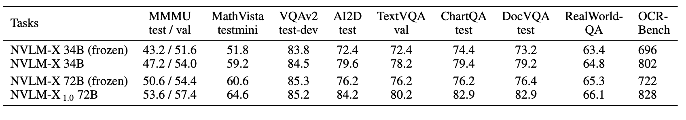

* NVLM-D 需要更长的序列长度

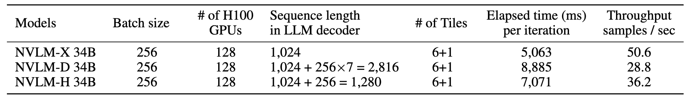

#### 四、数据

1. PT数据：对 LAION-115M进行过滤和recaption。

   * **尝试了交错的文本图像数据集**，包括 MMC4和 OBEELICS ，发现它们在 NVLM 框架内对下游视觉语言任务的影响最小。我们假设这种交错的文本图像数据集需要更仔细地过滤和重新生成caption。

   

   * 数据消融实验：

   

2. SFT数据:

   **Text-only SFT Data：**&#x5229;用OpenAI模型GPT-4o和GPT-4o-mini进一步精炼

#### 五、消融实验

* **分隔符消融**

  

  1. NVLM-D

  

  * NVLM-X

  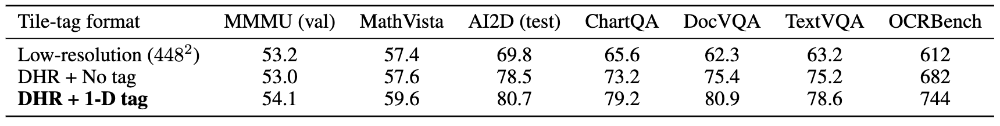

* NVLM-X，在多模态SFT中使用冻结和未冻结的LLM主干对视觉语言性能的影响（为了保留模型的纯文本能力）

#### 六、结果

* 多模态结果

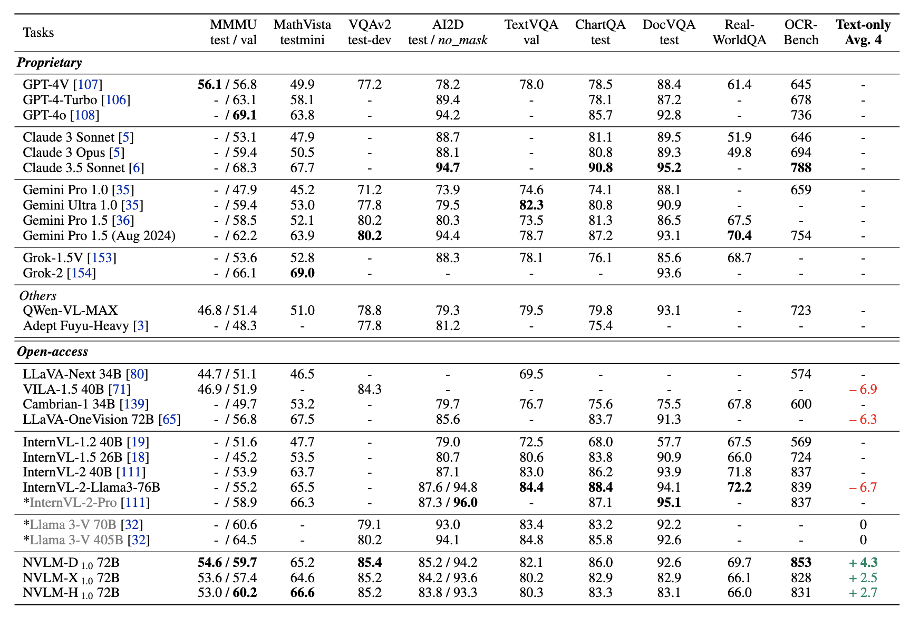

* 纯文本结果

#### 七、一些结论

> 1. 当视觉编码器相对较弱和预训练数据集足够多样化时，pt阶段训练MLP投影仪和视觉编码器是有用的；
>
> 2. 仅解码器 MLLM ，在 SFT 期间训练LLM会导致纯文本性能显着下降，需添加纯文本数据保持模型纯文本能力；
>
> 3. 1-D grid tag效果更好一些
>
> 4. 感知器重采样器有利于自然图像字幕，但它会对密集的 OCR 任务产生负面影响，例如从扫描文档中转录文本。主要原因是感知器中对潜在数组的交叉注意混合了输入图像标记，潜在地破坏了图像patch之间的空间关系。

### EAGLE

[EAGLE: Exploring The Design Space for Multimodal LLMs with Mixture of Encoders](https://www.arxiv.org/pdf/2408.15998) （2024.06 英伟达）

code：https://github.com/NVlabs/Eagle

#### 一、Summary

* 主要探究了多个视觉编码器组合、token融合策略、预训练前的预对齐阶段

#### 二、研究

1. CLIP视觉编码器：插值且训练CLIP-448 在性能方面非常接近 InternVL（300M 与 6B）

* 不同视觉编码器

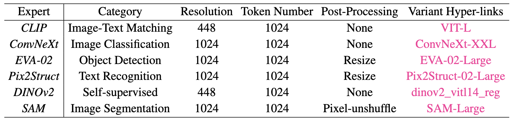

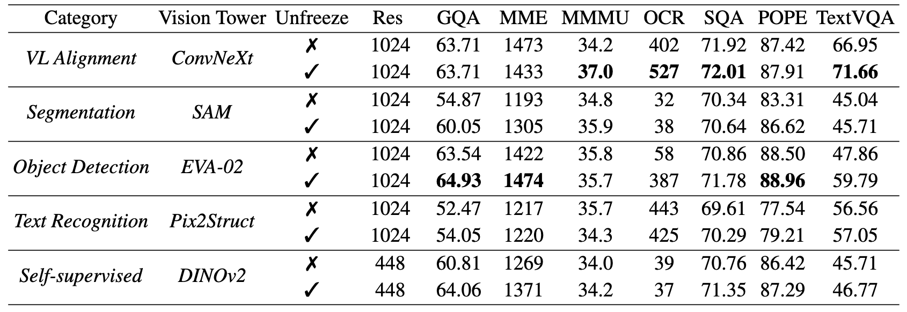

* 融合策略

  

  1. 序列追加(Sequence Append)：直接将来自不同主干的视觉标记附加为更长的序列

  2. 通道连接(Channel Concatenation)：在不增加序列长度的情况下沿通道维度连接视觉标记；

  3. LlaVA-HR：使用混合分辨率适配器将高分辨率特征注入到低分辨率视觉编码器中；

  4. Mini-Gemini：使用 CLIP token作为低分辨率query，通过交叉注意力机制将高分辨率特征注入到低分辨率特征

  5. Deformable Attention：在 Mini-Gemini中引入可变形注意力&#x20;

  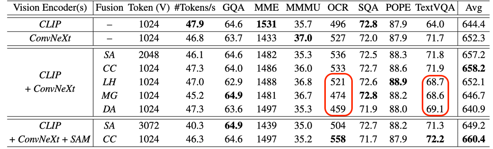

结论：选择**直接通道连接作为我们的融合策略**，考虑到其性能、可扩展性和效率。

* Vison-language Pre-Alignment：在SFT阶段解冻视觉专家模型（pt+sft），pt前预对齐阶段

* 训练策略：

  1. 预对齐：在SFT数据上训视觉专家和自己的投影仪，同时保持语言模型冻结；

  2. 预训练：训练映射层；

  3. 微调：在SFT数据上训练整个模型。

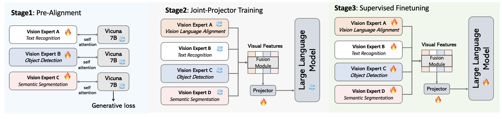

* 探索视觉专家的最佳组合

  | A    | B        | C   | D      | E           | F        |
  | ---- | -------- | --- | ------ | ----------- | -------- |
  | CLIP | ConvNeXt | SAM | DINOv2 |  Pix2Struct | EVA-02-L |

* 模型结构

  * Eagle-X4：CLIP、ConvNeXt、Pix2Struct、EVA-02

  * Eagle-X5：CLIP、ConvNeXt、Pix2Struct、EVA-02、SAM（还使用与 Cambrian-1相同的数据来训练 Eagle-X5，包括 250 万和 700 万数据进行预训练和监督微调。）

  * 连接器是mlp，不同视觉专家**直接通道连接作为融合策略**

#### 三、数据

1. 预对齐：SFT数据

2. PT：llava1.5 556k

3. SFT

#### 四、多模态结果

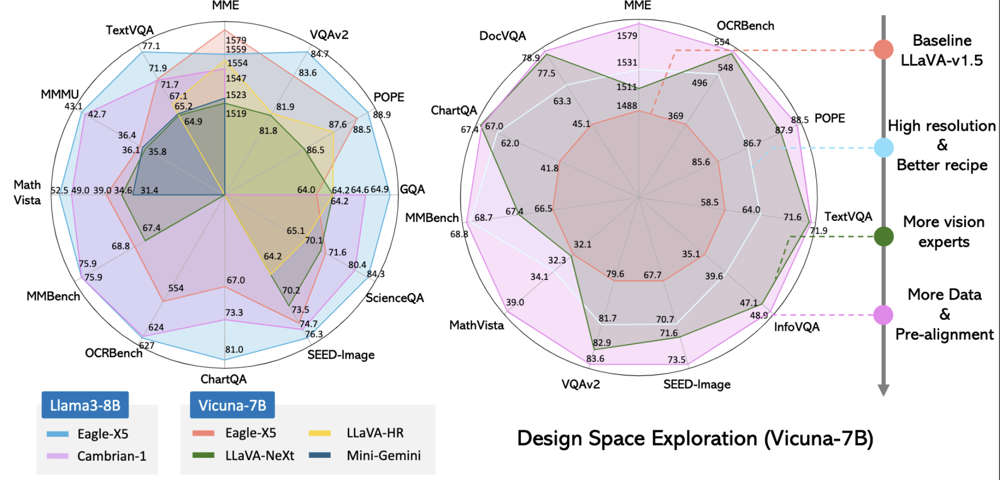

### POINTS

[POINTS: IMPROVING YOUR VISION-LANGUAGE MODEL WITH AFFORDABLE STRATEGIES](https://www.arxiv.org/pdf/2408.15998)（2024.09 WeChat AI）

code：

#### 一、Summary

* 一致纵横比动态高分辨率切图，增加了一个OCR ViT

* 使用困惑度过滤预训练数据，选择困惑度最低的数据作为训练集。

* 对微调数据集进行选择

#### 二、模型结构

* 视觉编码器 CLIP-ViT-Large-336、一个两层MLP和大语言模型Yi-1.5-9B-Chat。

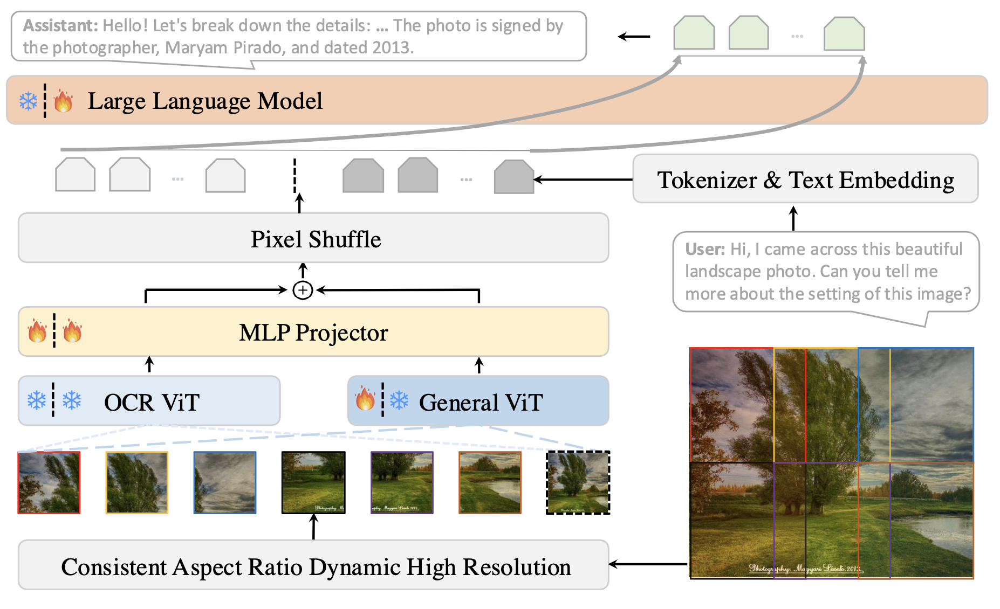

1. 一致纵横比动态高分辨率切图：

   

   1. 预定义网格，按照长宽比选择网格

   2. 给定一个高度为 H 和宽度 W 的图像，根据网格获取图像的高度 $$H_r
      $$和宽度 $$W_r$$，将图像大小调整为目标大小 $$H_t*W_t$$：

   

   * 分别在高度和宽度上使用跨步 $$(S_h,S_w)$$的滑动窗口分割目标图像 $$H_t*W_t$$

* 双视觉编码器：为了提高光学字符识别 (OCR) 能力，训练一个单独的视觉编码器，使用 PaddleOCR 提取的OCR数据和caption进行预训练，称为 OCR ViT

#### 三、数据

1. 预训练数据：

   1. **CapFusion**

   利用大语言模型整合原始 caption 和 synthetic caption，使用 InternLM-XComposer2为图像生成 synthetic caption，使用 InternLM2来整合原始 caption 和 synthetic caption

   * **困惑度**

按升序对所有这些项目进行排序，并为预训练阶段选择前 20%

* OCR ViT（20M OCR+10M caption）：

  * OCR数据：从 LAION-5B-en、LAION-5B-cn 、WuKong 和 Zero 中随机选择了 2000 万个数据，使用 PaddleOCR 从图像中提取文本，替换原始标题以形成新的图像标题对

  * caption数据：LAION-5B 的 1000 万个原始数据样本，进行预训练。

* 视觉语言预训练数据（1M）：OCR增强数据，使用 CapFusion 从 LAION-5B 构建 2000 万个数据点，从中选择了 500 万个数据点，基于 500 万个数据点，我们进一步通过选择困惑度值最低的前 20% 的数据。

* 指令微调数据（Individual Select）

  * Maximum Soup：topk个求平均

  * Average Soup

  * Greedy Soup：计算其权重的平均值与当前模型池中所有模型的权重的平均值，平均值高于池中的平均值，则将模型放入池中

  

#### 四、训练

1. OCR ViT预训练：LLM保持冻结，训练VIT和 MLP

2. 视觉语言预训练：OCR ViT来自前一阶段冻住，训练通用 ViT最后三层，通用 ViT和OCR ViT倒数第二层的特征并将其输入到投影仪

3. OCR ViT和通用 ViT冻结，训练llm和mlp

#### 五、消融实验

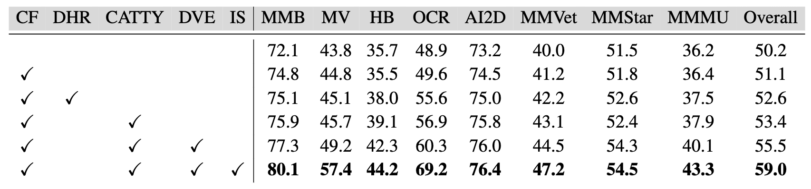

#### 六、多模态效果

### ARIA

&#x20;pdf：[Aria: An Open Multimodal Native Mixture-of-Experts Model](http://arxiv.org/abs/2410.05993)

code：https://github.com/rhymes-ai/Aria

#### 一、Summary

* 混合专家模型，核心思想是用一组专家替换Transformer中的每个前馈层(FFN)，其中每个专家在结构上与FFN相同。

* &#x20;64k 个token的长多模态上下文窗口

* 由于激活参数的数量较少，推理成本较低

#### 二、模型结构

* ViT接受其原生纵横比的图像作为可变长度的patch序列，保留了图像中固有的信息结构，

* **视觉端为SigLIP-SO400M ，连接器为一个交叉注意力层和一个 FFN 层，**&#x4E2D;分辨率图像有 128 个query，而高分辨率图像有256 个query

* 连接器：一个cross-attention，图像处理时，长边resize为490 or 980，用siglip会做padding，所以每张图一定是490或者980，根据patch\_to\_query\_dict={1225: 128, 4900: 256}，设置query大小 queries = queries\[:, :query\_num, :]

|       | 分辨率           | token数 |
| ----- | ------------- | ------ |
| 中分辨率  | <=490         | 128    |
| 高分辨率  | <=980         | 256    |
| 超高分辨率 | 动态切分为多个高分辨率图像 | -      |

* 动态切分为多个高分辨率图像：intervl1.5，最佳长宽比的方法，设定一系列box，取最佳box，直接resize为980\*box，切完是980\*980的子图

* ARIA 在每个 MoE 层有 66 个专家，66 个专家中的 2 个在所有输入中共享以捕获常识知识，而路由器模块为每个token激活了 6 个更多专家。

* 负载平衡损失，以防止路由崩溃并鼓励平衡的专家激活，将负载平衡放宽为专家组，每组包含 8 个细粒度的专家。

#### 三、四阶段训练

1. 语言预训练：语言数据（6.4T个token）**训练MoE 解码器**（8k token上下文窗口）

2. 多模态预训练：用混合语言（1T个token）和多模态数据（400B个token）**预训练 MoE 解码器和视觉编码器**

3. 多模态长上下文预训练：对长序列进行预训练（64k token上下文窗口）

4. 多模态Post-training：最终的预训练阶段退火学习率以收敛

#### 四、数据

1. **语言预训练数据：6.4T个token**

   1. **基于规则的方法**和**基于模型的质量分类器的组合**过滤删除数据

   2. 增强上下文学习能力，**使用最小生成树算法进行语言数据聚类：训练期间采用数据聚类和打包同一序列中的相似数据**

2. **多模态预训练数据： 1T 个语言token，400B个多模态token**

   1. **交错图文网页数据**（190B个token）：从 Common Crawl 中提取和过滤网页。删除图像或文本质量较低的网页，对图像进行重复数据删除，删除图像和文本整体 CLIP 分数较低的网页 。

   2. **生成图像captions**（70B个多模态token）：为LAION-400M数据集中的300M图像创建合成标题

   3. **文档转录和 QA**（ 102B 个token）：使用公共 OCR 方法将文档图像转录为文本

   4. **视频caption和QA**（35B 个token）:收集了 4.4M 不同长度的视频，训练了一个模型来为视频生成帧级密集描述，使用语言模型基于密集视频描述生成问答对和视频摘要。

3. **多模态长上下文预训练数据**（12B 个语言token和 21B 个多模态token， 69% 是长序列）：由短多模态数据构建的长视频、长文档和合成长序列。**将一系列独立的图像作为输入，并将它们的图像描述连接起来作为目标**。

4. **多模态Post-training数据**（20B 个token）：使用高质量开源数据集和人工注释数据集的混合。

#### 五、结果

* 视频和长上下文多模态理解（3.5+0.4）

* 多模态和文本能力

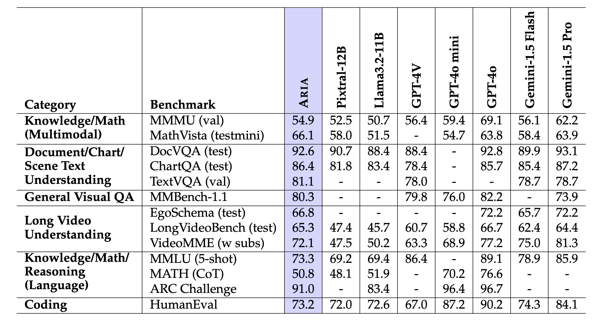

### Molmo&#x20;

&#x20;pdf：[Molmo and PixMo: Open Weights and Open Data for State-of-the-Art Multimodal Models](https://arxiv.org/abs/2409.17146)

code：https://molmo.allenai.org

#### 一、Summary

* 联合训练生成的VLM从新收集的详细、高质量、密集的图像描述数据集中生成字幕。在联合训练之后，我们遵循标准做法并使用监督微调来生成指令跟随模型。

* 避免了多个预训练阶段，不依赖于其他 VLM 的合成数据

* 新的数据集：PixMo（未开源）

#### 二、模型结构

* CLIP ViT-L/14-336作为视觉编码器，mlp和pooling作为连接器，OLMo-7B-1024和Qwen2 7B和Qwen2 72B。

* 优先长宽比切图，有重叠四个像素

#### 三、两阶段训练

1. 预训练：使用PixMo-Cap生成字幕的多模态预训练

2. 监督微调：使用混合学术数据集和新收集的监督PixMo-百科数据集家族进行监督微调。

3. 无RLHF

#### 四、数据收集

1. **caption生成（ 712k 个不同的图像，1.3M 字幕）：**

   1. **人工生成注释：**&#x9996;先根据一组不同的 ∼70 个高级主题（例如，街道标志、表情包、食物、绘画、网站、模糊照片等）获取网络图像，对于每个图像，要求三个注释者通过至少 60 秒说话来详细描述图像。

   2. **数据转录和增强**：使用现成的语音到文本系统转录注释者的音频，然后**使用 LLM&#x20;**&#x5904;理转录文本以提高文本质量（例如，**删除语音伪影、规范化风格**）。通过**LLM将三个原始转录本汇总为单个描述来创建第四个图像描述。**

2. **监督微调**：包括常见的学术数据集和几个新的PixMo数据集

   1. **PixMo-AskModelAnything**（162k 个问题-答案对和 73k 张图像）：

      1. **图像选择**：注释者从大量图像池中选择图像，并提出与图像相关的问题。

      2. **模型生成初始答案**：使用一个阶段1模型为图像生成密集标题，同时结合 OCR 输出和仅语言的语言模型（LLM）来回答问题（LLM 无法直接访问图像）。

      3. **注释者校验答案**：注释者可以接受或拒绝 LLM 的答案。如果拒绝，他们会解释答案的错误，并要求 LLM 修正。

      4. **迭代改进**：注释者不断重复这一过程，直到得到可接受的答案。

      5. **特定提示**：对于某些数据，注释者需要按照特定要求提出问题，比如要求并排写答案等。

   2. **PixMo-Points**（428k 图像和2.3M 个问题对）：**指向数据**

      * 人工注释者需要指向图像中的物体，描述它们，并标注其每个实例。

   3. **PixMo-CapQA**（165k 图像和214k 个问答对）：

      * 通过提示 LLM 来提出和回答问题

   4. **PixMo-Docs**（2.3M问答对）：

      * 我们提示LLM为255k文本和图形繁重的图像生成代码，然后提示LLM根据对代码(不使用图像)生成2.3M问答对。

   5. **PixMo-Clocks**（ 826k 个示例）：

      * 合成模拟时钟数据集（手表图像），其中包含有关时间的问题和答案。

   6. **Academic datasets：**

      * VQA v2、TextVQA、OK-VQA、ChartQA、DocVQA训练\[21]、InfographyVQA、AI2D、A-OKVQA、AndroidControl、ScienceQA、TabMWP、ST-VQA、TallyQA、DVQA、FigureQA和PlotQA

   #### 五、结果

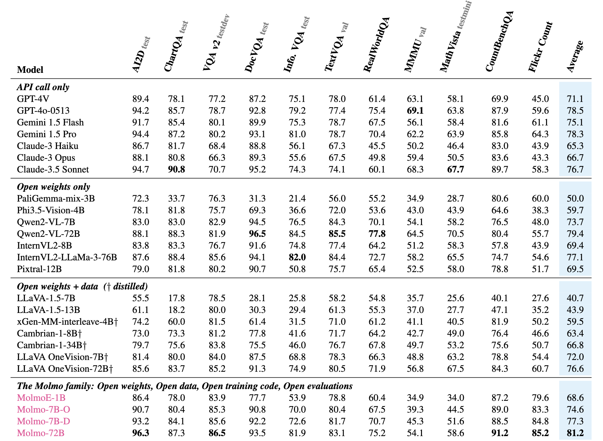

* MolmoE-1B：OLMoE-1B-7B mixture-of-experts LLM&#x20;

* Molmo-7B-O： OLMo-7B-1024 LLM&#x20;

* Molmo-7B-D：Qwen2 7B LLM&#x20;

* Molmo-72B：Qwen2 72B LLM

### ORYX

pdf：[ORYX MLLM: ON-DEMAND SPATIAL-TEMPORALUNDERSTANDING AT ARBITRARY RESOLUTION](http://arxiv.org/html/2409.12961v1)

code：https://oryx-mllm.github.io/

#### 一、Summary

* 优化分辨率与压缩效率，针对长视频的训练

* 直接将位置编码调整为 ⌊H/p⌋ × ⌊W/p⌋ 会导致准确度显着下降，更大的位置嵌入2048×2028，对于每个视觉输入，使用**双线性插值embedding**将原始位置嵌入重新缩放为 P ∈⌊H/p⌋×⌊W/p⌋

* 对于一个batch内的图，N1,N2,Nb长度的视觉token，进行拼接 $$ [1,{\textstyle \sum_{i=1}^{b}}N_{i},C]$$，生成对应每张图的索引，利用flash attention 中提供的可变长度注意算子独立计算批处理中每个视觉输入的注意力

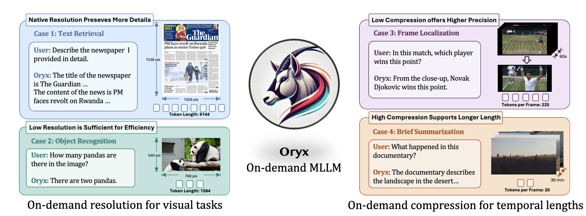

#### 二、模型结构

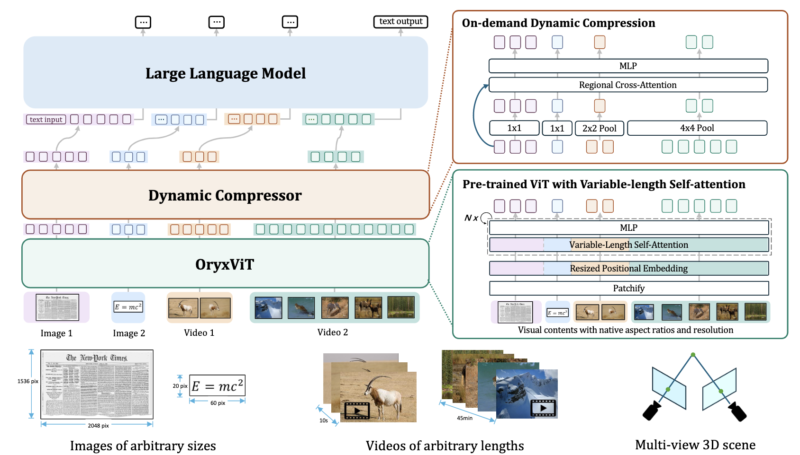

* 连接器**Dynamic Compression**：

  * 下采样比例：1:4:16

  * cross-attention：下采样得到低分辨率特征为query，高分辨率特征为key和value，按照位置做cross-attention

  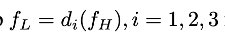

  

  * 使&#x7528;**&#x20;2 层 MLP** 投影维度

  * 标准视频帧数64，长视频256帧，压缩比分别为2\*2和4\*4，视频分辨率288\*480内，图像在1536\*1536内

* 视觉编码器消融，搜索最佳锚点分辨率会带来更好的性能

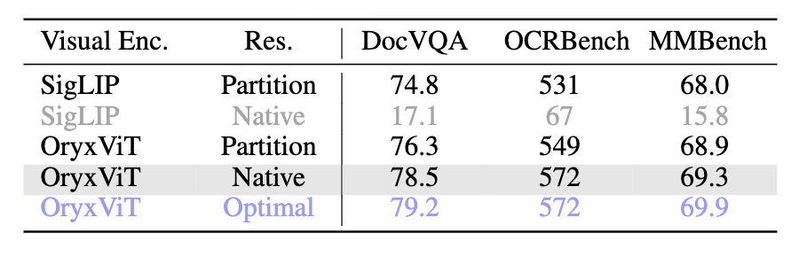

* 固定分辨率和增大分辨率的影响

* 与传统的MLP连接器相比，评估动态压缩模块的影响

#### 三、训练(视觉端都是冻住)

* stage1:

  * **预训练阶段：训练连接器**

  * **监督微调阶段：冻结视觉编码器，训练连接器和LLM**。

* stage2:

  * 联合监督微调：冻结视觉编码器，训练连接器和LLM。

#### 四、数据

* Stage 1：

  * 预训练数据LlaVA-1.5 中 558k

  * 监督微调数据4M：收集了 400 万个专注于高质量知识学习的监督微调图像-文本对的集合（LlaVA-NeXt 、Cauldron和 Cambrian-1 )

* Stage 2（1.2M）：

  * 图像数据：采样stage 1的600k监督微调数据

  * 视频数据（650k）：

    * caption：VideoChatGPT-Plus 、ShareGPT4Video 和 LLAVA-Hound 。

    * 多项选择：Cinepile 、NextQA 和 PerceptionTest&#x20;

    * 利用GPT4o基于[ScanQA](https://huggingface.co/datasets/hmxiong/ScanQA_Finetune)视频)，包含两个任务：

      * **长视频数据平均1000帧，平均时长为45分钟：为特定索引的帧生成caption和寻找给定索引的情况下识别两帧之间的差异**；

      * **粗对应学习空间感知知识**，将一致的标签分配给跨帧的同一对象，允许模型更好地捕获多个视图之间的空间相关性。

* 长视频中的检索能力：选择了一个非常长的视频，然后将不相关的图像问答数据插入到视频中任意深度的单帧中。该模型的任务是回答与这些插入的图像相关的问题。左边是32帧训练的llava-next-video

  

#### 五、结果

1. General Temporal Understanding

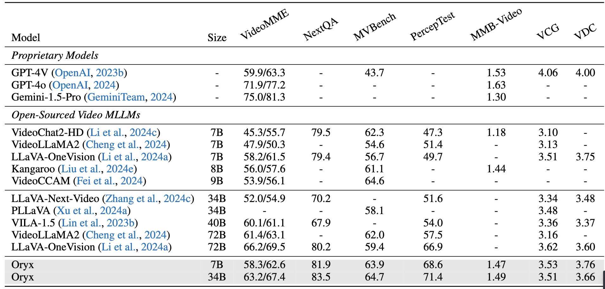

* Long-Form Temporal Understanding

* Image Understanding

### Pixtral 12B

pdf：[Pixtral 12B](https://arxiv.org/pdf/2410.07073)

code：https://github.com/mistralai

#### 一、Summary

* 128k token（30张高分辨率图像或者一本300页的书）的长上下文窗口中处理任意数量的图像

* 评估时进行了一些显示的提醒

* 对于一个batch内的图，N1,N2,...,Nb长度的视觉token，进行拼接 $$ [1,{\textstyle \sum_{i=1}^{b}}N_{i},C]$$，生成对角矩阵块进行self- attention

#### 二、模型结构

* 视觉编码器PixtralViT，文本端Mistral Nemo 12B，连接器两层MLP

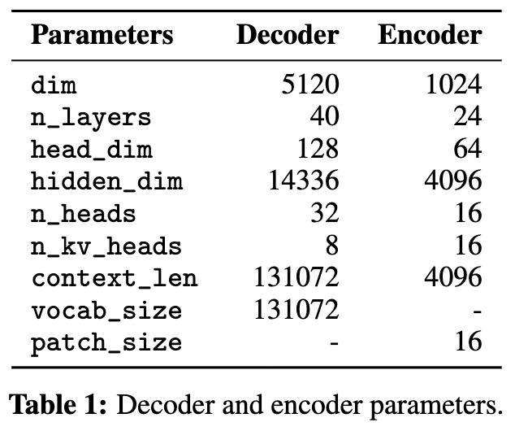

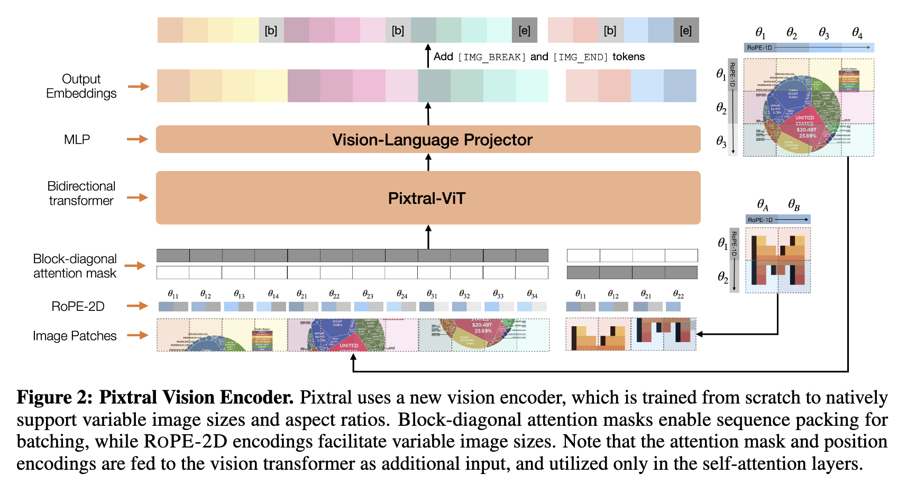

* **Break token**：在图像行之间插&#x5165;**&#x20;\[IMAGE BREADK]&#x20;**&#x74;oken，图像序列的末尾添加\[IMAGE END] token

* **序列打包**：将图像沿序列维度展平并将它们连接起来，并构建了一个块对角掩码，确保来自不同图像的补丁之间没有注意力泄漏。

* **ROPE-2D 位置编码**，视觉编码器**从头开始训练，**&#x6CE8;意掩码和位置编码作为附加输入馈送到vit

* 图像编码器消融

* 12B，400M

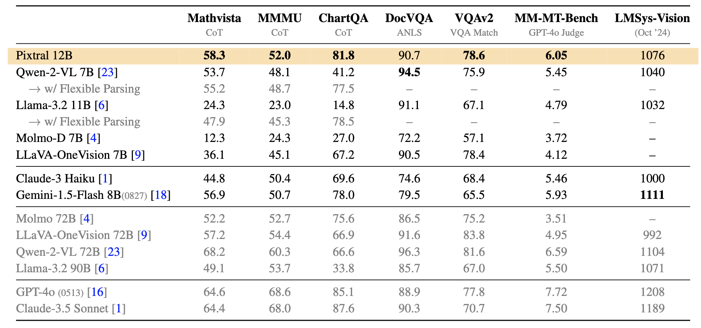

* 124B，1B

### 任意分辨率MLLM

|             | vit                                   | 位置编码                | padding图像 | 如何处理大小不一样的多图                              | 区分不同图像token            |
| ----------- | ------------------------------------- | ------------------- | --------- | ----------------------------------------- | ---------------------- |
| idefics2    | siglip-980-huggingface                | nn.Parameter()均匀分布  | 是         | 对于一个batch内的图做padding，组成\[B, N(max), C]    | patch\_attention\_mask |
| qwen2-vl    | dfn5b-clip                            |  2D-RoPE            | 否         | 对于一个batch内的图，N1,N2,...,Nb长度的视觉token，进行拼接  | 每张图的起始token索引          |
| ORYX        | siglip                                | nn.Parameter()双线性插值 | 否         | 对于一个batch内的图，N1,N2,...,Nb长度的视觉token，进行拼接  | 每张图的起始token索引          |
| Pixtral 12B | train a new vision encoder：PixtralViT |  2D-RoPE            | 否         | 对于一个batch内的图，N1,N2,...,Nb长度的视觉token，进行拼接  | 直接构建块对角mask矩阵          |

###

### Summary

https://github.com/BradyFU/Awesome-Multimodal-Large-Language-Models.

https://github.com/lijiannuist/Efficient-Multimodal-LLMs-Survey.

| 名称                                                                                                                  | 公司                                 | 时间      | 改进点                                                            | 模型                               |                                                              |                                                        | 训练                                                 |                                                                                                                | 数据                                                                                                                                 |
| ------------------------------------------------------------------------------------------------------------------- | ---------------------------------- | ------- | -------------------------------------------------------------- | -------------------------------- | ------------------------------------------------------------ | ------------------------------------------------------ | -------------------------------------------------- | -------------------------------------------------------------------------------------------------------------- | ---------------------------------------------------------------------------------------------------------------------------------- |
|                                                                                                                     |                                    |         |                                                                | Vision encoder                   | connector                                                    | LLM                                                    | 分辨率                                                | 阶段                                                                                                             |                                                                                                                                    |
| [BLIPv2](https://nio.feishu.cn/docx/NFxddS1A0oUVv5xn3L2cPP1in0g#part-ByOpdzuV2owkHjxBzazcBosgnKU)                   | Salesforce Research                | 2023.01 | 1.引入Q-Former                                                   | EVA-CLIP ViT-L/14                | Q-Former+全连接层                                                | OPT(Decoder-only)、FlanT5(Encoder-Decoder)              | 224\*224                                           | （1）PT(表征学习)：训练Q-Former（ITC、ITM、ITG）（2）PT(生成学习)：训练Q-Former+全连接层                                                 | PT(129M)：caption                                                                                                                   |
| [LLaVA](https://nio.feishu.cn/docx/NFxddS1A0oUVv5xn3L2cPP1in0g#part-GGdnd7V3DoQB3XxCQS5cmHgMnBb)                    | 威斯康星大学-马迪逊分校、微软研究院                 | 2023.04 | Instruct tuning扩展到多模态空间                                        | CLIP ViT-L/14                    | Projection (Linear → GELU → Linear)                          | LLaMA                                                  | 224\*224                                           | （1）PT：训练projection（2）SFT：训练projection+llama                                                                    | PT（559k）：单轮对话（构造）SFT（158k+21.1k）：LLaVA-Instruct-158K、ScienceQA数据集                                                                  |
| [MiniGPT-4](https://nio.feishu.cn/docx/NFxddS1A0oUVv5xn3L2cPP1in0g#part-EZPHdmvT1oTNtixXr5ycZ7znnjb)                | 阿卜杜拉国王科技大学                         | 2023.04 | 1.视觉特征提取部分额外用了Q-Former2. 两阶段训练都只更新Projection层的参数               | EVA-CLIP ViT-G/14+BLIP2 Q-Former | Linear Layer(256tokens)                                      | Vicuna-7B                                              | 448\*448                                           | （1）PT：训练Linear Layer（2）SFT：训练Linear Layer                                                                      | PT(500万对)：Conceptual Caption、SUB，LAIONSFT(3500对):人工过滤生成的caption                                                                    |
| [InstructBLIP](https://nio.feishu.cn/docx/NFxddS1A0oUVv5xn3L2cPP1in0g#part-QOPvd9nO3oDI7AxZWCncyBhYncP)             | Salesforce Research 、香港科技大学、南洋理工大学 | 2023.05 | 1.textual instruction不仅提供给LLM，还提供给Q-Former2.instruction tuning | EVA-CLIP ViT-L/14                | Q-Former+全连接层                                                | FlanT5-XL (3B)、FlanT5-XXL (11B)、Vicuna-7B 和 Vicuna-13B | 224\*224                                           | （1）PT(表征学习)：训练Q-Former（ITC、ITM、ITG）（2）PT(生成学习)：训练Q-Former+全连接层（3）SFT：训练Q-Former+全连接层                           | PT(129M)：captionSFT(1.2M)：multi-task                                                                                               |
| [Qwen-VL](https://nio.feishu.cn/docx/NFxddS1A0oUVv5xn3L2cPP1in0g#part-KukudBKrlo6DEvxat9QcQitynpE)                  | 阿里巴巴                               | 2023.08 | 1.cross-attention，压缩图像特征至256固定长度2.VIT加入参数更新                    | Openclip ViT-bigG                | 单层cross-attention（256tokens）                                 | Qwen-7B                                                | 224\*224(PT)、448\*448                              | （1）PT(1.4B)：训练vit+cross-attention（2）Multi-task PT：训练vit+cross-attention+LLM（3）SFT(50M)：训练cross-attention+LLM   | PT(1.4B)：Caption(清洗)Multi-task PT(76.8M)：multi task +interleaved VL dataSFT(**350k**)：chat interleaved VL data                     |
| [InternLM-XComposer](https://nio.feishu.cn/docx/NFxddS1A0oUVv5xn3L2cPP1in0g#part-YwUndTPw1oPZJIxwABWcReebnAg)       | 上海AI lab                           | 2023.09 | 1.图文交错数据                                                       | EVA-CLIP VIT                     | 基于BLIP2预训练的配备交叉注意力层的 BERTbase作为perciever resampler(64tokens) | InternLM-Chat-7B                                       | 224\*224                                           | （1）PT：训练projection+LLM（2）SFT：训练projection+loral                                                                | PT(1.1B张图片+77.7B文本token)：caption(图像、文本)+text only+图文交错数据SFT multi-task()：multi taskSFT()：LLAVA-150k+text only+LRV+图文交错数据（in-house） |
| [LLaVA1.5](https://nio.feishu.cn/docx/NFxddS1A0oUVv5xn3L2cPP1in0g#part-PsQOdQm6ZoRboRxQk5lcoK2lnmg)                 | 威斯康星大学-马迪逊分校、微软研究院                 | 2023.10 | 1.adapter换成了双层的 MLP2.分辨率为3363.增加了许多 QA 和 OCR 的数据               | CLIP-ViT-L-336px                 | 双层MLP                                                        | Vicuna1.5 13B                                          | 336\*336                                           | （1）PT：训练MLP（2）SFT：训练MLP+Vicuna                                                                                 | PT(558k):captionSFT(665k):LLaVA-Instruct-158K、COCO、GQA、OCR-VQA、TextVQA、VisualGenome、chat、LLaVA demo 、GPT                           |
| [Fuyu-8B](https://nio.feishu.cn/docx/NFxddS1A0oUVv5xn3L2cPP1in0g#part-XA8ldubMSoTnXDxruGtcA6M5nyc)                  | AI公司Adept                          | 2023.10 | 1.没有专门的图像编码器2.模型为Decoder-only transformer                      | 无vision encoder                  | 无connector                                                   | Decoder-only transformer                               | 暂无                                                 | 暂无                                                                                                             | 暂无                                                                                                                                 |
| [MiniGPT-v2](https://nio.feishu.cn/docx/NFxddS1A0oUVv5xn3L2cPP1in0g#part-CO4TdMcYYoHLXQx0yrGceRi5nPe)               | 阿卜杜拉国王科技大学、Meta AI Research        | 2023.10 | 1.引入\[Task Identifier]                                         | EVA ViT                          | Linear Layer（1024tokens）                                     | LLaMA2-7B                                              | 448\*448                                           | （1）PT：训练Linear Layer（2）SFT（multi-task training）：训练Linear Layer+LLM（3）SFT（multi-task tuning）：训练Linear Layer+LLM | PT()：Caption、REC、REG、VQASFT()：multi task SFT()：multi task + conversation +text only                                                |
| [Video-LLaVA](https://nio.feishu.cn/docx/NFxddS1A0oUVv5xn3L2cPP1in0g#part-UqJOd70d9od4sxx0ZagcmmrDnNc)              | 北京大学，鹏程实验室，中山大学，腾讯数据平台             | 2023.11 | 1.视频信息和图像信息在投影前对齐                                              | （LanguageBind）OpenClip ViT-L/14  | 两个全连接层                                                       | Vicuna-7B                                              | 224                                                | （1）Understanding Training：训练projection（2）Instruction Tuning：训练projection+LLM                                   | Understanding Training(1.23M)：单轮对话--图像caption、视频captionInstruction Tuning(765k)：多轮对话                                               |
| [internVL](https://nio.feishu.cn/docx/NFxddS1A0oUVv5xn3L2cPP1in0g#part-YNFkddmrxoaE3zxOuJLcrJUdnFf)                 | 上海AI lab、商汤                        | 2023.12 | 1.从头训练更大vit2.LLM 初始化QLLaMA作为connector                          | internViT6B                      | QLLaMA7B                                                     | Vicuna-13B                                             | 336                                                | （1）contrastive PT：训练vit+llama，clip loss（2）generative PT：训练cross attention，blip2 loss（3）SFT：mlp+LLM，llm loss    | PT（1B）： captionSFT（4M）：multi task + conversation                                                                                   |
| [LLaVA-NEXT（2024.01）](https://nio.feishu.cn/docx/NFxddS1A0oUVv5xn3L2cPP1in0g#part-KdphdQ2YGo8Fc9xd56ucCatDnfe)      | 威斯康星大学-马迪逊分校、微软研究院                 | 2024.01 | 1.动态分辨率2.高质量数据3.更强LLM4.微调阶段vit参数也更新                            | CLIP-ViT-L-336px                 | 双层MLP                                                        | Vicuna 7B/13B、Mistral-7B、Nous-Hermes-2-Yi-34B          | 672x672、336x1344、1344x336                          | （1）PT：训练MLP（2）SFT：训练MLP+LLM+VIT                                                                                | PT(558k):captionSFT(760k):multi-task+LLaVA Demo+多模态图表                                                                              |
| [InternLM-XComposer2](https://nio.feishu.cn/docx/NFxddS1A0oUVv5xn3L2cPP1in0g#part-DBbCdrbNSoNi5OxRB38ch7BHnxf)      | 上海AI lab，香港中文大学，商汤科技               | 2024.01 | 1.针对视觉的Partial LoRA                                            | CLIP ViT-L/14-336                | MLP                                                          | InternLM2-7B                                           | 336\*336                                           | （1）PT：训练vit+patial laral（2）SFT：训练vit+patial laral+LLM                                                          | PT()：caption+图表数据+图文交错数据SFT multi-task()：multi taskSFT()：conversation+图文交错数据                                                       |
| [DeepSeek-VL](https://nio.feishu.cn/docx/NFxddS1A0oUVv5xn3L2cPP1in0g#part-ZOAUdZOmyo9jOIxZttDcqnNLnZO)              |  DeepSeek-AI                       | 2024.03 | 1. 结合了混合视觉编码器2.调整多模态数据和文本数据比率（7:3）(joint VL PT)                | SigLIP-L(低分)，SAM-B (高分)          | 两层混合MLP                                                      | DeepSeek-LLM                                           | 384\*384（L）1024\*1024（H）                           | （1）connector training(预热)：训练MLP（2）joint VL PT(多模态预训练)：训练MLP+LLM（3）SFT：训练MLP+LLM+SigLIP-L                       | connector training(1.2亿+250万)：caption、Document OCRjoint VL PT()：multi task + text onlySFT()：multi task + conversation +text only   |
| [MiniGemini](https://nio.feishu.cn/docx/NFxddS1A0oUVv5xn3L2cPP1in0g#part-GurVdBLA3oJGA4xpbLtcHMAbnz3)               | 香港中文大学、SmartMore                   | 2024.03 | 1.高分辨率视觉token2.高质量数据3.可集成VLM与生成模型，引导的生成                        | VIT(LR)、LAION ConvNext(HR)       | MLP                                                          | Vicuna-7/13B、Hermes-2等                                 | 336                                                | （1）PT：训练MLP（2）SFT：训练MLP+LLM                                                                                    | PT(1.2M)：captionSFT(1.5M)：单轮或多轮对话                                                                                                  |
| [internVL 1.5](https://nio.feishu.cn/docx/NFxddS1A0oUVv5xn3L2cPP1in0g#part-IeFsdmMTHoEvE5x6AYVcHMTknUd)             | 上海AI lab、商汤                        | 2024.04 | 1.动态4k高分辨率2.双语pipeline                                         | InternViT-6B-448px               | MLP+pixel shuffle(256-3328)                                  | internLM220B                                           | 动态分辨率448-4k                                        | （1）vit PT：用Yi-34B训练intervit1.2-448（2）PT：训练vit+mlp（3）SFT：训练vit+mlp+LLM                                          | PT：caption、detection、OCR large、OCR smallSFT：multi task + conversation +text only                                                   |
| [MiniCpm-V 2.0](https://nio.feishu.cn/docx/NFxddS1A0oUVv5xn3L2cPP1in0g#part-DW27dLcJYoZhqixfi4TcVyMQnQf)            | 面壁                                 | 2024.04 | 1.任意长宽比图像输入2.中英双语多模态能力                                         |                                  | perciever resampler(64tokens)                                | MiniCpm                                                |                                                    | 暂无                                                                                                             | 暂无                                                                                                                                 |
| [InternLM-XComposer2-4KHD](https://nio.feishu.cn/docx/NFxddS1A0oUVv5xn3L2cPP1in0g#part-US7qdsw3oovRTrxgyFVcO4y4nuh) | 上海AI lab，香港中文大学，商汤科技               | 2024.04 | 1.动态4k高分辨率                                                     | OpenAI ViT-Large/14              | MLP                                                          | InternLM2-7B                                           | 动态分辨率336-4K                                        | （1）PT：训练vit+patial laral（2）SFT：训练vit+patial laral+LLM                                                          | PT()：caption+instruction data+图文交错数据SFT ()：multi task+conversation+HD OCR                                                          |
| [LLaVA-NEXT（2024.05）](https://nio.feishu.cn/docx/NFxddS1A0oUVv5xn3L2cPP1in0g#part-Z6QWdhkH6ow24ixezpkc7ANXneg)      | 威斯康星大学-马迪逊分校、微软研究院                 | 2024.05 | 1.更大更强的LLM2.动态4k高分辨率3.微调阶段vit参数也更新                             | CLIP-ViT-L-336px                 | 双层MLP                                                        | LLaMA3(8B)、Qwen-1.5(72B)、Qwen-1.5(110B）                | 动态分辨率336-4K                                        | （1）PT：训练MLP（2）SFT：训练vit+MLP+LLM                                                                                | PT(558k):captionSFT(790k):                                                                                                         |
| 总结2024.05.12                                                                                                        |                                    |         |                                                                |                                  |                                                              |                                                        |                                                    |                                                                                                                |                                                                                                                                    |
| [PaliGemma](https://nio.feishu.cn/wiki/ShQZwCVOQieIOwkJUglcv1kEn6c#part-FBxmdFBt0otulFxV7OycXmPHn1d)                | 谷歌                                 | 2024.05 |                                                                | SigLIP                           | 线性层                                                          | Gemma-2B                                               | 224x224、448x448或896x896（预训练）、812×812和1064×1064（微调） | （1）单模态预训练：单模态数据分别训练vit和LLM（2）多模态训练：训练线性层+LLM（3）SFT：训练vit+线性层+LLM（4）任务迁移：训练线性层+LLM                              |                                                                                                                                    |
| [CogVLM2](https://nio.feishu.cn/wiki/ShQZwCVOQieIOwkJUglcv1kEn6c#part-WPeodp9x6oGXRwx6cLgcC70gnXb)                  | 智谱                                 | 2024.05 | 1.在LLM中引入visual expert2.支持8k长文本                                | EVA-CLIP-E                       | 2\*2Downsample+MLP Adapter                                   | Meta-Llama-3-8B-Instruct +visual expert                | 1344\*1344                                         | （1）PT  stage1：（2）PT stage2：（3）SFT：训练vit+connector+LLM with visual expert                                       | （1）PT  stage1：图文对（2）PT stage2：图像描述（image captioning）和指代表达理解（REC）（3）SFT：                                                            |

|                                     |       | Text-oriented VQA |          |          | mllm benchmark |           |            |            |                  |          |          |
| ----------------------------------- | ----- | ----------------- | -------- | -------- | -------------- | --------- | ---------- | ---------- | ---------------- | -------- | -------- |
|                                     | 平均分数  | TextVQA           | DocVQA   | ChartQA  | MME Per        | MME Cog   | MMBench en | MMBench cn | SEED Bench image | MMstar   | AI2D     |
| InternVL 1.5 26B                    | 63.5  | **80.6**          | **90.9** | **83.8** | 1637.8         | **550.0** | **82.2**   | **82.0**   | **76**           | **57.1** | 80.7     |
| InternLM-XComposer2 4kHD-7B         | 61.9  | 77.2              | 90.0     | 81.0     | **1655.9**     | 548.9     | 82.0       | 77.7       | 74.7             | 54.1     | **80.9** |
| Llava-next 13B                      | 52.5  | 67.1              | 77.5     | 62.2     | 1575.1         | 316.8     | 70.0       | 64.4       | 71.9             | 40.4     | 70.0     |
| sft\_1.6.2.35\_fix\_crop\_learnable | 51.2  | 70.1              | 67.6     | 59.9     | 1577.0         | 379.3     | 70.4       | 64.8       | 71.4             | 40.7     | 65.9     |
| Llava-next 7B                       | 49.8  | 64.9              | 74.4     | 54.8     | 1519.3         | 322.5     | 67.4       | 60.6       | 70.2             | 37.6     | 66.6     |

## Vision Encoder and Connector

| Vision Encoder  |                                                           | Which MLLM                                                                                                                                                                                                                                    | paper                                                                              | code                                                                                                                                                                                                                                                                                 | model\_zoo                                                                                                                                     | 参考                                                                                                                                                                                                                                                                                                                    | 精度        | 路径                                                                 |
| --------------- | --------------------------------------------------------- | --------------------------------------------------------------------------------------------------------------------------------------------------------------------------------------------------------------------------------------------- | ---------------------------------------------------------------------------------- | ------------------------------------------------------------------------------------------------------------------------------------------------------------------------------------------------------------------------------------------------------------------------------------ | ---------------------------------------------------------------------------------------------------------------------------------------------- | --------------------------------------------------------------------------------------------------------------------------------------------------------------------------------------------------------------------------------------------------------------------------------------------------------------------- | --------- | ------------------------------------------------------------------ |
|                 | Siglip                                                    | [DeepSeek-VL](https://github.com/deepseek-ai/DeepSeek-VL/blob/main/deepseek_vl/models/siglip_vit.py)[MiniCPM-Llama3-V-2\_5](https://huggingface.co/openbmb/MiniCPM-Llama3-V-2_5/blob/main/modeling_minicpmv.py#L36)(siglip-so400m)&#xA;       |                                                                                    | https://github.com/google-research/big\_vision/blob/main/big\_vision/models/vit.pyhttps://github.com/huggingface/transformers/blob/main/src/transformers/models/siglip/modeling\_siglip.py#L959https://huggingface.co/HuggingFaceM4/siglip-so400m-14-980-flash-attn2-navit/tree/main | siglip-so400m-patch14-384siglip-base-patch16-224siglip-base-patch16-384siglip-base-patch16-512siglip-large-patch16-256siglip-large-patch16-384 | [Deepseek:](https://nio.feishu.cn/wiki/ShQZwCVOQieIOwkJUglcv1kEn6c#part-XvsQdnvOaoX0Ybx3Iupc9oxunBb)siglip-large-patch16-384（384\*384）siglip-so400m-patch14-384[PaliGemma:](https://nio.feishu.cn/wiki/ShQZwCVOQieIOwkJUglcv1kEn6c#part-FNwady4PZoGjWvxYIwGcMumtnfg)siglip-so400m-patch14-384（224x224、448x448或896x896 | fp16/bf16 | /dc-hl/dai.guan/pretrained/siglip/+model\_zoo+model.safetensors    |
|                 | SAM                                                       | [DeepSeek-VL](https://github.com/deepseek-ai/DeepSeek-VL/blob/main/deepseek_vl/models/sam.py)                                                                                                                                                 |                                                                                    | https://github.com/facebookresearch/segment-anything/blob/main/segment\_anything/modeling/image\_encoder.py                                                                                                                                                                          | sam-vit-basesam-vit-largesamvit-huge                                                                                                           | [Deepseek:](https://nio.feishu.cn/wiki/ShQZwCVOQieIOwkJUglcv1kEn6c#part-XvsQdnvOaoX0Ybx3Iupc9oxunBb)sam-vit-base（1024\*1024）                                                                                                                                                                                          | fp16/bf16 | /dc-hl/dai.guan/pretrained/sam/+model\_zoo+model.safetensors       |
|                 | ConvNext                                                  | [LLaVA-HR](https://github.com/luogen1996/LLaVA-HR/blob/main/llava_hr/model/multimodal_encoder/convnext.py)、MiniGenimi                                                                                                                         |                                                                                    | https://github.com/facebookresearch/ConvNeXt/blob/main/semantic\_segmentation/backbone/convnext.py                                                                                                                                                                                   |                                                                                                                                                |                                                                                                                                                                                                                                                                                                                       |           |                                                                    |
|                 | Eva-CLIP ViT                                              | [MiniGPT-4](https://github.com/Vision-CAIR/MiniGPT-4/blob/main/minigpt4/models/eva_vit.py)、[MiniGemini](https://github.com/dvlab-research/MGM/blob/main/mgm/model/multimodal_encoder/eva_encoder.py)、MiniGPTv2instructBLIP、InternLM-Xcomposer |                                                                                    | https://github.com/baaivision/EVA/blob/master/EVA-CLIP/rei/eva\_clip/eva\_vit\_model.py                                                                                                                                                                                              |                                                                                                                                                |                                                                                                                                                                                                                                                                                                                       |           |                                                                    |
|                 | InternViT                                                 | [InternVL](https://github.com/OpenGVLab/InternVL/blob/main/internvl_g/internvl/model/internvl_stage2/modeling_intern_vit.py)、InternVL1.5                                                                                                      |                                                                                    | https://github.com/OpenGVLab/InternVL/blob/main/internvl\_g/internvl/model/internvl\_stage2/modeling\_intern\_vit.py                                                                                                                                                                 |                                                                                                                                                |                                                                                                                                                                                                                                                                                                                       |           | /dc-hl/dai.guan/pretrained/InternViT/+model\_zoo+model.safetensors |
|                 | DINO                                                      |                                                                                                                                                                                                                                               |                                                                                    | https://github.com/facebookresearch/dino/blob/main/vision\_transformer.py                                                                                                                                                                                                            |                                                                                                                                                |                                                                                                                                                                                                                                                                                                                       |           |                                                                    |
|                 | DINOv2                                                    |                                                                                                                                                                                                                                               |                                                                                    | https://github.com/facebookresearch/dinov2/blob/main/dinov2/models/vision\_transformer.py                                                                                                                                                                                            | dinov2-smalldinov2-basedinov2-largedinov2-giant                                                                                                |                                                                                                                                                                                                                                                                                                                       | fp16/bf16 | /dc-hl/dai.guan/pretrained/dinov2/+model\_zoo+model.safetensors    |
|                 | SigLIT                                                    |                                                                                                                                                                                                                                               |                                                                                    |                                                                                                                                                                                                                                                                                      |                                                                                                                                                |                                                                                                                                                                                                                                                                                                                       |           |                                                                    |
|                 | CoAtNet                                                   |                                                                                                                                                                                                                                               |                                                                                    | https://github.com/KKKSQJ/DeepLearning/tree/master/classification/coatNet                                                                                                                                                                                                            |                                                                                                                                                |                                                                                                                                                                                                                                                                                                                       |           |                                                                    |
|                 | ViTamin                                                   |                                                                                                                                                                                                                                               |                                                                                    | https://github.com/Beckschen/ViTamin/blob/main/ViTamin/models/vitamin.py                                                                                                                                                                                                             |                                                                                                                                                |                                                                                                                                                                                                                                                                                                                       |           |                                                                    |
|                 | SILC                                                      | [SILC](http://arxiv.org/abs/2310.13355v2)                                                                                                                                                                                                     |                                                                                    |                                                                                                                                                                                                                                                                                      |                                                                                                                                                |                                                                                                                                                                                                                                                                                                                       |           |                                                                    |
|                 | ViT-e                                                     | [PALI](http://arxiv.org/pdf/2209.06794)                                                                                                                                                                                                       |                                                                                    |                                                                                                                                                                                                                                                                                      |                                                                                                                                                |                                                                                                                                                                                                                                                                                                                       |           |                                                                    |
|                 | ERADIO                                                    |                                                                                                                                                                                                                                               |                                                                                    | https://github.com/NVlabs/RADIO/blob/main/radio/eradio\_model.py                                                                                                                                                                                                                     |                                                                                                                                                |                                                                                                                                                                                                                                                                                                                       |           | /dc-hl/dai.guan/pretrained/eradio/+model\_zoo+model.safetensors    |
|                 | NFNet                                                     |                                                                                                                                                                                                                                               |                                                                                    | https://github.com/google-deepmind/deepmind-research/blob/master/nfnets/nfnet.py                                                                                                                                                                                                     |                                                                                                                                                |                                                                                                                                                                                                                                                                                                                       |           |                                                                    |
| Connector       | Resampler                                                 | [honeybee](https://github.com/kakaobrain/honeybee/blob/main/honeybee/projectors/resamplers.py)                                                                                                                                                |                                                                                    |                                                                                                                                                                                                                                                                                      |                                                                                                                                                |                                                                                                                                                                                                                                                                                                                       |           |                                                                    |
|                 | Perceive Sampler                                          | [MiniCPM-V](https://github.com/OpenBMB/MiniCPM-V/blob/main/omnilmm/model/resampler.py)、InternLM-Xcomposer                                                                                                                                     |                                                                                    |                                                                                                                                                                                                                                                                                      |                                                                                                                                                |                                                                                                                                                                                                                                                                                                                       |           |                                                                    |
|                 | Cross-attention                                           | Qwen-VL                                                                                                                                                                                                                                       |                                                                                    |                                                                                                                                                                                                                                                                                      |                                                                                                                                                |                                                                                                                                                                                                                                                                                                                       |           |                                                                    |
|                 | Q-former                                                  | instructBLIP、[MiniGPT-4](https://github.com/Vision-CAIR/MiniGPT-4/blob/main/minigpt4/models/Qformer.py)                                                                                                                                       |                                                                                    |                                                                                                                                                                                                                                                                                      |                                                                                                                                                |                                                                                                                                                                                                                                                                                                                       |           |                                                                    |
|                 | MLP                                                       | [Video-LLaVA](https://gitcode.com/PKU-YuanGroup/Video-LLaVA/blob/main/llava/model/multimodal_projector/builder.py)                                                                                                                            |                                                                                    |                                                                                                                                                                                                                                                                                      |                                                                                                                                                |                                                                                                                                                                                                                                                                                                                       |           |                                                                    |
|                 | Linear Layer                                              | MiniGPT-4、MiniGPTv2、LLaVA、[Video-LLaVA](https://gitcode.com/PKU-YuanGroup/Video-LLaVA/blob/main/llava/model/multimodal_projector/builder.py)                                                                                                  |                                                                                    |                                                                                                                                                                                                                                                                                      |                                                                                                                                                |                                                                                                                                                                                                                                                                                                                       |           |                                                                    |
|                 | [Dense Connector](https://zhuanlan.zhihu.com/p/700000183) |                                                                                                                                                                                                                                               |                                                                                    | https://github.com/HJYao00/DenseConnector/blob/main/dc/model/multimodal\_projector/dense\_connector.py                                                                                                                                                                               |                                                                                                                                                |                                                                                                                                                                                                                                                                                                                       |           |                                                                    |
|                 | C-Abstractor                                              | [honeybee](https://github.com/kakaobrain/honeybee/blob/main/honeybee/projectors/projectors.py)                                                                                                                                                | [Honeybee](https://readpaper.com/paper/4832516705137721345)(韩国kakao brain,2023.12) | https://github.com/kakaobrain/honeybee/blob/main/honeybee/projectors/projectors.py                                                                                                                                                                                                   |                                                                                                                                                |                                                                                                                                                                                                                                                                                                                       |           |                                                                    |
|                 | D-Abstractor                                              | [honeybee](https://github.com/kakaobrain/honeybee/blob/main/honeybee/projectors/dabs.py)                                                                                                                                                      | [Honeybee](https://readpaper.com/paper/4832516705137721345)(韩国kakao brain,2023.12) | https://github.com/kakaobrain/honeybee/blob/main/honeybee/projectors/dabs.py                                                                                                                                                                                                         |                                                                                                                                                |                                                                                                                                                                                                                                                                                                                       |           |                                                                    |
|                 | LDPv2                                                     | [MobileVLM V2](https://arxiv.org/abs/2402.03766)                                                                                                                                                                                              | 2024.02 美团、浙大                                                                      | https://github.com/Meituan-AutoML/MobileVLM/blob/main/mobilevlm/model/vision\_projector.py                                                                                                                                                                                           |                                                                                                                                                |                                                                                                                                                                                                                                                                                                                       |           |                                                                    |
|                 | VSS                                                       | [VL-Mamba](https://arxiv.org/abs/2403.13600)                                                                                                                                                                                                  | 2024.03澳大利亚机器学习研究所、阿德莱德大学、中科院自动化研究所                                                | https://github.com/MzeroMiko/VMamba                                                                                                                                                                                                                                                  |                                                                                                                                                |                                                                                                                                                                                                                                                                                                                       |           |                                                                    |
|                 | MEQ-Former                                                | [BRAVE](https://arxiv.org/abs/2404.07204)                                                                                                                                                                                                     | 2024.04谷歌                                                                          |                                                                                                                                                                                                                                                                                      |                                                                                                                                                |                                                                                                                                                                                                                                                                                                                       |           |                                                                    |
|                 | H-Reducer(适用于高分辨率文本)                                      | [PLUG-DocOwl1.5](https://github.com/X-PLUG/mPLUG-DocOwl/blob/main/DocOwl1.5/mplug_docowl/model/visual_encoder.py)                                                                                                                             | [mPLUG-DocOwl 1.5](https://arxiv.org/abs/2403.12895)                               | https://github.com/X-PLUG/mPLUG-DocOwl/blob/main/DocOwl1.5/mplug\_docowl/model/visual\_encoder.py                                                                                                                                                                                    |                                                                                                                                                |                                                                                                                                                                                                                                                                                                                       |           |                                                                    |
|                 | MR-Adapter(混合分辨率)                                         | [LLaVA-HR](https://github.com/luogen1996/LLaVA-HR/blob/main/llava_hr/model/multimodal_projector/builder.py)                                                                                                                                   | [LLaVA-HR](http://arxiv.org/pdf/2403.03003v1)                                      | https://github.com/luogen1996/LLaVA-HR/blob/main/llava\_hr/model/multimodal\_projector/builder.py                                                                                                                                                                                    |                                                                                                                                                |                                                                                                                                                                                                                                                                                                                       |           |                                                                    |

PixtralViT：

